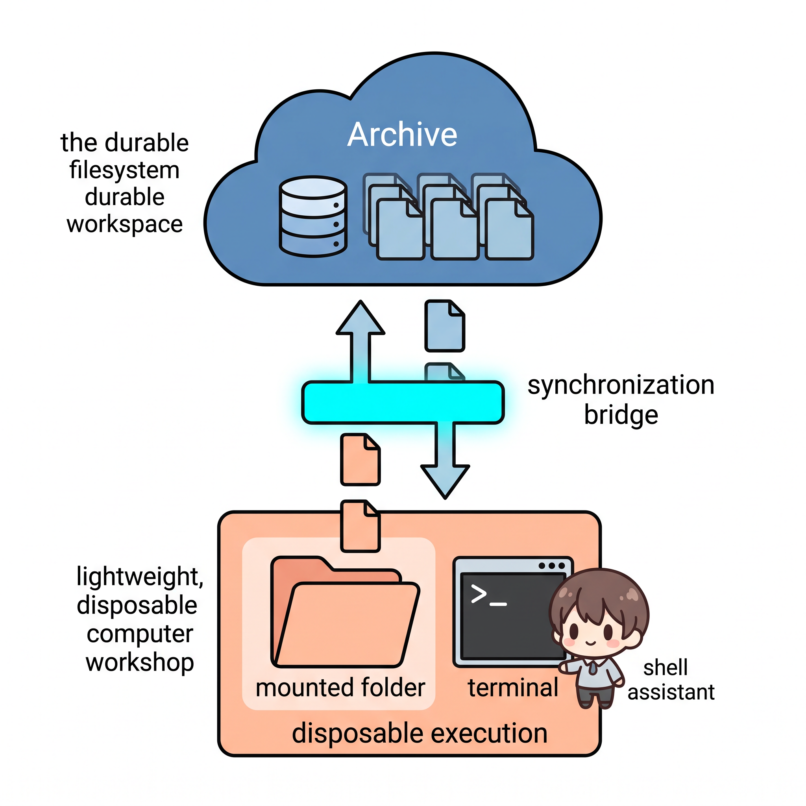

# 第一部分：Cloudflare Durable Objects 入门

智能体的机器可能在两次请求之间消失，但它的身份和工作区不应该随之消失。

> <u>**核心心智模型：**</u>
> **稳定身份并不等于常驻进程。** Durable Object 持有持久状态；执行环境可以围绕这份状态重新构建。

<p align="center">
  
</p>

*图 1：执行环境可以消失，而身份和已提交状态继续存在。本图仅用于解释概念；下文会精确定义 Durable Object 的内存与存储边界。*

## TL;DR

- **Durable Objects 为状态指定所有者：** 每个逻辑实体拥有一个稳定地址、一个协调点和一份私有事务型存储。
- **Computer 把 SQLite 变成文件系统：** 作为唯一事实源的 VFS 位于 Workspace Durable Object 的 SQLite 数据库中。
- **FUSE 暴露的是可丢弃的执行副本：** 它挂载 `computerd` 中的 VFS，**并不**直接挂载 Durable Object 数据库。
- **Shell 写入要在同步后才持久化：** Computer 将执行侧变更 pull 回作为唯一事实源的 Workspace。
- <u>**存储权衡：**</u> 完全相同的内容可以高效去重，但固定 512 KiB 边界会放大部分微小修改和文件头插入。
- <u>**速度权衡：**</u> 原生兼容性带来 FUSE 穿越成本；持久化带来 push/pull 同步成本。

```text
逻辑工作区身份
    │
    ▼
Durable Object：稳定所有者 + 私有 SQLite
    │
    ├── 作为唯一事实源的 Computer VFS
    │
    └── push → 可丢弃的 computerd VFS → FUSE → 原生命令 → pull
```

本文明确区分三类证据：

| 标签 | 能够证明什么 |
| --- | --- |
| **平台契约** | Cloudflare 文档所定义的 Durable Objects 身份、执行与存储行为。 |
| **开源实现** | 在 commit [`76d9e75`](https://github.com/cloudflare/computer/tree/76d9e75c5688713b656bce85540d9e0071cece8b) 上核验的 Computer 行为。 |
| **实测行为** | 本仓库在本地 WSL2、workerd、computerd 和真实 FUSE 路径上得到的基准结果。 |

[各章研究资料](part-i/)保留了更多实现细节。本文选择通往可用心智模型的最短路径。

---

## 第 1 章：Durable Objects——从第一性原理理解有状态无服务器计算

> <u>**基本定义：**</u>
> 一个 Durable Object 同时是**一个可寻址的应用代码实例、一个协调点，以及一个私有持久存储单元**。

### Durable Objects 要解决什么问题？

无服务器计算把请求而不是服务器变成工作单元。它很适合无状态逻辑，但有状态应用仍然需要独立的数据库和协调器。

Cloudflare 在 2020 年首次介绍 Durable Objects 时，指出 Workers 模型缺少两种能力：

| 缺失能力 | 为什么无状态执行不够用 |
| --- | --- |
| **强状态** | 最终一致存储无法安全处理频繁且相互冲突的更新。 |
| **协调** | 请求可能落到不同的 Worker 实例，客户端没有稳定的实时汇合点。 |

```text
无状态请求                                      DURABLE OBJECT

请求 ──► Worker A ──► 内存 ✕                    请求 ──► 稳定的对象身份
请求 ──► Worker B ──► 内存 ✕                                 │
                                                               ▼
                                                      ┌──────────────────┐
状态 ─────► 独立数据库                                 │ 单一协调器        │
客户端 ───► 独立协调器                                 │ 私有存储          │
                                                      └──────────────────┘
```

协作文档能把这两个问题具体化。编辑者需要一个地方为并发修改排序、立即广播修改，并持久保存已接受的状态。让每次按键都访问远端数据库会增加延迟；把请求发给彼此无关的无状态实例，又无法提供共同的协调器。

Durable Objects 把**应用状态的逻辑单元**变成无服务器状态的基本单元。聊天应用可以为每个房间使用一个对象，文档编辑器可以为每份文档使用一个对象，游戏则可以为每场对局使用一个对象。Cloudflare 负责决定对象在哪里运行，并在需要时重建它的执行环境。

### 什么是 Durable Object？

首发文章通过三个词解释了这个名字。这仍然是最简单的入门方式：

| 单词 | 含义 |
| --- | --- |
| **Object** | 应用自定义类的一个实例：包含代码、私有状态和方法。 |
| **Unique** | 实例拥有全局可寻址的身份。使用该身份的请求会抵达同一个逻辑对象。 |
| **Durable** | 实例拥有持久存储；即使当前内存执行实例消失，存储仍然存在。 |

因此，完整结构不只是一个数据库：

```text
Durable Object namespace（一个应用自定义类）
    │
    ├── object ID A
    │     ├── 需要时存在的单一活动协调器
    │     ├── 可丢弃的内存状态
    │     └── 私有持久存储
    │
    ├── object ID B
    │     ├── 需要时存在的单一活动协调器
    │     ├── 可丢弃的内存状态
    │     └── 私有持久存储
    │
    └── object ID C ...
```

**namespace（命名空间）**把应用与一个 Durable Object 类绑定，并提供定位实例的 API。**ID** 标识一个实例。**stub（调用句柄）**是客户端引用，Worker 通过它向实例发送 HTTP 或 RPC 请求。其他 Workers 和 Durable Objects 不会直接打开该实例的数据库；它们与拥有该数据库的对象通信。

### 它有哪两种基本能力？

首发文章把**存储**和**协调**描述为相互独立但彼此补充的能力：

```text
                         Durable Object
                              │
                 ┌────────────┴────────────┐
                 │                         │
               协调                        存储
                 │                         │
        把相关请求路由到              在私有事务中保存
        一个活动所有者                已接受的状态
                 │                         │
                 └────────────┬────────────┘
                              ▼
                    一个逻辑有状态实体
```

| 能力 | 提供什么 | 能否单独使用？ |
| --- | --- | --- |
| 协调 | 让相关请求和连接在一个稳定目的地汇合。 | 可以。短生命周期的限流器也许能够容忍内存历史丢失。 |
| 存储 | 附属于一个对象的私有、强一致、事务型状态。 | 可以。对象可以主要对外提供存储支持的 API。 |
| 两者结合 | 活动协调器把决策的最终结果持久保存。 | 这是房间、文档、游戏、任务和工作区的常见模型。 |

这个区别非常重要：Durable Objects 不只是“边缘上的 SQLite”。它的核心抽象是**一份逻辑状态的所有者**。存储让所有者能够恢复，协调让所有者能够在活动期间做出决策。

### 什么是 Durable Object Storage？

Durable Object Storage 是附属于单个 Durable Object 实例的私有存储。它具有以下属性：

| 属性 | 实际含义 |
| --- | --- |
| **私有** | 只有拥有该存储的对象代码能够直接访问。 |
| **同址** | 计算和存储共享对象的放置位置，避免额外的应用到数据库网络跳转。 |
| **强一致** | 成功读取会遵循存储模型已接受的顺序，而不是读取最终一致副本。 |
| **事务型** | 相关 SQL 或键值操作可以原子地维护不变量。 |
| **持久** | JavaScript 执行实例被驱逐和重建后，已提交状态仍然存在。 |

对于当前由 SQLite 支持的 Durable Objects，附加存储在同一个对象自有数据库上提供多个接口：

```text
Durable Object 实例
    │
    └── ctx.storage
          ├── SQL 表
          ├── 由隐藏 SQLite 存储支持的键值 API
          ├── alarm 状态
          └── 嵌入式数据库的时间点恢复
```

| 存储接口 | 用途 |
| --- | --- |
| SQL API | 定义表、查询结构化状态，并使用 SQLite 事务。 |
| 同步 KV API | 通过 `ctx.storage.kv` 读写键值状态。 |
| 异步 KV 兼容 API | 保留熟悉的 `get`、`put`、`delete` 和 `list` 接口。 |
| Alarms | 持久保存对象自有定时任务的未来唤醒时间。 |
| PITR | 在平台恢复窗口内还原整个嵌入式 SQLite 数据库。 |

#### 为什么选择 SQLite，而不是仅使用 KV 的后端？

```text
旧版纯 KV 后端                              SQLITE 后端存储

┌──────────────────┐                      ┌────────────────────────────┐
│ key ──► value    │                      │ SQL 表 + 索引               │
│ key ──► value    │          ──►         │ 多记录事务                  │
│ key ──► value    │                      │                            │
└──────────────────┘                      │ ┌────────────────────────┐ │
                                          │ │ KV 兼容层               │ │
                                          │ └────────────────────────┘ │
                                          │ alarms + 数据库 PITR       │
                                          └────────────────────────────┘
```

SQLite 并没有抛弃键值模型，而是把 KV 放进一个更通用的事务引擎，使一个对象可以同时使用简单键和结构化表。Computer 需要这个更广泛的模型来表示路径、inode、分块、manifest（清单）和同步元数据。

2020 年文章描述的是 beta 阶段的存储 API，因此本章使用当前文档说明 API 细节：新 namespace 应使用 SQLite 后端存储；旧版后端只提供键值存储。

**资料来源：** [Workers Durable Objects Beta: A New Approach to Stateful Serverless](https://blog.cloudflare.com/introducing-workers-durable-objects/)、[当前 Durable Objects 概念](https://developers.cloudflare.com/durable-objects/concepts/what-are-durable-objects/)、[namespace API](https://developers.cloudflare.com/durable-objects/api/namespace/)、[SQLite-backed Durable Object Storage](https://developers.cloudflare.com/durable-objects/api/sqlite-storage-api/)以及[旧版 KV storage API](https://developers.cloudflare.com/durable-objects/api/legacy-kv-storage-api/)。

---

## 第 2 章：Computer——SQLite 如何通过 FUSE 成为文件系统

> <u>**关键边界：**</u>
> **FUSE 挂载的是 computerd 中可丢弃的 VFS，而不是 Durable Object SQLite。**

<p align="center">
  
</p>

*图 2：Computer 在作为唯一事实源的 Workspace VFS 与可丢弃的执行侧 VFS 之间同步。FUSE 把后者暴露给原生命令；它不会直接挂载 Durable Object SQLite。*

### 作为唯一事实源的文件系统在哪里？

在这里讨论的 Durable Object 部署中，Cloudflare Computer 在 Workspace 对象的 SQLite 数据库里创建一个应用层**虚拟文件系统（VFS）**。VFS 是由软件实现的文件系统数据模型，包含路径、目录、文件元数据、内容引用和文件操作。

原生程序调用 `open()` 时，不能直接执行 SQL 或 Workspace RPC。因此，Computer 使用两个 VFS 实例：

```text
┌─────────────────────────────────────────────────────────┐
│ Workspace Durable Object                               │
│                                                         │
│  私有 SQLite                                             │
│      └── 作为唯一事实源的 Computer VFS                   │
└──────────────────────────┬──────────────────────────────┘
                           │ push / pull 同步
                           ▼
┌─────────────────────────────────────────────────────────┐
│ 可丢弃的 Linux 执行环境                                  │
│                                                         │
│  computerd 内存 SQLite VFS                               │
│      └── FUSE 暴露 ──► /workspace                       │
│                           └── npm、git、ls、cat           │
└─────────────────────────────────────────────────────────┘
```

**FUSE** 即 Filesystem in Userspace，它允许用户态进程实现文件系统，再由 Linux 内核把该文件系统暴露到普通路径。**computerd** 是 Computer 的执行侧守护进程；它拥有可丢弃的 VFS，并实现 FUSE 回调。push 和 pull 在这份执行副本与作为唯一事实源的 VFS 之间同步。

| 层 | 持久所有者？ | 职责 |
| --- | ---: | --- |
| Workspace Durable Object SQLite VFS | 是 | 存储作为唯一事实源的路径、文件布局、payload（内容数据）和 revision（修订号）。 |
| computerd SQLite VFS | 否 | 提供可重建的执行副本。 |
| FUSE 挂载 | 否 | 把 Linux 文件系统调用转换成 computerd VFS 操作。 |
| 原生进程 | 否 | 像使用普通文件系统一样使用 `/workspace`。 |

当 `FUSE_MOUNT=auto` 时，如果真正的内核 FUSE 挂载不可用，computerd 可以退回到用户态兼容层。第 4 章的基准测试强制要求并核验了真实 FUSE 挂载。

### 原生 `read()` 到达哪个文件系统？

假设一个原生进程读取 `/workspace/package.json`：

```text
cat /workspace/package.json
  │
  ├── Linux open/read 系统调用
  ▼
kernel VFS → FUSE → fuse-native → computerd FUSE driver
                                      │
                                      ├── 转换挂载路径
                                      └── 从待处理内存或
                                          本地 SQLite chunk 行读取
```

程序并不知道自己的工作树来自 Durable Object。正是这种兼容性，让原生 Shell、Git、编译器、包管理器和开发工具无需改写成调用 `Workspace.fs` 就能运行。该实现提供广泛的 POSIX 风格兼容性，但并不承诺与 POSIX 完全等价。

### SQLite 如何表示一个文件？

可以分三层理解 Computer 的 VFS：

| 层 | 要回答的问题 | 固定版本实现中的主要表 |
| --- | --- | --- |
| **Namespace** | 哪个路径名指向哪个 inode？ | `vfs_nodes`、`vfs_dirents` |
| **文件布局** | 哪些有序分块组成这个文件？ | `vfs_chunks`、可选的 `vfs_manifests` |
| **Payload 存储** | 每个内容哈希对应哪些字节？ | `vfs_blobs`、`vfs_blob_bytes` |

**inode** 是文件系统对象的 VFS 记录；目录项把父目录下的名字映射到该 inode。**manifest** 可以标识一组有序分块。**内容寻址存储（CAS）**按内容哈希标识 payload，因此字节完全相同的 payload 可以复用同一存储对象。

Computer 按**最大 512 KiB** 的固定边界切分文件，用 SHA-256 对每一块计算哈希，并在一个 Workspace 数据库内部对相同 payload 去重：

```text
Computer VFS
    = SQLite 元数据
    + 最大 512 KiB 的固定窗口
    + SHA-256 payload 标识
    + 数据库内完全相同内容的去重
```

512 KiB 是**最大分块大小，而不是最小分配单位**。一个 10-byte 文件的 payload 就是 10 bytes。然而，对一个已满分块做微小覆盖写，可能产生新的 512 KiB payload；第 4 章会测量这种情况。

#### 操作跟踪：1 MiB 文件再加 10 bytes

使用较大的 `/workspace/model.bin`，让分块几何关系清晰可见：

```text
/workspace/model.bin
    │
    ├── namespace：parent + "model.bin" → inode 42
    ├── node：inode 42，type=file，size=1 MiB + 10 B
    ├── 有序文件布局
    │      index 0 → H1，512 KiB
    │      index 1 → H2，512 KiB
    │      index 2 → H3，10 B
    └── 可选 manifest：[H1, H2, H3] 的标识

H1 / H2 / H3 → payload 元数据 → payload 字节
```

完全相同的副本拥有独立的 namespace 和 inode 元数据，但可以复用 H1、H2 和 H3。hardlink（硬链接）则共享 inode。**revision** 是为 VFS 变更排序的编号；**watermark** 记录同步进度。两者本身都不是用户可见的检查点。

### 整个文件写入时会发生什么？

核心算法很小：

```ts
// Explanatory pseudocode based on Computer's pinned write path.
function writeFile(path, bytes) {
  const pieces = splitIntoFixedWindows(bytes, 512 * KiB);

  transaction(() => {
    const chunkRefs = pieces.map(piece => {
      const hash = sha256(piece);
      insertBlobIfMissing(hash, piece); // exact-content reuse in this DB
      return { hash, size: piece.length };
    });

    const manifestHash = getOrCreateManifest(chunkRefs);
    const revision = incrementGlobalRevision();
    replaceFileChunks(path, chunkRefs);
    updateNode(path, { manifestHash, revision, size: bytes.length });
  });
}
```

真实实现包含更多路径。流式写入可以先暂存 payload，再执行最终元数据事务。直接范围写入（range write）可能让 `manifest_hash` 保持为 null；此时有序的 `vfs_chunks` 仍是唯一事实源。同步侧的 `stageBlob()` 信任调用者提供的哈希，而不会重新计算，因此固定版本的这条路径不能证明端到端 CAS 完整性检查。

固定分块也不是**内容定义分块（CDC）**。CDC 根据滚动内容指纹选择边界，并能在插入后重新同步。Computer 的固定窗口让索引和传输逻辑更简单，但文件头插入会让后续所有窗口发生偏移。

### FUSE 只是兼容层吗？

它也是一项性能策略。Computer 让面向内核的 I/O 与存储分块大小对齐，并缓存元数据：

| FUSE 选择 | 固定版本默认值 | 目的 |
| --- | ---: | --- |
| `max_read` / `max_write` | 最大 512 KiB | 与 `CHUNK_SIZE` 对齐，避免重复执行更小的 SQL 查询。 |
| `big_writes` | 启用 | 允许更大的内核写请求。 |
| `auto_cache` | 启用 | 在文件大小或 mtime 变化前复用页缓存数据。 |
| 属性与目录项缓存（attribute/entry cache） | 1 秒 | 减少 `ls -l`、`find` 和 `git status` 的重复跨层调用。 |
| 负缓存（negative cache） | 0 秒 | 让之前未命中的路径在新建后立即可见。 |

小写入会先被缓冲，因此并非每个系统调用都会立即计算哈希并存储中间 payload。最后一个文件句柄执行 `release()` 时，可以重新计算整个文件的哈希并提交到 computerd 本地 VFS。这样既改善兼容性，也避免了一部分写放大，但同时增加了另一个缓存与持久化边界。

FUSE 解释了**原生文件系统调用会落到哪里**，但还没有解释**结果何时持久化**。这正是第 3 章讨论的命令生命周期。

**资料来源：** 固定版本的[文件系统 schema](https://github.com/cloudflare/computer/blob/76d9e75c5688713b656bce85540d9e0071cece8b/docs/03_filesystem_schema.md)、[`CHUNK_SIZE` 与写入路径](https://github.com/cloudflare/computer/blob/76d9e75c5688713b656bce85540d9e0071cece8b/packages/dofs/src/fs/writeFile.ts)、[核心 VFS schema](https://github.com/cloudflare/computer/blob/76d9e75c5688713b656bce85540d9e0071cece8b/packages/dofs/src/schema/core.ts)、[同步协议](https://github.com/cloudflare/computer/blob/76d9e75c5688713b656bce85540d9e0071cece8b/docs/02_sync_protocol.md)、[FUSE 选项](https://github.com/cloudflare/computer/blob/76d9e75c5688713b656bce85540d9e0071cece8b/packages/computerd/src/fuse/options.ts)以及 [FUSE 实现](https://github.com/cloudflare/computer/tree/76d9e75c5688713b656bce85540d9e0071cece8b/packages/computerd/src/fuse)。

---

## 第 3 章：跟随一条命令——从 push 到持久化 pull

> <u>**持久化边界：**</u>
> **Shell 成功退出并不能确认文件已经到达 Workspace。`await run.result()` 会排空输出并等待 pull 完成。**

### `npm install` 什么时候才算持久化？

使用远程 computerd 后端时，`Workspace.runtime.exec()` 会在命令周围建立一个**执行边界（execution bracket）**：执行前 push 当前状态，事件流完全排空后再 pull 已接受的变更。

```text
作为唯一事实源的 Workspace
          │
          ├── 1. push 当前 revision
          ▼
可丢弃的 computerd VFS
          │
          ├── 2. 通过 FUSE 暴露 /workspace
          ├── 3. 运行 /bin/sh -c "npm install"
          ├── 4. release 已修改的文件句柄
          └── 5. 报告变更路径和分块
          │
          ▼
作为唯一事实源的 Workspace
          ├── 6. 暂存缺失 payload
          ├── 7. 应用文件系统变更
          └── 8. 推进同步 cursor
```

实际 API 很紧凑：

```ts
const workspace = new Workspace({
  storage: state.storage,
  backends: [new LocalComputerdBackend(env.COMPUTERD_URL)],
});

using run = await workspace.runtime.exec("npm install", {
  backend: "local-computerd",
  encoding: "utf8",
});

const result = await run.result();
```

这个例子假设所选原生环境已经提供 Node.js 和 npm。Computer 提供存储与执行管道，但不会让一个原本为空的镜像凭空拥有所有原生二进制文件。

### `await run.result()` 究竟做什么？

Computer 的命令 API 会产生事件流。命令后的 pull 只有在该事件流被完整消费后才会调度。`result()` 会排空事件流并等待 pull 结果。过早取消事件流可能绕过这一步。

必须把两个结果分开：

```text
process exit code  → 命令是否成功结束？
pull outcome       → 已接受的文件系统状态是否到达 Workspace？
```

写入路径会跨过多个可见性层级：

| 事件 | Shell 可见？ | 已进入 computerd VFS？ | 已在 Workspace 中持久化？ |
| --- | ---: | ---: | ---: |
| FUSE 接受 `write()` | 是 | 位于本地写缓冲区 | 否 |
| 当前直接缓冲路径执行 `fsync()` | 是 | 不能保证提交到 chunk table | 否 |
| 最后一个文件句柄执行 `release()` | 是 | 分块和本地 revision 已提交 | 否 |
| pull 成功并由 Durable Object 应用 | 是 | 是 | 是 |

**容器侧 `fsync()` 不是 Workspace 持久化原语。** 在固定版本的直接缓冲路径中，最后一次 `release()` 提交本地分块；pull 和应用（apply）才让它们成为唯一事实源。

### 执行边界可能在哪里失败？

push、进程执行和 pull 是三个独立阶段，而不是一个文件系统事务：

| 失败点 | 调用者可以得出什么结论 |
| --- | --- |
| 执行前 push 失败 | Computer 记录 `pushed = 0`，但仍会启动命令；computerd 可能处于旧状态。 |
| 命令通过 FUSE 写入 | 变更存在于执行侧，但尚未进入 Workspace。 |
| computerd 在同步前消失 | 未同步的本地变更可能随可丢弃 VFS 一同消失。 |
| pull 传输或 apply（应用）失败 | 无法确认完全收敛；某个批次前缀可能已经被接受，因此重试和状态协调必须安全。 |
| pull 完成 | 结果会报告本次 pull 的 `applied` 数量，以及按路径列出的 `skipped` 条目。 |
| 事件流过早取消 | 命令后 pull 可能根本不会被调度。 |

这个区别对智能体很重要。它不能只根据进程退出码就报告“依赖更新已保存”，而应把命令状态、pull 状态以及所有 `skipped` 路径分别保留为独立事实。

### Code Mode 能运行 `npm install`，还是只能模拟 Bash？

Computer 提供多条执行路径：

```text
Workspace.fs ────────────────────────────────► 作为唯一事实源的 VFS
isolate filesystem capability ──────────────► 作为唯一事实源的 VFS
just-bash Workspace adapter ────────────────► 作为唯一事实源的 VFS

原生 Linux 进程 ─► FUSE VFS ─► pull ───────► 作为唯一事实源的 VFS
```

`just-bash` 提供 Bash 语法以及用 JavaScript 实现的命令。它适合可移植、能力范围受限的文件与 Shell 工作流，但它不是 Linux 操作系统，也不能执行任意原生二进制文件。

`npm install`、编译器、开发服务器和原生工具属于原生 Linux 分支。在那里，FUSE 为未经修改的程序提供看起来正常的 `/workspace`；Computer 的 push/pull 协议则让程序输出有路径回到持久化的唯一事实源。当不需要原生兼容性时，直接使用 `Workspace.fs`、isolate 和 just-bash 可以避开第二个需要同步的 VFS。

现在，**命令时间**和**持久化时间**已经成为两个独立概念，第 4 章可以分别测量它们。

**资料来源：** 固定版本的[同步协议](https://github.com/cloudflare/computer/blob/76d9e75c5688713b656bce85540d9e0071cece8b/docs/02_sync_protocol.md)、[`runtime.exec()` push/pull 执行边界](https://github.com/cloudflare/computer/blob/76d9e75c5688713b656bce85540d9e0071cece8b/packages/computer/src/shell.ts)、[`result()` 事件排空](https://github.com/cloudflare/computer/blob/76d9e75c5688713b656bce85540d9e0071cece8b/packages/computer/src/runtime/runtime.ts)、[computerd `/bin/sh -c` 执行器](https://github.com/cloudflare/computer/blob/76d9e75c5688713b656bce85540d9e0071cece8b/packages/computerd/src/exec/runner.ts)、[`Workspace` 同步 API](https://github.com/cloudflare/computer/blob/76d9e75c5688713b656bce85540d9e0071cece8b/packages/computer/src/workspace.ts)以及 [computerd FUSE 实现](https://github.com/cloudflare/computer/tree/76d9e75c5688713b656bce85540d9e0071cece8b/packages/computerd/src/fuse)。

---

## 第 4 章：测量存储与速度成本

> <u>**实测弱点：**</u>
> 在一个已满分块内覆盖写入 **10 bytes**，产生了 **512 KiB** 新增唯一 payload。向一个 32 MiB 文件头部插入 **10 bytes**，产生了约 **32 MiB** 新增唯一 payload。

<p align="center">
  
</p>

*图 3：修改形态决定存储放大。本图仅用于解释概念；下文给出保留基准测试中的精确测量值。*

### 应该从基准测试中记住什么？

下面四个核心结果足以支持初步设计评审：

| 操作 | 实测结果 | 解释 |
| --- | ---: | --- |
| 复制一棵 274.781 MiB 的文件树 | **新增唯一 payload 为 0 bytes**；数据库增加 1.727 MiB | 完全相同内容的去重能力很强。 |
| 在一个已满分块中覆盖 10 bytes | **新增 512 KiB 唯一 payload** | 固定分块会放大微小覆盖写。 |
| 向 32 MiB 文件头部插入 10 bytes | **新增约 32 MiB 唯一 payload** | 文件头插入会移动后续所有固定边界。 |
| 对 6,385 个文件递归执行 `ls -lR` | **原生 0.921 秒；经 FUSE 14.4 秒** | 元数据密集遍历会反复支付桥接层和 VFS 成本。 |

这些结果不能简单说明 Computer 普遍快或慢，而是揭示哪些工作负载形态与它的设计相匹配。

### 基准测试真的经过了完整 Computer 路径吗？

是。基准测试比较了原生 WSL2 文件系统和完整的本地 Computer 路径。测试使用 6,385 个文件，总计 274.781 MiB，并且没有修改固定版本 Computer 的源代码：

```text
原生基线
    Bash → 原生 WSL 文件系统

Computer 完整路径
    Workspace Durable Object SQLite
        → push
        → computerd SQLite VFS
        → 真实 FUSE mount
        → Bash
        → pull
        → Workspace Durable Object SQLite 验证
```

集成代码构造官方 `Workspace`，传入 Durable Object Storage，把官方 RPC 客户端连接到已经运行的本地 computerd，然后调用 `Workspace.runtime.exec()`。完整的构造和执行路径只有 [48 行](../benchmarks/storage/local-pipeline/computer-in-48-lines.ts)。

`LocalComputerdBackend` 只改变本地基准测试连接 computerd 的方式：它直接打开 WebSocket，而不是启动生产环境 Cloudflare Container 并等待反向连接。它没有替换 Computer 的 VFS、分块、同步、FUSE 或命令执行器。

这是本地实现证据，而不是生产 Cloudflare 部署或计费测量。原始产物固定并哈希了 Computer 软件包，但没有记录同级源代码 checkout 所选择的精确 Wrangler/workerd 版本。因此，如果不改变已报告数值，就无法完整复现所有环境细节。

### 持久 VFS 会占用多少空间？

下面四列回答不同问题：

| 指标 | 含义 |
| --- | --- |
| 逻辑字节 | Workspace 当前可见的文件内容。 |
| 唯一 blob（数据块） | 不同内容寻址 payload 的总字节数。 |
| 孤立数据 | 已存储但当前文件不再引用的 payload。 |
| `sql.databaseSize` | payload、元数据、索引和 SQLite 分配开销。 |

```text
文件生命周期中的 COMPUTER 数据库

初始文件树       282.0 MiB = 274.8 可达 +   0.0 孤立 + 7.2 开销
完全相同副本     283.8 MiB = 274.8 可达 +   0.0 孤立 + 9.0 开销
                            +274.8 MiB 逻辑数据，但唯一 payload +0

头部插入 10 B    319.3 MiB = 308.3 可达 +   2.0 孤立 + 9.0 开销
                            微小文件头修改产生约 32 MiB payload

删除所有文件     318.8 MiB =   0.0 可达 + 310.3 孤立 + 8.5 开销
                            删除先移除名称，GC 之后才回收 blob
```

**从上往下读：** 去重让完全相同的副本成本很低；文件头插入破坏固定边界复用；删除也不会立即缩小数据库。

| Workspace 状态 | 逻辑 MiB | Computer DB MiB | 唯一 blob MiB | 孤立 MiB |
| --- | ---: | ---: | ---: | ---: |
| 初始唯一文件树 | 274.781 | 282.023 | 274.781 | 0.000 |
| 完全相同副本树 | 549.563 | 283.750 | 274.781 | 0.000 |
| 一次 10-byte 覆盖写 | 549.563 | 284.250 | 275.281 | 0.000 |
| 五次修改，五个执行边界 | 549.563 | 286.758 | 277.781 | 2.000 |
| 再做五次修改，合并在一个执行边界 | 549.563 | 287.258 | 278.281 | 2.000 |
| 向 32 MiB 文件头部插入 10 bytes | 549.563 | 319.309 | 310.281 | 2.000 |
| 删除所有文件 | 0.000 | 318.785 | 310.281 | 310.281 |

完全相同的副本让逻辑内容翻倍，却没有增加唯一 payload。数据库增加的 1.727 MiB 来自 namespace、inode、布局、索引和 SQLite 开销。因此，去重节省了 payload 空间，但不会让第二个文件完全免费。

修改形态比用户改了多少字节更重要。固定边界让覆盖写保持局部，却会让文件头插入向后传播：

```text
10-BYTE 覆盖写

修改前   [ A: 512 KiB ][ B: 512 KiB ][ C: 512 KiB ]
修改后   [ A: 复用     ][ B′: 新建    ][ C: 复用     ]
                                ▲
                           修改 10 bytes
                           存储 512 KiB

头部插入 10 BYTES

修改前   [ A ][ B ][ C ][ D ][ E ]
            ▲ 在文件头插入 10 bytes
修改后   [ A′][ B′][ C′][ D′][ E′][tail]
           ▲   ▲   ▲   ▲   ▲
           后续所有固定边界都发生偏移
```

```text
实测新增唯一 PAYLOAD

对齐 append              修改 10 B -> 存储       10 B          1x
一次覆盖写               修改 10 B -> 存储  512 KiB     52,429x
五次修改，一个执行边界    修改 50 B -> 存储  512 KiB     10,486x
五次修改，五个执行边界    修改 50 B -> 存储  2.5 MiB     52,429x
文件头 prepend           修改 10 B -> 存储约 32 MiB  3,355,444x
```

**越低越好。** 实测放大倍数取决于修改位置和执行边界，而不只取决于用户修改的字节数。

| 模式 | 存储行为 | 评价 |
| --- | --- | --- |
| 完全相同副本 | 复用所有匹配的 payload 哈希。 | 优秀 |
| 对齐 append | 只增加尾部字节。 | 优秀 |
| 一个执行边界内完成多次修改 | 中间状态可以合并。 | 良好 |
| 小范围随机覆盖写 | 每个被触及的已满分块都会被替换。 | 较弱 |
| 每次修改使用一个执行边界 | 中间持久分块会不断累积。 | 较弱 |
| 在文件头附近插入 | 后续大多数固定边界都会移动。 | 最坏情况 |

### 每次修改 10 bytes 都会占用 512 KiB 吗？

不会。**512 KiB 是最大值，不是最小值。** 小文件或最后的尾块会使用更小的 payload。昂贵的情况，是对一个已经填满的分块做微小修改：

```text
当前文件
    │ 替换一个已满分块
    ├──► H-new ──► 512 KiB ──► 被引用
    │
    └──► H-old ──► 512 KiB ──► 孤立
                                   │
                                   │ last_seen 早于 cutoff
                                   ▼
                               可被 GC
                                   │
                                   │ 仅在内部 gc() 运行时
                                   ▼
                              删除 SQL 行
                                   │
                                   └── 数据库文件可以复用页面，
                                       但物理大小不一定缩小
```

把五次写入放在一个执行边界内，只增加了一个替换分块；把同样五次写入放到五个执行边界中，则增加了五个分块。这是支持合并相关修改的良好证据，但它并不构成通用检查点系统。

### 旧分块什么时候会被垃圾回收？

在 Computer commit `76d9e75` 中，代码定义的是资格规则，而不是后台调度周期：

| 垃圾回收说法 | 已核验？ |
| --- | --- |
| 存在内部 `gc(db, options)` | 是 |
| 默认 cutoff 为 `last_seen < now - 1 hour` | 是 |
| 一小时从文件执行 unlink 的准确时刻开始计算 | 否；字段是 `last_seen` |
| GC 自动每 30 或 60 分钟运行一次 | 否；没有找到调度器或调用点 |
| 存在公开的 `Workspace.gc()` | 否 |
| 被引用的 payload 会被删除 | 否 |
| 内部 GC 运行时会删除符合条件且未被引用的行 | 是 |

**一小时是符合回收条件的截止条件，不是每小时运行 GC 的承诺。** 基准测试在删除整棵文件树后立即测量，并没有调用内部回收器。得到的 310.281 MiB 孤立 payload 证明回收存在延迟，但不能证明永久泄漏。删除数据库行也不能证明 SQLite 文件会立刻缩小；释放的页面可能继续保留并在内部复用。

### CAS 能提供回滚或廉价检查点吗？

不能。CAS 对内容去重；**回滚需要保留能够命名完整文件系统状态的版本根（version root）**，还需要保留策略和 GC 活性规则。Computer 的固定版本设计保留当前根。它的 revision 和 sync cursor 用于为当前状态同步排序，而不是具名快照。

| 机制 | 可用？ | 范围 |
| --- | ---: | --- |
| Computer CAS 检查点图 | 固定 commit 中不可用 | 需要文件/版本根和保留策略。 |
| Durable Object SQLite 时间点恢复（PITR） | 平台功能 | 在恢复窗口内还原整个嵌入式数据库。 |

PITR 可以整体恢复 Workspace 数据库，但不会把 Computer manifest 变成用户可寻址的文件检查点。

对于检查点密集型工作负载，应明确比较以下替代设计：

| 设计 | 微小覆盖写 | 文件头插入 | 主要权衡 |
| --- | --- | --- | --- |
| 固定 512 KiB 分块——当前实现 | 为触及的已满分块新增一个完整分块 | 后续大多数分块改变 | 行和传输对象更少、逻辑简单；修改放大高。 |
| 更小的固定分块 | 替换量更小 | 边界仍会移动 | 更多哈希、行和同步对象。 |
| 内容定义分块 | 主要影响局部修改区域 | 边界可以重新同步 | 滚动哈希 CPU 成本和实现复杂度。 |
| 增量（delta）或补丁日志（patch log） | 大致等于修改量 | 大致等于修改量 | 读取链、压缩整理和恢复复杂度。 |

审慎的结论很具体：**固定 512 KiB 分块更适合维护当前持久工作区，而不是高频、字节级检查点存储。** 如果不保留检查点，被替换的分块会造成临时压力，直到符合资格的 GC 真正运行。如果保留检查点，旧分块会按设计保持存活，也就不能被回收。

### 时间花在哪里？

基准测试区分了原生命令时间、经过已挂载 Computer VFS 的时间，以及完整同步执行时间：

```text
递归 LS
原生 0.92 s ------> 已挂载 VFS 14.4 s ------> 完整持久执行 14.5 s
                    ^ 最大增量

10-BYTE 覆盖写
原生 8.5 ms ------> 已挂载 VFS 14.7 ms ------> 完整持久执行 167 ms
                                                ^ 最大增量

10-BYTE 头部插入
原生 51 ms --------> 已挂载 VFS 205 ms --------> 完整持久执行 1.60 s
                                                 ^ 最大增量
```

这些是**端到端检查点**，不能相加后视为因果分解。尤其要注意，“已挂载 VFS”包含内核 FUSE、原生桥接层、JavaScript 驱动、SQLite VFS 和 Shell 路径的组合成本。

| 操作 | 原生 | FUSE 命令 | 完整持久执行 |
| --- | ---: | ---: | ---: |
| 递归 `ls -lR` | 921 ms | 14.4 s | 14.5 s |
| 读取所有文件内容 | 198 ms | 7.04 s | 7.07 s |
| 一次覆盖写 10 bytes | 8.51 ms | 14.7 ms | 167 ms |
| 五次修改，五个执行边界 | 38.6 ms | 73.2 ms | 473 ms |
| 五次修改，一个执行边界 | 23.4 ms | 53.6 ms | 126 ms |
| 向 32 MiB 文件头部插入 10 bytes | 51.1 ms | 205 ms | 1.60 s |

递归 `ls` 是元数据密集型操作。每次路径查找和属性请求都可能跨过 kernel/FUSE 边界、进入 JavaScript，再查询本地 SQLite VFS。测得的命令时间组合了这些部分，并没有隔离每一部分的准确占比。

文件头插入显示了不同的瓶颈。命令本身只用了约 205 ms，而完整同步执行用了 1.60 秒。pull 阶段占主要部分，但基准测试没有分别计时传输、哈希探测和 Durable Object SQLite 应用。

微小覆盖写提供了最清晰的分解：原生执行 8.51 ms，经过 FUSE 为 14.7 ms，跨越完整持久化边界则为 167 ms。把全部时间都称为“FUSE 延迟”是错误的。**FUSE 是兼容性成本；同步是持久化成本。**

合并五次修改后，完整时间从 473 ms 降到 126 ms，新增 payload 从 2.5 MiB 降到 512 KiB。对于相关写入，一个执行边界同时改善了速度和空间。

| 优势 | 弱点 |
| --- | --- |
| Workspace 内完全相同的 payload 可以去重。 | 微小覆盖写可能替换完整分块。 |
| 合并写入可以消除中间状态。 | 文件头插入可能重写所有固定边界。 |
| 作为唯一事实源的文件能够跨越可丢弃执行环境继续存在。 | 删除的 payload 不会立即回收。 |
| FUSE 支持未经修改的原生工具。 | 元数据密集遍历会反复穿越 VFS。 |
| push/pull 让持久化边界可观察。 | 短命令的同步时间可能超过运行时间。 |

这些成本不能孤立地说明 Durable Computer 好或坏，而是告诉我们哪些工作负载适合它。

**资料来源：** [基准测试方法](../benchmarks/storage/BENCHMARK.md)、[精简版中型结果](../benchmarks/storage/results/medium-summary.md)、[原始结果](../benchmarks/storage/results/raw/local-medium-d64d142688d0.json)、[可运行测试框架](../benchmarks/storage/)、固定版本的 [`gc.ts`](https://github.com/cloudflare/computer/blob/76d9e75c5688713b656bce85540d9e0071cece8b/packages/dofs/src/fs/gc.ts)、[文件系统 schema 分析](https://github.com/cloudflare/computer/blob/76d9e75c5688713b656bce85540d9e0071cece8b/docs/03_filesystem_schema.md)以及 [Durable Object SQLite PITR](https://developers.cloudflare.com/durable-objects/api/sqlite-storage-api/#pitr-point-in-time-recovery-api)。
