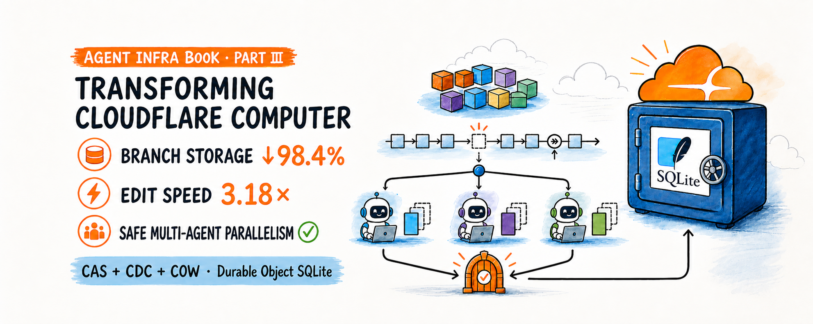
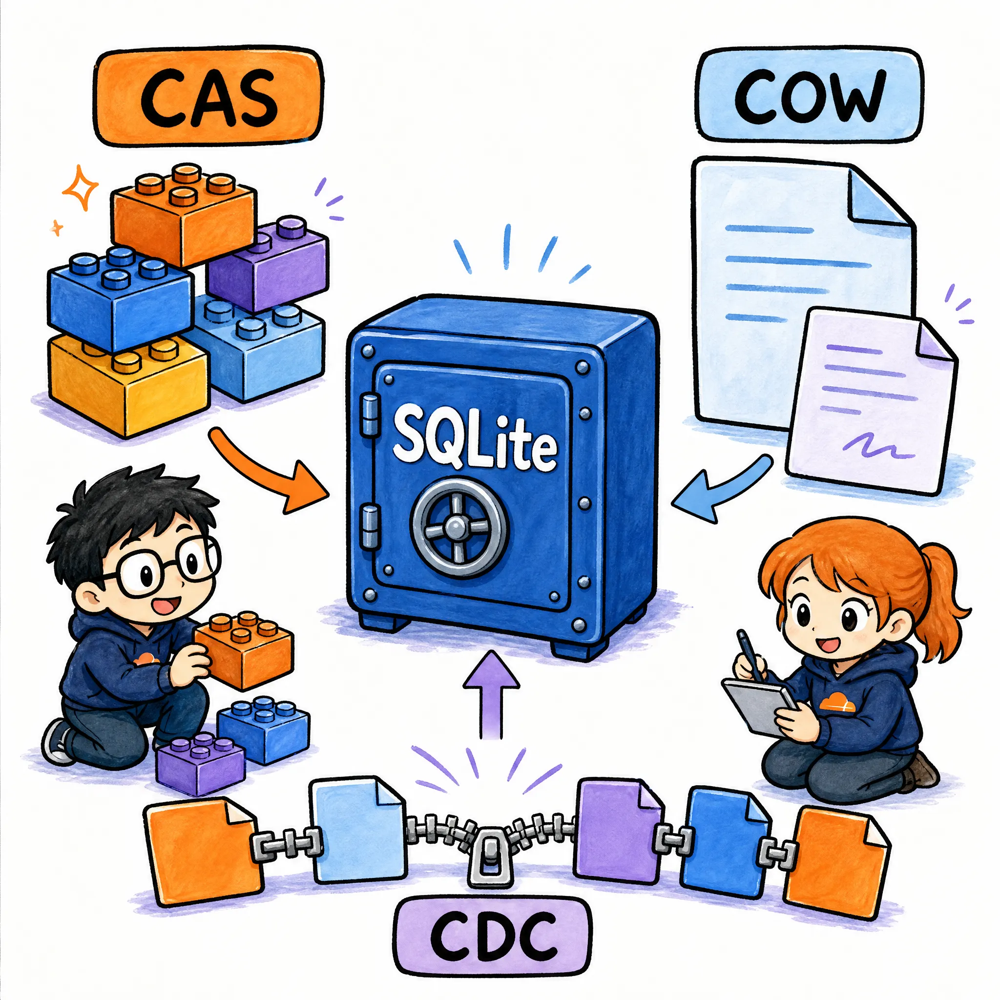
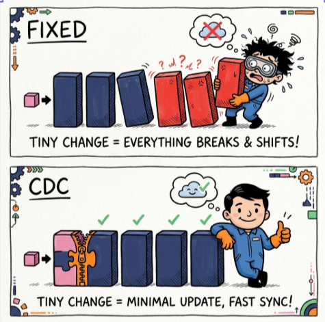

# Transforming Cloudflare Computer: 98.4% Less Branch Storage, 3.18× Faster Edits, and Safe Multi-Agent Parallelism

**If an agent changes one byte, should the system store another 512 KiB? If
50 agents work at once, should it create 50 complete workspaces?**

Cloudflare Computer already solves an important problem: project files remain
durable in a Durable Object SQLite database, while Linux appears only when an
operation needs `computerd`, FUSE, and native tools.

But frequent checkpoints, large files, and multiple writers expose a second
problem: how should that durable workspace represent incremental work?

We built an experimental prototype called **C3**:

```text
C3 = CAS + CDC + COW
```

- **CAS** stores identical content once.
- **CDC** finds old content after offsets move.
- **COW** stores only privately changed pages.
- **Branch + Publish** separates work and orders commits.

C3 does not replace Durable Objects or modify Cloudflare's underlying storage
engine. It changes only the application-level file representation stored in
Durable Object SQLite.

<p align="center">
  
</p>

## TL;DR

- **98.4% less branch-exclusive content:** 50 agents each changed one byte in
  a private 256 KiB file; storage fell from 12,804 KiB to 200 KiB.
- **3.18× faster tiny edits:** across 10 paired full Computer/FUSE runs,
  16 durable edits fell from 5,122 ms to 1,608.5 ms.
- **3.81× faster front insertion:** inserting 10 bytes at the front fell from
  1,638 ms to 430 ms.
- **No silent overwrites:** when 50 agents competed on one file, C3 accepted
  one publication and returned 49 explicit conflicts.
- **There is a real cost:** initial creation of a 32 MiB file was 37% slower.
- **Synchronization is now the bottleneck:** an 8.2 KiB branch still moved
  6 MiB through cold push and pull.

The complete article, implementation, and recorded results live in the
[Agent Infra Book](https://github.com/agent-infra-foundation/agent-infra-book/tree/main/cloudflare/computer).

---

## The problem is not saving files—it is how much each edit saves

Cloudflare Computer uses fixed **512 KiB chunks**, SHA-256 hashes, and exact
content deduplication. This is simple and effective for ordinary overwrites:
changing one location usually replaces one chunk.

Two workloads are less friendly:

1. **Frequent tiny edits:** a one-byte private change may still create a new
   512 KiB chunk.
2. **Front insertion:** every later fixed offset moves, so many later chunks
   can receive different content.

Multiple agents amplify the issue. If every agent materializes a complete
workspace, storage approaches:

```text
workspace size × number of agents
```

A conceptual 10 GiB workspace with 50 complete copies becomes 500 GiB.

The desired model is different:

```text
shared immutable content
  + small private agent changes
  + one transactional publisher
```

<p align="center">
  
</p>

### Keep the system boundary honest

C3 does not describe how Cloudflare implements the distributed storage below
Durable Objects. It changes the same layer as Computer's own VFS: application
tables created through `ctx.storage.sql`.

```text
Cloudflare Computer / C3
          |
          v
Durable Objects SQLite API
          |
          v
Cloudflare-managed storage
```

The comparison is therefore between two application-level representations:

- **Baseline:** Computer's fixed 512 KiB chunks and manifests.
- **C3:** CAS objects, CDC manifests, COW pages, and branch metadata.

Durable Object identity, request ordering, and SQLite transactions remain in
place. C3 uses those properties; it does not claim them as prototype results.

---

## Step 1: CAS gives every agent one shared base

Content-addressed storage identifies an object by its content hash:

```text
hash-A -> bytes A
hash-B -> bytes B
hash-X -> Agent A's new bytes
```

Main and every branch can reference the same immutable objects:

```text
main    -> [A, B, C]
agent-a -> [A, X, C]
agent-b -> [A, B, C]
```

Creating a branch writes metadata instead of copying a checkout:

```sql
INSERT INTO branches
  (branch_id, base_commit, state)
VALUES
  ('agent-a', 42, 'active');
```

Branch creation now scales with metadata, not workspace size.

CAS alone is insufficient because it recognizes only exact equality:

```text
SHA256("abcdef")
  !=
SHA256("Xabcdef")
```

It removes complete duplicate objects, but it does not automatically make
small edits cheap.

Implementation:
[`cas-cdc-cow.ts`](https://github.com/agent-infra-foundation/agent-infra-book/blob/30f0a01fe5e8878140a3ffbcd5c07b1245155749/cloudflare/computer/benchmarks/cas-cdc-cow/src/engines/cas-cdc-cow.ts).

---

## Step 2: COW turns a one-byte edit into one 4 KiB page

C3 treats the main file as an immutable base. A small equal-length overwrite
stores only the touched **4 KiB COW page**.

```text
BASE
[0][1][2][3][4]
       |
       +-- Agent A changes 10 B

agent-a
[base][base][private][base][base]
```

Repeated writes to the same page replace the same SQLite row rather than
appending another complete file representation.

<p align="center">
  
</p>

In the 50-agent experiment, each agent changed one byte in a different private
256 KiB file:

| Branch storage | Baseline → C3 | Change |
| --- | ---: | ---: |
| Exclusive content | 12,804 → 200 KiB | **−98.4%** |
| SQLite growth | 12,880 → 232 KiB | **−98.2%** |
| Per agent | 256.1 → 4 KiB | **about 1/64** |

“Exclusive content” includes private pages, branch-only CAS objects, manifests,
and structural patches. It is not a selectively chosen internal counter.

[See the complete 50-agent result](https://github.com/agent-infra-foundation/agent-infra-book/blob/30f0a01fe5e8878140a3ffbcd5c07b1245155749/cloudflare/computer/benchmarks/cas-cdc-cow/results/multi-agent-latest.md).

### COW reads and fallbacks

A branch read starts from its base manifest, then overlays private pages and
ordered structural patches:

```text
branch view
  = base bytes
  + private pages
  + ordered patches
```

Other agents and main cannot see those changes before publication. Isolation
comes from branch identity, not from duplicating complete files.

COW is not the right representation for every write:

| Change shape | Private representation |
| --- | --- |
| Small equal overwrite | 4 KiB COW pages |
| Insert or delete | Ordered patch |
| Large replacement | CDC/CAS materialization |
| Too many patches | Full-file fallback |

Widely distributed edits and complete rewrites may still approach
O(file size). The fallback preserves correctness and bounds metadata; it does
not promise constant-time writes.

---

## Step 3: CDC keeps a front insertion local

Fixed chunks depend on absolute offsets:

```text
before  [ A ][ B ][ C ][ D ]
insert  [A'][B'][C'][D']...
```

Content-defined chunking chooses boundaries from the content:

```text
before  [ A ][ B ][ C ][ D ]
insert  [new prefix][ B ][ C ][ D ]
                    ^ resynchronized
```

<p align="center">
  
</p>

C3 uses a compact FastCDC-style rolling Gear fingerprint:

| Chunk parameter | Value |
| --- | ---: |
| Minimum | 32 KiB |
| Target average | 128 KiB |
| Maximum | 512 KiB |

To avoid rescanning a complete large file after every tiny edit, C3 starts near
the dirty region and stops after reconnecting with an old boundary:

```text
old [A][B][C][D][E][F]
          ^ edit

new [A][B][C'][D'][E][F]
    reuse   new    reuse
```

Implementation:
[`fastcdc.ts`](https://github.com/agent-infra-foundation/agent-infra-book/blob/30f0a01fe5e8878140a3ffbcd5c07b1245155749/cloudflare/computer/benchmarks/cas-cdc-cow/src/engines/fastcdc.ts).

### CDC moves cost; it does not erase it

Fixed chunking is cheap: offset arithmetic finds the affected chunk. CDC must
compute rolling fingerprints, maintain finer manifests, and search for known
boundaries during publication.

```text
baseline
edit -> copy a fixed chunk now

C3
edit -> write a sparse page
publish -> local CDC + manifest update
```

In an engine test with 1,000 one-byte overwrites to a 16 MiB file, baseline
took about 4.02 seconds. C3 spent 274 ms on private edits and 124 ms on
publication—398 ms total, or 10.1× faster.

But a write-once file may never recover the first CDC scan. That is why the
full result must show both slower initial creation and faster later edits.

---

## Step 4: Branch + Publish enables parallel work without silent loss

Each branch records two pieces of base state:

- the main commit from which it started;
- the base manifest of every changed file.

Agents edit privately. One Durable Object SQLite transaction orders accepted
publications:

```text
agent-a --private work--+
                        |
agent-b --private work--+--> publish
                        |      |
agent-c --private work--+      v
                         SQLite main
```

<p align="center">
  
</p>

Publication performs a file-level optimistic check:

```ts
if (mainHash !== branch.baseHash) {
  return "conflict";
}
```

- Different files can publish independently.
- Two writers to one file produce one winner and one conflict.
- Create, delete, and rename participate in namespace checks.
- Retrying one operation ID returns the recorded result.

When 50 agents changed the same file:

| Outcome | Baseline | C3 |
| --- | ---: | ---: |
| Reported merged | 50 | 1 |
| Explicit conflicts | 0 | 49 |
| Silently lost updates | **49** | **0** |

The baseline appears to accept every publication, but only one value survives.
C3's 49 conflicts are the boundary that prevents silent data loss.

> **A fast workspace that silently loses work is not a safe multi-agent
> workspace.**

### Why publication must be transactional

Hash computation may happen outside a transaction. Changing main must not:

```text
check base manifests
  -> insert missing objects
  -> create new manifests
  -> move main pointers
  -> advance commit
  -> mark branch merged
```

These operations either commit together or roll back together. C3 checks base
state again immediately before the synchronous SQLite transaction and records
the result under an operation ID.

This handles two common failures:

- **Concurrent movement:** main changes while hashes are prepared, so the
  second check returns a conflict.
- **Lost response:** publication commits but the caller misses the response,
  so retry returns the original result without another commit.

Fault-injection tests also cover transaction rollback, abandoned-branch GC,
truncate, and rename retry.

[See recovery and idempotency tests](https://github.com/agent-infra-foundation/agent-infra-book/blob/30f0a01fe5e8878140a3ffbcd5c07b1245155749/cloudflare/computer/benchmarks/cas-cdc-cow/src/tests/recovery.test.ts).

---

## The decisive test: keep the result through Computer and FUSE

Testing only a SQLite engine cannot establish a Cloudflare Computer result.
Both baseline and C3 therefore run through the same path:

```text
Durable Object SQLite
  -> push
  -> computerd + FUSE
  -> shell
  -> pull
  -> SQLite + verify
```

The comparison pins
[Cloudflare Computer commit `76d9e75`](https://github.com/cloudflare/computer/tree/76d9e75c5688713b656bce85540d9e0071cece8b)
and uses 10 paired runs in randomized order.

### Do not mix three evidence layers

| Evidence layer | Question answered |
| --- | --- |
| Engine | How much does the algorithm write? |
| DO request | Do requests order and publish safely? |
| Full E2E | Does it survive Computer and FUSE? |

The full E2E comparison holds the Worker, RPC, `computerd`, FUSE, shell command,
and final verification constant. Only the Workspace and execution-side DOFS
representation changes.

Each pair randomizes baseline/C3 order and reports median with quartiles. This
does not replace production testing, but it reduces fixed ordering and one-run
noise.

### Speed

| Full E2E workload | Baseline → C3 | Result |
| --- | ---: | ---: |
| Create 32 MiB | 1,618.5 → 2,219 ms | **37% slower** |
| 16 tiny edits | 5,122 → 1,608.5 ms | **3.18× faster** |
| Front insert 10 B | 1,638 → 430 ms | **3.81× faster** |
| Read and sync | 207 → 155.5 ms | **1.33× faster** |

### Storage

| Full E2E metric | Baseline → C3 | Change |
| --- | ---: | ---: |
| BLOBs after 16 edits | 8.00 → 3.20 MiB | **−60.0%** |
| BLOBs after insert | 32.00 → 0.19 MiB | **−99.4%** |
| Final SQLite size | 72.32 → 35.89 MiB | **−50.4%** |

[See the complete paired result](https://github.com/agent-infra-foundation/agent-infra-book/blob/30f0a01fe5e8878140a3ffbcd5c07b1245155749/cloudflare/computer/benchmarks/cas-cdc-cow/e2e/results/paired-volume-latest.md).

### Why is initial creation slower?

There is no old content to reuse on first write. Baseline only divides bytes
into fixed 512 KiB chunks. C3 also scans for content boundaries, encodes a
finer manifest, and builds metadata needed by later incremental work.

```text
first write: pay indexing cost
later edits: copy and write less data
```

Baseline may be better for write-once workloads. C3 becomes more attractive
when agents repeatedly edit, checkpoint, and branch large files.

---

## Two agents, two FUSE mounts, one durable main

The multi-agent E2E test adds two independent execution environments:

```text
branch A -> computerd A -> FUSE A --+
                                      +-> SQLite
branch B -> computerd B -> FUSE B --+
```

Each agent changes one byte through a real shell command, pulls the execution
delta into a private branch, and publishes to the same SQLite main.

<p align="center">
  
</p>

| Two-branch E2E | Baseline → C3 |
| --- | ---: |
| Exclusive branch content | 1.00 MiB → **8.2 KiB** |
| SQLite growth | 1.01 MiB → **0.01 MiB** |
| Total wall time | 323.0 → **316.5 ms** |
| Silent losses in conflicts | 4 → **0** |

The result also exposes the next bottleneck:

> **An 8.2 KiB branch still moved 4 MiB during cold push and 2 MiB during
> pull.**

C3 dramatically compresses private storage, but Computer's full
materialization and synchronization remain expensive at higher concurrency.

[See the two-branch presentation result](https://github.com/agent-infra-foundation/agent-infra-book/blob/30f0a01fe5e8878140a3ffbcd5c07b1245155749/cloudflare/computer/benchmarks/cas-cdc-cow/e2e/results/branches-presentation.md).

### What high-volume execution needs next

Reducing storage from 1.00 MiB to 8.2 KiB does not automatically reduce network
traffic by 99%. The prototype still constructs a complete view for a cold
executor, and pull still returns the complete changed file.

```text
today
branch -> full view -> push/pull

next
branch -> delta negotiation
       -> missing-object transfer
       -> sparse pull
```

Production work would also need executor pooling, backpressure, quotas, branch
TTL, incremental GC, crash recovery during push/pull, directory and symlink
merge semantics, migrations, and observability.

C3 demonstrates that compact branches can survive real Computer execution. It
does not demonstrate unlimited scalability or production readiness.

---

## What did this transformation change?

| Goal | C3 mechanism |
| --- | --- |
| Less storage | Shared CAS + sparse COW + CDC |
| Faster edits | Avoid copying fixed chunks |
| Multiple agents | Private branches + safe publish |
| Preserved core | Durable Object SQLite is authoritative |

C3 is most attractive when:

- large files receive repeated small changes;
- checkpoints are frequent;
- many agents start from one workspace;
- silent last-writer-wins is unacceptable.

It does not guarantee:

- better speed for every workload;
- automatic source-code conflict resolution;
- push/pull traffic equal to COW payload;
- production-grade Cloudflare reliability;
- complete POSIX namespace merge semantics.

The correct description is **a runnable prototype with full-pipeline evidence**.

---

## Code and reproduction

Run the core checks:

```powershell
cd cloudflare/computer/benchmarks/cas-cdc-cow
npm.cmd test
npm.cmd run typecheck
```

Run paired Computer/FUSE experiments:

```powershell
cd e2e
npm.cmd run paired:volume
npm.cmd run paired:branches
```

- [Complete C3 prototype and benchmarks](https://github.com/agent-infra-foundation/agent-infra-book/tree/main/cloudflare/computer/benchmarks/cas-cdc-cow)
- [Full English Part III](https://github.com/agent-infra-foundation/agent-infra-book/blob/main/cloudflare/computer/chapters/PART-III.md)
- [Computer/FUSE branch adapter](https://github.com/agent-infra-foundation/agent-infra-book/blob/main/cloudflare/computer/benchmarks/cas-cdc-cow/e2e/template/branch-computer.ts)
- [50-agent Durable Object test](https://github.com/agent-infra-foundation/agent-infra-book/blob/main/cloudflare/computer/benchmarks/cas-cdc-cow/src/tests/multi-agent-do.test.ts)
- [Machine-readable E2E results](https://github.com/agent-infra-foundation/agent-infra-book/tree/main/cloudflare/computer/benchmarks/cas-cdc-cow/e2e/results)

---

## Continue reading Agent Infra Book

This article comes from the open-source
[Agent Infra Book](https://github.com/agent-infra-foundation/agent-infra-book),
a systems-engineering book about the infrastructure behind coding agents:
sandboxes, durable workspaces, and execution architecture.

- [Star and follow Agent Infra Book](https://github.com/agent-infra-foundation/agent-infra-book)
- [Read the Cloudflare Computer series](https://github.com/agent-infra-foundation/agent-infra-book/tree/main/cloudflare/computer)
- [Read Part I: Cloudflare Durable Objects](https://github.com/agent-infra-foundation/agent-infra-book/blob/main/cloudflare/computer/chapters/PART-I.md)
- [Read Part II: Cut Agent Sandbox Costs by 80%](https://github.com/agent-infra-foundation/agent-infra-book/blob/main/cloudflare/computer/chapters/PART-II-X-ARTICLE.md)

> **If you are building coding agents, durable workspaces, or multi-agent
> execution systems, reproduce the experiment, challenge it, and help improve
> the prototype.**

Cloudflare Computer remains preview software. These experiments use local
workerd, pinned source, and controlled workloads. They are not claims about
Cloudflare production throughput or latency.
