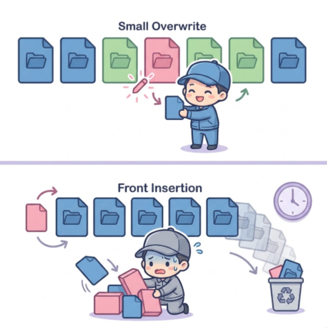

# Part I — Introducing Cloudflare Durable Objects

An agent's machine may disappear between two requests. Its identity and
workspace should not.

> <u>**Mental model:**</u>
> **Stable identity does not mean a permanent process.** A Durable Object owns
> the durable state; execution can be reconstructed around it.


*Figure 1: Execution can disappear while identity and committed state survive.
The illustration is conceptual; Durable Object memory and storage boundaries
are defined precisely below.*

## TL;DR

- **Durable Objects give state an owner:** one stable address, one coordination
  point, and private transactional storage for each logical entity.
- **Computer turns SQLite into a filesystem:** its authoritative VFS lives
  inside the Workspace Durable Object's SQLite database.
- **FUSE exposes a disposable execution copy:** it mounts the VFS in
  `computerd`, **not** the Durable Object database directly.
- **A shell write becomes durable after synchronization:** Computer pulls the
  execution-side change into the authoritative Workspace.
- <u>**Storage trade-off:**</u> exact content deduplicates well, but fixed
  512 KiB boundaries amplify some tiny edits and front insertions.
- <u>**Speed trade-off:**</u> native compatibility adds FUSE crossings;
  durability adds push/pull synchronization.

```text
logical workspace identity
    │
    ▼
Durable Object: stable owner + private SQLite
    │
    ├── authoritative Computer VFS
    │
    └── push → disposable computerd VFS → FUSE → native command → pull
```

This article distinguishes three kinds of evidence:

| Label | What it establishes |
| --- | --- |
| **Platform contract** | Durable Objects identity, execution, and storage behavior documented by Cloudflare. |
| **Open-source implementation** | Computer behavior verified at commit [`76d9e75`](https://github.com/cloudflare/computer/tree/76d9e75c5688713b656bce85540d9e0071cece8b). |
| **Measured behavior** | Results from the local WSL2, workerd, computerd, and real-FUSE benchmark in this repository. |

The [chapter research sources](part-i/) preserve additional implementation
detail. This article keeps the shortest path to a usable mental model.

---

## Chapter 1 — Durable Objects: Stateful Serverless from First Principles

> <u>**Fundamental definition:**</u>
> A Durable Object is **one addressable instance of application code, one
> coordination point, and one private durable storage unit**.

### What problem were Durable Objects created to solve?

Serverless compute made the request—not the server—the unit of work. It worked
well for stateless logic, but stateful applications still needed a separate
database and coordinator.

Cloudflare's original 2020 Durable Objects article identified two missing
capabilities in the Workers model:

| Missing capability | Why stateless execution was insufficient |
| --- | --- |
| **Strong state** | An eventually consistent store could not safely resolve frequent conflicting updates. |
| **Coordination** | Requests could land on different Worker instances, so clients had no stable place to meet in real time. |

```text
STATELESS REQUESTS                         DURABLE OBJECT

request ──► Worker A ──► memory ✕          request ──► stable object identity
request ──► Worker B ──► memory ✕                           │
                                                             ▼
                                                    ┌──────────────────┐
state ─────► separate database                      │ one coordinator  │
clients ───► separate coordinator                   │ private storage  │
                                                    └──────────────────┘
```

A collaborative document makes both problems concrete. Editors need one place
to order concurrent changes, broadcast them immediately, and persist accepted
state. Sending every keystroke through a distant database adds latency; sending
requests to unrelated stateless instances provides no common coordinator.

Durable Objects make the **logical unit of application state** the unit of
serverless state. A chat application can use one object per room, a document
editor one per document, and a game one per match. Cloudflare manages where
each object runs and reconstructs its execution when needed.

### What is a Durable Object?

The launch article explained the name by separating three ideas. That remains
the simplest introduction:

| Word | Meaning |
| --- | --- |
| **Object** | An instance of an application-defined class: code plus private state and methods. |
| **Unique** | The instance has a globally addressable identity. Requests using that identity reach the same logical object. |
| **Durable** | The instance owns persistent storage that survives the loss of its current in-memory incarnation. |

The complete structure is therefore larger than a database:

```text
Durable Object namespace (one application-defined class)
    │
    ├── object ID A
    │     ├── one active coordinator when needed
    │     ├── disposable in-memory state
    │     └── private durable storage
    │
    ├── object ID B
    │     ├── one active coordinator when needed
    │     ├── disposable in-memory state
    │     └── private durable storage
    │
    └── object ID C ...
```

A **namespace** binds an application to a Durable Object class and provides the
API for locating instances. An **ID** identifies one instance. A **stub** is the
client-side reference used by a Worker to send HTTP or RPC requests to that
instance. Other Workers and Durable Objects do not open its database directly;
they communicate with the owning object.

### What are its two fundamental abilities?

The launch article described **storage** and **coordination** as separate but
complementary abilities:

```text
                         Durable Object
                              │
                 ┌────────────┴────────────┐
                 │                         │
           coordination                  storage
                 │                         │
       route related requests      persist accepted state
       to one active owner         in private transactions
                 │                         │
                 └────────────┬────────────┘
                              ▼
                  one logical stateful entity
```

| Ability | What it provides | Can it be used alone? |
| --- | --- | --- |
| Coordination | A stable destination where related requests and connections meet. | Yes. A short-lived rate limiter may tolerate losing in-memory history. |
| Storage | Private, strongly consistent, transactional state attached to one object. | Yes. An object may primarily expose a storage-backed API. |
| Both | A live coordinator that persists the authoritative result of its decisions. | This is the common model for rooms, documents, games, jobs, and workspaces. |

The distinction matters: Durable Objects are not merely “SQLite at the edge.”
Their central abstraction is **an owner for a logical piece of state**. Storage
lets that owner recover; coordination lets it make decisions while active.

### What is Durable Object Storage?

Durable Object Storage is the private storage attached to one Durable Object
instance. It is:

| Property | Practical meaning |
| --- | --- |
| **Private** | Only the owning object's code accesses it directly. |
| **Colocated** | Compute and storage share the object's placement, avoiding a separate application-to-database network hop. |
| **Strongly consistent** | A successful read observes the storage model's accepted ordering rather than an eventually consistent replica. |
| **Transactional** | Related SQL or key-value operations can preserve invariants atomically. |
| **Durable** | Committed state survives eviction and reconstruction of the JavaScript incarnation. |

For current SQLite-backed Durable Objects, the attached storage has several
surfaces over one object-owned database:

```text
Durable Object instance
    │
    └── ctx.storage
          ├── SQL tables
          ├── key-value API backed by hidden SQLite storage
          ├── alarm state
          └── point-in-time recovery for the embedded database
```

| Storage surface | Purpose |
| --- | --- |
| SQL API | Define tables, query structured state, and use SQLite transactions. |
| Synchronous KV API | Read and write key-value state through `ctx.storage.kv`. |
| Asynchronous KV compatibility API | Preserve the familiar `get`, `put`, `delete`, and `list` interface. |
| Alarms | Persist a future wake-up time for object-owned scheduled work. |
| PITR | Restore the whole embedded SQLite database within the platform recovery window. |

#### Why SQLite rather than a KV-only backend?

```text
LEGACY KV-ONLY                          SQLITE-BACKED STORAGE

┌──────────────────┐                   ┌────────────────────────────┐
│ key ──► value    │                   │ SQL tables + indexes       │
│ key ──► value    │                   │ multi-record transactions  │
│ key ──► value    │         ──►       │                            │
└──────────────────┘                   │ ┌────────────────────────┐ │
                                       │ │ KV compatibility       │ │
                                       │ └────────────────────────┘ │
                                       │ alarms + database PITR     │
                                       └────────────────────────────┘
```

SQLite does not discard the key-value model. It places KV inside a more general
transactional engine, so one object can use simple keys and structured tables
together. Computer needs that broader model for paths, inodes, chunks,
manifests, and synchronization metadata.

The 2020 article describes a beta-era storage API, so this chapter uses current
documentation for API details: new namespaces should use SQLite-backed
storage; the legacy backend exposes only key-value storage.

**Sources:** [Workers Durable Objects Beta: A New Approach to Stateful Serverless](https://blog.cloudflare.com/introducing-workers-durable-objects/),
[current Durable Objects concepts](https://developers.cloudflare.com/durable-objects/concepts/what-are-durable-objects/),
[namespace API](https://developers.cloudflare.com/durable-objects/api/namespace/),
[SQLite-backed Durable Object Storage](https://developers.cloudflare.com/durable-objects/api/sqlite-storage-api/),
and [legacy KV storage API](https://developers.cloudflare.com/durable-objects/api/legacy-kv-storage-api/).

---

## Chapter 2 — Computer: SQLite Becomes a Filesystem Through FUSE

> <u>**Critical boundary:**</u>
> **FUSE mounts computerd's disposable VFS, not Durable Object SQLite.**


*Figure 2: Computer synchronizes the authoritative Workspace VFS with a
disposable execution-side VFS. FUSE exposes the latter to native commands; it
does not mount Durable Object SQLite directly.*

### Where is the authoritative filesystem?

In the Durable Object deployment discussed here, Cloudflare Computer creates an
application-level **virtual filesystem (VFS)** inside the Workspace object's
SQLite database. A VFS is a filesystem data model implemented by software:
paths, directories, file metadata, content references, and file operations.

Native programs cannot issue SQL or Workspace RPCs when they call `open()`.
Computer therefore uses two VFS instances:

```text
┌─────────────────────────────────────────────────────────┐
│ Workspace Durable Object                               │
│                                                         │
│  private SQLite                                         │
│      └── authoritative Computer VFS                     │
└──────────────────────────┬──────────────────────────────┘
                           │ push / pull synchronization
                           ▼
┌─────────────────────────────────────────────────────────┐
│ disposable Linux execution environment                  │
│                                                         │
│  computerd in-memory SQLite VFS                         │
│      └── FUSE projection ──► /workspace                 │
│                                  └── npm, git, ls, cat   │
└─────────────────────────────────────────────────────────┘
```

**FUSE**, or Filesystem in Userspace, lets a userspace process implement a
filesystem that the Linux kernel exposes at a normal path. **computerd** is
Computer's execution-side daemon; it owns the disposable VFS and implements the
FUSE callbacks. Push and pull synchronize that execution copy with the
authoritative VFS.

| Layer | Durable owner? | Job |
| --- | ---: | --- |
| Workspace Durable Object SQLite VFS | Yes | Stores authoritative paths, file layout, payloads, and revisions. |
| computerd SQLite VFS | No | Provides a reconstructible execution copy. |
| FUSE mount | No | Translates Linux filesystem calls into computerd VFS operations. |
| Native process | No | Uses `/workspace` as if it were an ordinary filesystem. |

With `FUSE_MOUNT=auto`, computerd can fall back to a userspace shim when a real
kernel FUSE mount is unavailable. The benchmark in Chapter 4 required and
verified a real FUSE mount.

### Which filesystem does a native `read()` reach?

Suppose a native process reads `/workspace/package.json`:

```text
cat /workspace/package.json
  │
  ├── Linux open/read syscalls
  ▼
kernel VFS → FUSE → fuse-native → computerd FUSE driver
                                      │
                                      ├── translate mounted path
                                      └── read from pending memory or
                                          local SQLite chunk rows
```

The program does not know its working tree originated in a Durable Object. This
compatibility is why native shells, Git, compilers, package managers, and
development tools can operate without being rewritten to call `Workspace.fs`.
The implementation is broad POSIX-style compatibility, not a claim of perfect
POSIX equivalence.

### How does SQLite represent a file?

Computer's VFS can be learned in three layers:

| Layer | Question | Main tables in the pinned implementation |
| --- | --- | --- |
| **Namespace** | Which path name points to which inode? | `vfs_nodes`, `vfs_dirents` |
| **File layout** | Which ordered chunks form this file? | `vfs_chunks`, optional `vfs_manifests` |
| **Payload store** | Which bytes belong to each content hash? | `vfs_blobs`, `vfs_blob_bytes` |

An **inode** is the VFS record for a filesystem object; a directory entry maps
a name under a parent directory to that inode. A **manifest** can identify an
ordered chunk list. A **content-addressed store (CAS)** identifies payloads by
their content hash, so byte-identical payloads can reuse one stored object.

Computer splits files at fixed boundaries of **at most 512 KiB**, hashes each
piece with SHA-256, and deduplicates matching payloads inside one Workspace
database:

```text
Computer VFS
    = SQLite metadata
    + fixed windows of at most 512 KiB
    + SHA-256 payload identities
    + database-local exact-content deduplication
```

The 512 KiB value is a **maximum chunk size, not a minimum allocation**. A
10-byte file has a 10-byte payload. A tiny overwrite inside an existing full
chunk can, however, create a new 512 KiB payload; Chapter 4 measures that case.

#### Worked trace: a 1 MiB file plus 10 bytes

Use a large `/workspace/model.bin` to make the chunk geometry visible:

```text
/workspace/model.bin
    │
    ├── namespace: parent + "model.bin" → inode 42
    ├── node: inode 42, type=file, size=1 MiB + 10 B
    ├── ordered file layout
    │      index 0 → H1, 512 KiB
    │      index 1 → H2, 512 KiB
    │      index 2 → H3, 10 B
    └── optional manifest: identity for [H1, H2, H3]

H1 / H2 / H3 → payload metadata → payload bytes
```

An exact copy gets separate namespace and inode metadata but can reuse H1, H2,
and H3. A hardlink shares an inode instead. A **revision** is the VFS change
number used to order mutations; a **watermark** records synchronization
progress. Neither is a user-visible checkpoint by itself.

### What happens during a whole-file write?

The essential algorithm is small:

```ts
// Explanatory pseudocode based on Computer's pinned write path.
function writeFile(path, bytes) {
  const pieces = splitIntoFixedWindows(bytes, 512 * KiB);

  transaction(() => {
    const chunkRefs = pieces.map(piece => {
      const hash = sha256(piece);
      insertBlobIfMissing(hash, piece); // exact-content reuse in this DB
      return { hash, size: piece.length };
    });

    const manifestHash = getOrCreateManifest(chunkRefs);
    const revision = incrementGlobalRevision();
    replaceFileChunks(path, chunkRefs);
    updateNode(path, { manifestHash, revision, size: bytes.length });
  });
}
```

The real implementation has more paths. Streaming writes can stage payloads
before their final metadata transaction. Direct range writes may leave
`manifest_hash` null; ordered `vfs_chunks` remain authoritative. Sync-side
`stageBlob()` trusts its supplied hash rather than recomputing it, so the pinned
path is not proof of end-to-end CAS integrity checking.

Fixed chunks are also not **content-defined chunking (CDC)**. CDC chooses
boundaries from a rolling content fingerprint and can resynchronize after an
insertion. Computer's fixed windows keep indexing and transfer logic simpler,
but a front insertion shifts all later windows.

### Is FUSE only a compatibility layer?

It is also a performance policy. Computer aligns kernel-facing I/O with the
storage chunk size and caches metadata:

| FUSE choice | Pinned default | Purpose |
| --- | ---: | --- |
| `max_read` / `max_write` | 512 KiB maximum | Match `CHUNK_SIZE` and avoid repeated smaller SQL lookups. |
| `big_writes` | Enabled | Allow larger kernel write requests. |
| `auto_cache` | Enabled | Reuse page-cache data until size or mtime changes. |
| Attribute and entry cache | 1 second | Reduce repeated crossings from `ls -l`, `find`, and `git status`. |
| Negative cache | 0 seconds | Reveal newly created paths after an earlier miss. |

Small writes are buffered so every syscall does not immediately hash and store
an intermediate payload. The last file-handle release can rehash and commit the
complete file to computerd's local VFS. This improves compatibility and avoids
some write amplification, but creates another cache and durability boundary.

FUSE explains **where native filesystem calls land**. It does not yet explain
**when their results become durable**. That is the command lifecycle in Chapter
3.

**Sources:** pinned [filesystem schema](https://github.com/cloudflare/computer/blob/76d9e75c5688713b656bce85540d9e0071cece8b/docs/03_filesystem_schema.md),
[`CHUNK_SIZE` and write paths](https://github.com/cloudflare/computer/blob/76d9e75c5688713b656bce85540d9e0071cece8b/packages/dofs/src/fs/writeFile.ts),
[core VFS schema](https://github.com/cloudflare/computer/blob/76d9e75c5688713b656bce85540d9e0071cece8b/packages/dofs/src/schema/core.ts),
[sync protocol](https://github.com/cloudflare/computer/blob/76d9e75c5688713b656bce85540d9e0071cece8b/docs/02_sync_protocol.md),
[FUSE options](https://github.com/cloudflare/computer/blob/76d9e75c5688713b656bce85540d9e0071cece8b/packages/computerd/src/fuse/options.ts),
and [FUSE implementation](https://github.com/cloudflare/computer/tree/76d9e75c5688713b656bce85540d9e0071cece8b/packages/computerd/src/fuse).

---

## Chapter 3 — Follow One Command from Push to Durable Pull

> <u>**Durability boundary:**</u>
> **A successful shell exit does not confirm that its files reached the
> Workspace. `await run.result()` drains output and waits for the pull.**

### When does `npm install` become durable?

With a remote computerd backend, `Workspace.runtime.exec()` creates an
**execution bracket** around the command: it pushes current state before the
command and pulls accepted changes after the event stream is fully drained.

```text
authoritative Workspace
          │
          ├── 1. push current revisions
          ▼
disposable computerd VFS
          │
          ├── 2. expose /workspace through FUSE
          ├── 3. run /bin/sh -c "npm install"
          ├── 4. release modified file handles
          └── 5. report changed paths and chunks
          │
          ▼
authoritative Workspace
          ├── 6. stage missing payloads
          ├── 7. apply filesystem mutations
          └── 8. advance synchronization cursor
```

The actual API surface is compact:

```ts
const workspace = new Workspace({
  storage: state.storage,
  backends: [new LocalComputerdBackend(env.COMPUTERD_URL)],
});

using run = await workspace.runtime.exec("npm install", {
  backend: "local-computerd",
  encoding: "utf8",
});

const result = await run.result();
```

The example assumes the selected native environment provides Node.js and npm.
Computer supplies the storage and execution plumbing; it does not make every
binary appear inside an otherwise empty image.

### What exactly does `await run.result()` do?

Computer's command API produces an event stream. Post-command pull is scheduled
after that stream is completely consumed. `result()` performs the drain and
waits for the pull outcome. Cancelling the stream early can bypass that step.

Keep two results separate:

```text
process exit code  → did the command finish successfully?
pull outcome       → did accepted filesystem state reach the Workspace?
```

The write path crosses several visibility levels:

| Event | Visible to shell? | In computerd VFS? | Durable in Workspace? |
| --- | ---: | ---: | ---: |
| `write()` accepted by FUSE | Yes | In a local write buffer | No |
| `fsync()` on the current direct buffered path | Yes | Not a chunk-table commit guarantee | No |
| Last file-handle `release()` | Yes | Chunks and local revision committed | No |
| Successful pull and Durable Object apply | Yes | Yes | Yes |

**A container-side `fsync()` is not a Workspace durability primitive.** In the
pinned direct buffered path, the last release commits the local chunks; pull
and apply make them authoritative.

### Where can the execution bracket fail?

Push, process execution, and pull are separate phases—not one filesystem
transaction:

| Failure point | What the caller may conclude |
| --- | --- |
| Pre-exec push fails | Computer records `pushed = 0` but still starts the command; computerd may be stale. |
| Command writes through FUSE | The change exists on the execution side, not yet in the Workspace. |
| computerd disappears before synchronization | Unsynchronized local changes can disappear with the disposable VFS. |
| Pull transport or apply fails | Full convergence is unconfirmed; a batch prefix may already be accepted, so retry and reconciliation must be safe. |
| Pull completes | The result reports an applied count and path-level skipped entries for that pull. |
| Event stream is cancelled early | Post-command pull may never be scheduled. |

This distinction matters for an agent. It should not report “dependency update
saved” from the process exit code alone. It should preserve command status,
pull status, and any skipped paths as separate facts.

### Can Code Mode run `npm install`, or only simulated Bash?

Computer exposes more than one execution path:

```text
Workspace.fs ────────────────────────────────► authoritative VFS
isolate filesystem capability ──────────────► authoritative VFS
just-bash Workspace adapter ────────────────► authoritative VFS

native Linux process ─► FUSE VFS ─► pull ──► authoritative VFS
```

`just-bash` provides Bash syntax plus JavaScript implementations of commands.
It is useful for portable, capability-scoped file and shell workflows. It is
not a Linux operating system and cannot execute arbitrary native binaries.

`npm install`, compilers, development servers, and native tools belong on the
native Linux branch. There, FUSE gives unmodified programs a normal-looking
`/workspace`; Computer's push/pull protocol gives their output a path back to
durable authority. Direct `Workspace.fs`, isolate, and just-bash paths avoid
the second synchronized VFS when native compatibility is unnecessary.

Now that **command time** and **durability time** are separate concepts, Chapter
4 can measure both.

**Sources:** pinned [sync protocol](https://github.com/cloudflare/computer/blob/76d9e75c5688713b656bce85540d9e0071cece8b/docs/02_sync_protocol.md),
[`runtime.exec()` push/pull bracket](https://github.com/cloudflare/computer/blob/76d9e75c5688713b656bce85540d9e0071cece8b/packages/computer/src/shell.ts),
[`result()` event draining](https://github.com/cloudflare/computer/blob/76d9e75c5688713b656bce85540d9e0071cece8b/packages/computer/src/runtime/runtime.ts),
[computerd `/bin/sh -c` runner](https://github.com/cloudflare/computer/blob/76d9e75c5688713b656bce85540d9e0071cece8b/packages/computerd/src/exec/runner.ts),
[`Workspace` sync API](https://github.com/cloudflare/computer/blob/76d9e75c5688713b656bce85540d9e0071cece8b/packages/computer/src/workspace.ts),
and [computerd FUSE implementation](https://github.com/cloudflare/computer/tree/76d9e75c5688713b656bce85540d9e0071cece8b/packages/computerd/src/fuse).

---

## Chapter 4 — Measure the Storage and Speed Costs

> <u>**Measured weakness:**</u>
> A **10-byte overwrite** inside a full chunk created **512 KiB** of new unique
> payload. A **10-byte prepend** to 32 MiB created about **32 MiB**.



*Figure 3: Edit shape determines storage amplification. The illustration is
conceptual; the exact retained benchmark measurements appear below.*

### What should you remember from the benchmark?

The four headline findings are enough to guide an initial design review:

| Operation | Measured result | Interpretation |
| --- | ---: | --- |
| Duplicate a 274.781 MiB tree | **0 additional unique payload bytes**; database +1.727 MiB | Exact-content deduplication is strong. |
| Overwrite 10 bytes in one full chunk | **512 KiB new unique payload** | Fixed chunks amplify tiny overwrites. |
| Prepend 10 bytes to a 32 MiB file | **about 32 MiB new unique payload** | Front insertion shifts every later fixed boundary. |
| Recursive `ls -lR` over 6,385 files | **0.921 seconds native; 14.4 seconds through FUSE** | Metadata-heavy traversal pays repeated bridge and VFS costs. |

These results do not make Computer universally fast or slow. They reveal which
workload shapes agree with its design.

### Was the full Computer path actually exercised?

Yes. The benchmark compared the native WSL2 filesystem with the complete local
Computer path, using 6,385 files totaling 274.781 MiB and the pinned Computer
implementation without source changes:

```text
native baseline
    Bash → native WSL filesystem

Computer full path
    Workspace Durable Object SQLite
        → push
        → computerd SQLite VFS
        → real FUSE mount
        → Bash
        → pull
        → Workspace Durable Object SQLite verification
```

The integration constructs the official `Workspace`, passes Durable Object
storage, connects the official RPC client to an already-running local
computerd, and calls `Workspace.runtime.exec()`. The complete construction and
execution path fits in [48 lines](../benchmarks/storage/local-pipeline/computer-in-48-lines.ts).

`LocalComputerdBackend` changes only how the local benchmark reaches computerd:
it opens a direct WebSocket instead of starting a production Cloudflare
Container and waiting for a reverse connection. It does not replace Computer's
VFS, chunking, synchronization, FUSE, or command runner.

This is local implementation evidence, not a production Cloudflare deployment
or billing measurement. The raw artifact pins and hashes the Computer packages.
It does not record the exact Wrangler/workerd versions selected from the sibling
checkout, which limits exact environment reproduction without changing the
reported values.

### How much space does the durable VFS consume?

Four columns answer different questions:

| Measure | Meaning |
| --- | --- |
| Logical bytes | Current file content visible in the Workspace. |
| Unique blobs | Distinct content-addressed payload bytes. |
| Orphans | Stored payloads no longer reachable from current files. |
| `sql.databaseSize` | Payload, metadata, indexes, and SQLite allocation overhead. |

```text
COMPUTER DATABASE THROUGH THE FILE LIFECYCLE

Initial tree       282.0 MiB = 274.8 reachable +   0.0 orphan + 7.2 overhead
Exact duplicate    283.8 MiB = 274.8 reachable +   0.0 orphan + 9.0 overhead
                              +274.8 MiB logical data, but +0 unique payload

10-byte prepend    319.3 MiB = 308.3 reachable +   2.0 orphan + 9.0 overhead
                              tiny front edit creates about 32 MiB of payload

Delete every file  318.8 MiB =   0.0 reachable + 310.3 orphan + 8.5 overhead
                              deletion removes names before GC reclaims blobs
```

**Read this top to bottom:** deduplication makes an exact copy cheap, a front
insertion defeats fixed-boundary reuse, and deletion does not immediately
shrink the database.

| Workspace state | Logical MiB | Computer DB MiB | Unique blob MiB | Orphan MiB |
| --- | ---: | ---: | ---: | ---: |
| Initial unique tree | 274.781 | 282.023 | 274.781 | 0.000 |
| Exact duplicate tree | 549.563 | 283.750 | 274.781 | 0.000 |
| One 10-byte overwrite | 549.563 | 284.250 | 275.281 | 0.000 |
| Five edits in five execution brackets | 549.563 | 286.758 | 277.781 | 2.000 |
| Five more edits in one execution bracket | 549.563 | 287.258 | 278.281 | 2.000 |
| Prepend 10 bytes to a 32 MiB file | 549.563 | 319.309 | 310.281 | 2.000 |
| Delete every file | 0.000 | 318.785 | 310.281 | 310.281 |

The exact duplicate doubled logical content while adding no unique payload.
Its 1.727 MiB database growth came from namespace, inode, layout, index, and
SQLite overhead. Deduplication therefore saves payload space without making a
second file free.

Mutation shape matters more than the user's byte count. Fixed boundaries make
an overwrite local but make a front insertion propagate:

```text
10-BYTE OVERWRITE

before   [ A: 512 KiB ][ B: 512 KiB ][ C: 512 KiB ]
after    [ A: reused  ][ B′: NEW     ][ C: reused  ]
                              ▲
                         10 bytes changed
                         512 KiB stored

10-BYTE PREPEND

before   [ A ][ B ][ C ][ D ][ E ]
            ▲ insert 10 bytes at the front
after    [ A′][ B′][ C′][ D′][ E′][tail]
           ▲   ▲   ▲   ▲   ▲
           every later fixed boundary shifts
```

```text
MEASURED NEW UNIQUE PAYLOAD

Aligned append             10 B changed ->       10 B stored          1x
One overwrite              10 B changed ->  512 KiB stored     52,429x
Five edits, one bracket     50 B changed ->  512 KiB stored     10,486x
Five edits, five brackets   50 B changed ->  2.5 MiB stored     52,429x
Front prepend              10 B changed -> ~ 32 MiB stored  3,355,444x
```

**Lower is better.** The measured amplification depends on edit location and
execution bracketing, not only on the number of bytes the user changed.

| Pattern | Storage behavior | Assessment |
| --- | --- | --- |
| Exact duplicate | Every matching payload hash is reused. | Excellent |
| Aligned append | Only tail bytes are added. | Excellent |
| Several edits in one execution bracket | Intermediate states can coalesce. | Good |
| Small random overwrite | Every touched full chunk is replaced. | Weak |
| One execution bracket per edit | Intermediate durable chunks accumulate. | Weak |
| Insert near the front | Most later fixed boundaries shift. | Worst case |

### Does every 10-byte edit consume 512 KiB?

No. **512 KiB is a maximum, not a minimum.** A small file or final tail uses a
smaller payload. The expensive case is a tiny modification inside a chunk that
was already full:

```text
CURRENT FILE
    │ replace one full chunk
    ├──► H-new ──► 512 KiB ──► referenced
    │
    └──► H-old ──► 512 KiB ──► orphan
                                   │
                                   │ last_seen older than cutoff
                                   ▼
                              GC-ELIGIBLE
                                   │
                                   │ only if internal gc() runs
                                   ▼
                            SQL ROW DELETED
                                   │
                                   └── database file may reuse pages
                                       without physically shrinking
```

Batching five writes inside one execution bracket added one replacement chunk;
making the same five writes in five brackets added five. That is good evidence
for batching related edits, but it is not a general checkpoint system.

### When are old chunks garbage-collected?

At Computer commit `76d9e75`, the code establishes an eligibility rule—not a
background schedule:

| Garbage-collection claim | Verified? |
| --- | --- |
| Internal `gc(db, options)` exists | Yes |
| Default cutoff is `last_seen < now - 1 hour` | Yes |
| The hour starts exactly when a file is unlinked | No; the field is `last_seen` |
| GC automatically runs every 30 or 60 minutes | No scheduler or caller was found |
| Public `Workspace.gc()` exists | No |
| Referenced payloads are deleted | No |
| Eligible unreferenced rows are deleted when internal GC runs | Yes |

**One hour is an eligibility cutoff, not an hourly GC promise.** The benchmark
measured immediately after deleting the entire tree and did not invoke the
internal collector. The resulting 310.281 MiB of orphan payload proves delayed
reclamation; it does not prove permanent leakage. Nor does row deletion prove
that the SQLite file immediately shrinks—freed pages may remain allocated and
be reused internally.

### Does CAS give rollback or cheap checkpoints?

No. CAS deduplicates content; **rollback requires retained version roots** that
name complete filesystem states, plus retention and GC liveness rules.
Computer's pinned design keeps the current roots. Its revisions and sync
cursors order current-state synchronization; they are not named snapshots.

| Mechanism | Available? | Scope |
| --- | ---: | --- |
| Computer CAS checkpoint graph | No, at the pinned commit | Would require file/version roots and retention policy. |
| Durable Object SQLite point-in-time recovery (PITR) | Platform feature | Restores the whole embedded database within its recovery window. |

PITR can recover the Workspace database as a whole. It does not turn Computer
manifests into user-addressable file checkpoints.

For checkpoint-heavy workloads, compare the alternatives explicitly:

| Design | Tiny overwrite | Front insertion | Main trade-off |
| --- | --- | --- | --- |
| Fixed 512 KiB chunks—shipped | One new full touched chunk | Most later chunks change | Fewer rows and simple transfer; high edit amplification. |
| Smaller fixed chunks | Smaller replacement | Boundaries still shift | More hashes, rows, and sync objects. |
| Content-defined chunking | Mostly local changed region | Boundaries can resynchronize | Rolling-hash CPU and implementation complexity. |
| Delta or patch log | Approximately the edit | Approximately the edit | Read chains, compaction, and recovery complexity. |

The skeptical conclusion is specific: **fixed 512 KiB chunks fit a current
durable workspace better than a high-frequency, byte-scale checkpoint store**.
Without retained checkpoints, replaced chunks create temporary pressure until
eligible GC actually runs. With retained checkpoints, old chunks would stay
live by design and could not be collected.

### Where does the time go?

The benchmark separates native command time, time through the mounted
Computer VFS, and full synchronized execution time:

```text
RECURSIVE LS
Native 0.92 s ------> Mounted VFS 14.4 s ------> Full durable 14.5 s
                      ^ largest increase

10-BYTE OVERWRITE
Native 8.5 ms ------> Mounted VFS 14.7 ms ------> Full durable 167 ms
                                                  ^ largest increase

10-BYTE PREPEND
Native 51 ms --------> Mounted VFS 205 ms --------> Full durable 1.60 s
                                                   ^ largest increase
```

These are **end-to-end checkpoints**, not an additive decomposition. In
particular, “Mounted VFS” includes the combined kernel FUSE, native bridge,
JavaScript driver, SQLite VFS, and shell path.

| Operation | Native | FUSE command | Full durable exec |
| --- | ---: | ---: | ---: |
| Recursive `ls -lR` | 921 ms | 14.4 s | 14.5 s |
| Read all file content | 198 ms | 7.04 s | 7.07 s |
| Overwrite 10 bytes once | 8.51 ms | 14.7 ms | 167 ms |
| Five edits, five execution brackets | 38.6 ms | 73.2 ms | 473 ms |
| Five edits, one execution bracket | 23.4 ms | 53.6 ms | 126 ms |
| Prepend 10 bytes to 32 MiB | 51.1 ms | 205 ms | 1.60 s |

Recursive `ls` is metadata-heavy. Each path lookup and attribute request can
cross the kernel/FUSE boundary, enter JavaScript, and query the local SQLite
VFS. The measured command time combines those components; it does not isolate
the exact share of each one.

The prepend result shows a different bottleneck. Only about 205 ms occurred in
the command, while full synchronized execution took 1.60 seconds. The pull span
dominated, but the benchmark does not separately time transfer, hash probing,
and Durable Object SQLite apply.

The small overwrite is the clearest decomposition: 8.51 ms natively, 14.7 ms
through FUSE, and 167 ms across the full durability bracket. Calling all of
that “FUSE latency” would be wrong. **FUSE is a compatibility cost;
synchronization is a durability cost.**

Batching five edits reduced full time from 473 ms to 126 ms and new payload from
2.5 MiB to 512 KiB. For related writes, one execution bracket improved speed
and space together.

| Strength | Weakness |
| --- | --- |
| Exact payloads deduplicate inside a Workspace. | Tiny overwrites can replace full chunks. |
| Batched writes can collapse intermediate states. | Front insertions can rewrite fixed boundaries. |
| Authoritative files survive disposable execution. | Deleted payloads are not immediately reclaimed. |
| FUSE supports unmodified native tools. | Metadata-heavy traversals pay many VFS crossings. |
| Push/pull makes the durability boundary observable. | Short commands can spend more time synchronizing than running. |

These costs do not make Durable Computer good or bad in isolation. They tell us
which workloads fit it.

**Sources:** [benchmark method](../benchmarks/storage/BENCHMARK.md),
[compact medium result](../benchmarks/storage/results/medium-summary.md),
[raw result](../benchmarks/storage/results/raw/local-medium-d64d142688d0.json),
[runnable harness](../benchmarks/storage/), pinned
[`gc.ts`](https://github.com/cloudflare/computer/blob/76d9e75c5688713b656bce85540d9e0071cece8b/packages/dofs/src/fs/gc.ts),
[filesystem schema analysis](https://github.com/cloudflare/computer/blob/76d9e75c5688713b656bce85540d9e0071cece8b/docs/03_filesystem_schema.md),
and [Durable Object SQLite PITR](https://developers.cloudflare.com/durable-objects/api/sqlite-storage-api/#pitr-point-in-time-recovery-api).
