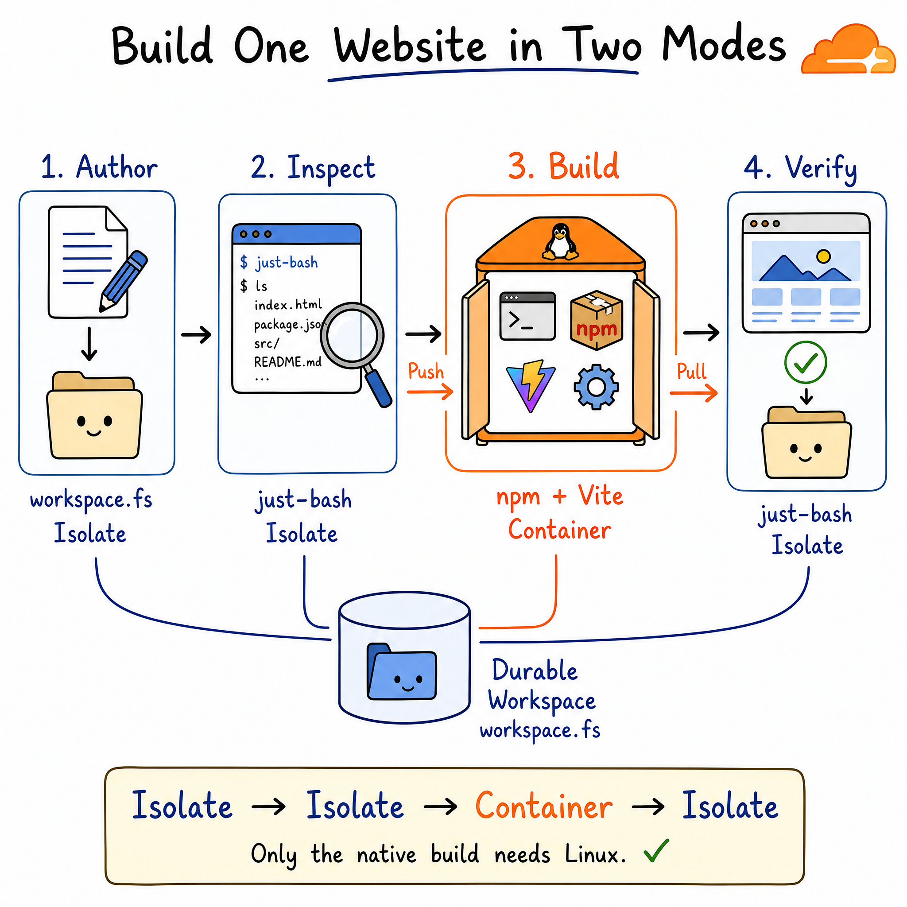

# Cloudflare Computer: How to Cut AI Agent Sandboxing Costs by 80%

Part I ended at Chapter 4 with a durable filesystem and measured execution
costs. Part II continues at **Chapter 5** and decides where agent work should
run.

An agent needs its workspace for the whole task. It does not need a complete
Linux machine for every step.

> <u>**Placement rule:**</u>
> **Keep durable state always available; make native Linux execution
> on demand.**

[Cloudflare Computer](https://github.com/cloudflare/computer) makes an
isolate-first placement policy possible: keep project state in a Workspace
Durable Object, perform ordinary work in isolates, and start Linux only for
native commands.

This article builds a small Vite website through both paths. It then prices an
always-running Cloudflare container against a model in which the container is
active for 10% of the month. Under the stated assumptions, the monthly estimate
falls from **$36.83 to $7.53: a 79.6% reduction**.

That is a worked scenario, not a promised Cloudflare discount. The result
depends on container duty cycle, instance size, storage, requests, CPU usage,
and synchronization behavior.

## TL;DR

- <u>**Authority:**</u> Durable Object SQLite owns the project across isolate
  and container lifecycles.
- **Common path:** `workspace.fs`, `just-bash`, and isolate JavaScript handle
  ordinary reads, searches, writes, and edits.
- **Compatibility path:** a Linux container runs real `npm`, native binaries,
  retained processes, and build tools.
- **Physical layout:** there is one authoritative copy plus a temporary
  `computerd` VFS exposed through FUSE—not one shared physical mount.
- <u>**Durability boundary:**</u> container output becomes authoritative after
  the post-command pull commits it to the Workspace.
- <u>**Modeled cost:**</u> 10% container-active time produces **$7.53 instead of
  $36.83 per month—a 79.6% reduction under the stated assumptions**.

```text
authoritative Workspace Durable Object
    |
    |-- common work --> isolate / workspace.fs / just-bash
    |
    `-- native work --> push --> container + FUSE --> pull
```

This article keeps three forms of evidence separate:

| Label | What it establishes |
| --- | --- |
| **Platform pricing** | Current Workers, Containers, and Durable Objects billing inputs published by Cloudflare. |
| **Open-source implementation** | Backend routing and synchronization behavior verified in Computer `0.1.1` and commit [`76d9e75`](https://github.com/cloudflare/computer/tree/76d9e75c5688713b656bce85540d9e0071cece8b). |
| **Modeled result** | The $36.83 and $7.53 estimates calculated from explicit utilization assumptions—not an observed production invoice. |

---

## Chapter 5 — The 10% Container Strategy

> <u>**Economic boundary:**</u>
> **Computer can reduce container time; it cannot guarantee a fixed percentage
> reduction for every workload.**

<p align="center">
  
</p>

*Figure 1: One durable Workspace supports a lightweight isolate path and an
on-demand Linux compatibility path. The illustration is conceptual; the
physical VFS and synchronization boundaries are defined below.*

### What work actually needs a container?

A container is a useful compatibility boundary. It gives an agent a normal
Linux filesystem, native executables, package managers, process control, and
network tools. The mistake is treating every operation as if it needs that
entire boundary.

| Agent operation | Full Linux required? | Computer path |
| --- | ---: | --- |
| Read or write a source file | No | `workspace.fs` in the Durable Object |
| Search text or list a tree | No | `worker-shell` (`just-bash`) |
| Transform data with JavaScript | No | Worker isolate |
| Wait for an LLM response | No | No active container work |
| Install npm dependencies | Usually | Container |
| Compile a native dependency | Yes | Container |
| Run an unmodified Linux binary | Yes | Container |
| Host a process that needs a real OS | Yes | Container |

[Cloudflare Containers charge](https://developers.cloudflare.com/containers/pricing/)
active CPU usage, while provisioned memory and disk are charged for the time the
container is running. Containers can sleep automatically, so an application
already configured for aggressive scale-to-zero will have a lower baseline
than an always-on server. The economic question is therefore specific:

> **How much container-running time can the isolate path remove?**

The runnable example for this article makes that placement visible rather than
asking a model to choose implicitly.

### How can one Workspace support both modes?

Part I explained how Computer stores a filesystem inside the Workspace Durable
Object. Here, that durable filesystem becomes the meeting point for two
execution modes.

```text
                         AUTHORITATIVE STATE
                  +-----------------------------+
                  | Workspace Durable Object    |
                  | SQLite-backed VFS           |
                  +--------------+--------------+
                                 |
                  +--------------+--------------+
                  |                             |
           COMMON OPERATIONS             NATIVE OPERATIONS
                  |                             |
         +--------v--------+           +--------v---------+
         | Worker isolate  |           | Linux container  |
         |                 |           |                  |
         | workspace.fs    |           | npm install      |
         | just-bash       |           | npm run build    |
         | JavaScript      |           | native binaries  |
         +-----------------+           +--------+---------+
                                                |
                                      computerd VFS + FUSE
                                      temporary materialization
```

*Architecture map: ordinary operations reach the authoritative VFS directly.
Native programs use a disposable execution-side VFS synchronized before and
after the command.*

### Are there one or two copies of the workspace?

| Component | Filesystem view | Persistence | Synchronization |
| --- | --- | --- | --- |
| Workspace Durable Object | Authoritative SQLite VFS | Durable | Authority |
| `workspace.fs` | Authoritative VFS | Durable at transaction completion | None |
| `worker-shell` | Authoritative VFS through Workers RPC | Durable | `sync: "none"` |
| Container command | Local `computerd` VFS mounted at `/workspace` | Disposable | Push before; pull after |

The isolate and container therefore do **not** share one physical mount.
Computer's [runtime documentation](https://github.com/cloudflare/computer/blob/76d9e75c5688713b656bce85540d9e0071cece8b/docs/05_runtime_interface.md)
describes the command bracket as:

```text
push -> spawn -> events/result -> pull
```

`worker-shell` short-circuits that bracket because its filesystem capabilities
reach the authoritative Workspace directly. The container cannot do that: an
unmodified Linux program expects normal filesystem syscalls, so `computerd`
projects a second VFS through FUSE and synchronizes it with the Durable Object.

This gives us the precise storage model:

> **One authoritative durable copy plus, while needed, one disposable
> execution-side materialization.**

It is not zero-copy. During container execution, synchronized files may exist
on both sides. The economic gain comes from making the second environment
temporary, not from pretending it does not exist.

**Sources:** [Cloudflare Computer announcement](https://blog.cloudflare.com/cloudflare-computer/),
[Cloudflare Sandbox general availability](https://blog.cloudflare.com/sandbox-ga/),
[Computer runtime interface](https://github.com/cloudflare/computer/blob/76d9e75c5688713b656bce85540d9e0071cece8b/docs/05_runtime_interface.md),
and [Cloudflare Containers pricing](https://developers.cloudflare.com/containers/pricing/).

---

## Chapter 6 — Build One Website in Two Modes

> <u>**Runnable proof:**</u>
> **The isolate authors and inspects the site. Linux starts only for `npm
> install` and the Vite build.**

<p align="center">
  
</p>

*Figure 2: The website follows isolate → isolate → container → isolate. Only
the native package installation and build require Linux.*

### What does the example prove?

The complete project is in
[`examples/dual-mode-website-builder`](../examples/dual-mode-website-builder/).
It pins `@cloudflare/computer` and the `computerd` image to `0.1.1` so the
tutorial does not silently follow a changing preview API.

The application performs four visible steps:

| Step | Operation | Execution backend | Durable effect |
| --- | --- | --- | --- |
| **1. Author** | Write the Vite source files | `workspace.fs` in the Durable Object isolate | Direct authoritative writes |
| **2. Inspect** | `find . -type f \| sort` | `just-bash` Worker isolate | Direct RPC; no synchronized copy |
| **3. Build** | `npm install && npm run build` | Linux container | Push before execution; pull afterward |
| **4. Verify** | Inspect and grep `dist/` | `just-bash` Worker isolate | Confirms the pulled output is durable |

### How are both execution backends registered?

The core wiring is deliberately small. `Workspace` receives the Durable Object
storage handle and both lazy execution backends:

```ts
import {
  type DurableObjectStorageLike,
  Workspace,
  WorkspaceProxy,
  WorkspaceServiceProxy,
  type WorkspaceStub,
} from "@cloudflare/computer";
import {
  CloudflareContainerBackend,
  withWorkspaceContainer,
} from "@cloudflare/computer/backends/container";
import { WorkerShellBackend } from "@cloudflare/computer/backends/worker-shell";
import { DurableObject } from "cloudflare:workers";

export { WorkspaceProxy, WorkspaceServiceProxy };

function workspaceRef(ctx: DurableObjectState) {
  return { binding: "SiteBuilder", id: ctx.id.toString() };
}

class SiteBuilderBase extends withWorkspaceContainer(
  class extends DurableObject<Env> {},
) {}

export class SiteBuilder extends SiteBuilderBase {
  readonly #containerBackend = new CloudflareContainerBackend({
    id: "container",
    container: () => this,
    workspace: workspaceRef(this.ctx),
  });

  readonly workspace = new Workspace({
    storage: this.ctx.storage as unknown as DurableObjectStorageLike,
    backends: [
      new WorkerShellBackend({
        id: "worker-shell",
        loader: this.env.LOADER,
        workspace: workspaceRef(this.ctx),
        ctx: this.ctx,
      }),
      this.#containerBackend,
    ],
  });

  override async fetch(request: Request): Promise<Response> {
    if (new URL(request.url).pathname === "/ws") {
      return this.#containerBackend.handleFetch(request);
    }
    return new Response("not found", { status: 404 });
  }

  async __getWorkspaceStub(): Promise<WorkspaceStub> {
    await this.workspace.ready();
    return this.workspace.stub();
  }
}
```

There are two loopback routes:

- `WorkspaceServiceProxy` lets the Dynamic Worker running `just-bash` call the
  authoritative Workspace.
- `WorkspaceProxy` lets `computerd` in the container connect back over the
  container backend's WebSocket path.

The application chooses the backend server-side. The caller cannot turn an
arbitrary command into a container operation merely by changing a request
field.

### How are files authored without starting the container?

Source creation uses `workspace.fs` directly:

```ts
await workspace.fs.rm("/workspace/site", {
  recursive: true,
  force: true,
});
await workspace.fs.mkdir("/workspace/site/src", { recursive: true });

await Promise.all(
  Object.entries(siteFiles(spec)).map(([relativePath, contents]) =>
    workspace.fs.writeFile(`/workspace/site/${relativePath}`, contents),
  ),
);
```

These writes execute against the VFS living in the Durable Object's SQLite.
No container exists merely because the project has files.

### How does `just-bash` inspect the durable workspace?

The first command explicitly selects the isolate shell:

```ts
using inspection = await workspace.runtime.exec(
  "find . -type f | sort",
  {
    backend: "worker-shell",
    cwd: "/workspace/site",
    encoding: "utf8",
  },
);

const inspected = await inspection.result();
```

This is shell syntax, but it is not a native Bash process. `WorkerShellBackend`
uses `just-bash` in a Dynamic Worker and calls Workspace filesystem capabilities
through RPC. Its result reports zero pushed and pulled entries because there is
no second filesystem to synchronize.

### When does the workflow escalate to Linux?

The build changes only the backend ID and command:

```ts
using build = await workspace.runtime.exec(
  "npm install --no-audit --no-fund && npm run build",
  {
    backend: "container",
    cwd: "/workspace/site",
    encoding: "utf8",
  },
);

const result = await build.result();

if (result.exitCode !== 0 || result.sync.status !== "complete") {
  throw new Error("The build or its post-command synchronization failed");
}
```

Calling `result()` matters. Computer completes the post-command pull before the
result settles. A Linux command can exit successfully while synchronization is
still unable to complete, so the application checks both `exitCode` and
`result.sync.status`.

The container image is equally small:

```dockerfile
FROM ghcr.io/cloudflare/computer-computerd-linux-x64:0.1.1 AS computerd
FROM node:22-bookworm-slim

RUN apt-get update \
 && apt-get install -y --no-install-recommends fuse3 libfuse2 ca-certificates git \
 && rm -rf /var/lib/apt/lists/*

COPY --from=computerd /usr/local/bin/computerd /usr/local/bin/computerd

ENV PORT=8080
ENV MOUNT_POINT=/workspace
ENV FUSE_MOUNT=auto
ENTRYPOINT ["/usr/local/bin/computerd"]
```

`computerd` is the container entry point. Node and npm are capabilities of the
container image, not of Code Mode or `just-bash`.

### How is the container output verified from the isolate?

When the build result settles, `dist/` has been pulled back to the authoritative
Workspace. The example switches to `worker-shell` again:

```ts
using verification = await workspace.runtime.exec(
  'find dist -type f | sort && grep -R "Dual-mode build" dist',
  {
    backend: "worker-shell",
    cwd: "/workspace/site",
    encoding: "utf8",
  },
);

const verified = await verification.result();
```

The application serves those verified files directly from the Workspace VFS.
The preview therefore demonstrates more than a successful container command:
it demonstrates that the build output crossed the durability boundary.

### How can you run the example locally?

Requirements:

- Node.js 22 or newer
- Docker Desktop
- Wrangler authenticated for the remote Cloudflare features used by Computer
- WSL when developing with Wrangler Containers from Windows

Install the tutorial itself and check its types:

```powershell
cd file_system_storage\cloudflare_computer\examples\dual-mode-website-builder
npm install
npm run types
npm run typecheck
```

On Linux, macOS, or a supported Cloudflare development environment:

```bash
npm run dev
```

On Windows, start it through WSL with Docker Desktop's WSL integration enabled:

```powershell
wsl --cd /mnt/c/path/to/dual-mode-website-builder `
  bash scripts/dev-wsl.sh 8793
```

Open <http://127.0.0.1:8793/> and select **Build website**. The interface shows
the chosen backend, elapsed time, push count, pull count, and sync status for
every step.

> The first build includes image construction, container startup, and npm
> installation. It is expected to be much slower than an isolate file edit.

**Sources:** [runnable website builder](../examples/dual-mode-website-builder/),
[complete Worker source](../examples/dual-mode-website-builder/src/index.ts),
[pinned container image](../examples/dual-mode-website-builder/Dockerfile), and
Cloudflare Computer's [`examples/think`](https://github.com/cloudflare/computer/tree/76d9e75c5688713b656bce85540d9e0071cece8b/examples/think).

---

## Chapter 7 — Follow One Command Across the Durability Boundary

> <u>**Durability boundary:**</u>
> **A successful process exit is not enough. The post-command pull must also
> complete.**

### What happens between `runtime.exec()` and durable output?

The container path is not a direct FUSE mount of Cloudflare's production
Durable Object database. It is synchronization between two VFS instances:

```text
                  AUTHORITATIVE WORKSPACE
                Durable Object SQLite VFS
                           |
                           | 1. push changed paths
                           |    and missing chunks
                           v
        +--------------------------------------------+
        | CONTAINER                                  |
        |                                            |
        | npm / Vite                                 |
        |    |                                       |
        |    +-> Linux syscalls -> FUSE              |
        |                           |                |
        |                           v                |
        |                    computerd local VFS     |
        +---------------------------+----------------+
                                    |
                                    | command exits
                                    | 2. pull changed paths
                                    |    and missing chunks
                                    v
                Durable Object SQLite transaction
                                    |
                                    v
                            DURABLE OUTPUT
```

```text
FUSE write       command exit       pull pending       SQLite commit
    |                 |                  |                   |
visible locally   process success    not yet durable     durable
```

> **Process success and durability success are two separate results.**

Computer's [documented synchronization protocol](https://github.com/cloudflare/computer/blob/76d9e75c5688713b656bce85540d9e0071cece8b/docs/02_sync_protocol.md)
transfers manifests and content-addressed chunks incrementally. Before
execution, the Durable Object pushes paths the container has not seen. After
execution, it fetches container-side changes, asks only for missing chunks, and
applies committed batches to SQLite.

### When is a write durable?

| Moment | File visible to command? | File authoritative? | Safe after container loss? |
| --- | ---: | ---: | ---: |
| Before command | Yes, after push | Yes, previous version | Yes |
| During FUSE write | Yes | Not yet | No |
| Command exits, pull pending | Yes | Not necessarily | Not necessarily |
| Pull commits to DO SQLite | Yes | Yes | Yes |
| Container sleeps or disappears | No local copy required | Yes | Yes |

This is why `exitCode === 0` is insufficient. The application needs a completed
sync result before it can claim durable success.

### What happens to `node_modules`?

Computer's [default container synchronization](https://github.com/cloudflare/computer/blob/76d9e75c5688713b656bce85540d9e0071cece8b/docs/02_sync_protocol.md#ignored-entries)
ignores `node_modules`. That is an important space and latency decision: one
`npm install` can create tens of thousands of small files that are useful to the
build but poor candidates for durable workspace synchronization.

```text
package.json   ----pull----> Durable Object
package-lock   ----pull----> Durable Object
src/           ----pull----> Durable Object
dist/          ----pull----> Durable Object
node_modules/  --ignored--> container-local and disposable
```

The result is a useful separation between **durable project artifacts** and
**rebuildable execution cache**.

### What if synchronization fails?

A runtime result can report:

```ts
{
  exitCode: 0,
  sync: {
    status: "pending",
    error: "..."
  }
}
```

The native command succeeded, but its changes are not yet confirmed in the
Workspace. The correct response is to retry or reconcile synchronization—not
to rerun a potentially non-idempotent command blindly.

**Sources:** pinned [synchronization protocol](https://github.com/cloudflare/computer/blob/76d9e75c5688713b656bce85540d9e0071cece8b/docs/02_sync_protocol.md),
[runtime result contract](https://github.com/cloudflare/computer/blob/76d9e75c5688713b656bce85540d9e0071cece8b/docs/05_runtime_interface.md),
and [`runtime.exec()` implementation](https://github.com/cloudflare/computer/blob/76d9e75c5688713b656bce85540d9e0071cece8b/packages/computer/src/runtime/runtime.ts).

---

## Chapter 8 — Calculate the 80% Reduction

> <u>**Modeled result:**</u>
> **A 10% container duty cycle costs $7.53 instead of $36.83 in this scenario.
> Change the duty cycle, and the percentage changes.**

### Which assumptions produce the 80% result?

The title's 80% figure comes from a transparent monthly model. It compares two
Cloudflare architectures, not a Cloudflare deployment with an unrelated VPS:

1. A `standard-1` Cloudflare Container kept active for the full month.
2. The same container active for 10% of the month, with ordinary work handled
   by Workers and one Workspace Durable Object.

| Input | Value |
| --- | ---: |
| Month | 30 days / 720 hours |
| Container | `standard-1` |
| Provisioned capacity | 0.5 vCPU, 4 GiB memory, 8 GB disk |
| Average CPU consumption while running | 20% of 0.5 vCPU |
| Dual-mode container time | 72 hours / 10% |
| Durable workspace | At most 5 GB-month |
| Worker usage | Within 10 million requests and 30 million CPU-ms |
| Durable Object usage | Within included request and duration allowances |
| Network and logs | No overage |

As of August 2026, the [$5 Workers Paid plan and container allowances](https://developers.cloudflare.com/containers/pricing/)
include 25 GiB-hours of container memory, 375 vCPU-minutes, and 200 GB-hours of
disk. Overage rates are $0.0000025 per GiB-second, $0.000020 per active
vCPU-second, and $0.00000007 per GB-second. Cloudflare charges memory and disk
while the container is active; CPU uses active consumption.

Converted to the units used below:

| Resource | Converted overage rate |
| --- | ---: |
| Memory | $0.009 per GiB-hour |
| Active CPU | $0.0012 per vCPU-minute |
| Disk | $0.000252 per GB-hour |

### What does the always-active baseline cost?

| Charge | Calculation | Cost |
| --- | --- | ---: |
| Workers Paid plan | Fixed monthly minimum | $5.00 |
| Memory | `(4 x 720 - 25) x $0.009` | $25.70 |
| Disk | `(8 x 720 - 200) x $0.000252` | $1.40 |
| CPU | `(0.5 x 20% x 720 x 60 - 375) x $0.0012` | $4.73 |
| DO storage up to 5 GB-month | Included | $0.00 |
| **Total** | | **$36.83/month** |

### What does a 10% container duty cycle cost?

| Charge | Calculation | Cost |
| --- | --- | ---: |
| Workers Paid plan | Fixed monthly minimum | $5.00 |
| Memory | `(4 x 72 - 25) x $0.009` | $2.37 |
| Disk | `(8 x 72 - 200) x $0.000252` | $0.09 |
| CPU | `(0.5 x 20% x 72 x 60 - 375) x $0.0012` | $0.07 |
| DO storage up to 5 GB-month | Included | $0.00 |
| **Total** | | **$7.53/month** |

```text
Estimated monthly cost                     each # is approximately $1

Always active |#####################################| $36.83
10% duty      |########                             |  $7.53

Estimated saving: $29.30 per month
Estimated reduction: 79.6%
```

The variable container charges fall from $31.83 to $2.53. The complete bill
does not fall to exactly 10% because the $5 Workers Paid minimum remains.

### How sensitive is the result to container awake time?

Using the same assumptions:

| Container-active share | Estimated monthly cost | Reduction vs always active |
| ---: | ---: | ---: |
| 5% | $6.09 | 83.5% |
| **10%** | **$7.53** | **79.6%** |
| 25% | $12.41 | 66.3% |
| 50% | $20.55 | 44.2% |
| 100% | $36.83 | 0% |

The title is therefore justified only for a workload near the 10% row. If a
container is required for half of the workflow, the same model saves about 44%,
not 80%.

### How much does Durable Object storage add?

[SQLite-backed Durable Objects](https://developers.cloudflare.com/durable-objects/platform/pricing/)
include 5 GB-month on the paid plan and charge $0.20 per additional GB-month.
Under the same operation allowances:

| Durable workspace | Storage overage | Dual-mode estimate |
| ---: | ---: | ---: |
| 1 GB | $0.00 | $7.53 |
| 5 GB | $0.00 | $7.53 |
| 8 GB | $0.60 | $8.13 |
| 10 GB | $1.00 | $8.53 |

This table describes billed live data, not Computer's temporary storage
amplification during rewrites and garbage-collection windows. Part I analyzes
the fixed 512 KiB chunk trade-off separately.

### When does dual mode win—and when does it not?

#### Strong fits

| Workload characteristic | Why dual mode helps |
| --- | --- |
| Many reads, searches, and small edits | They stay in the isolate path |
| Long waits between tool calls | No container needs to remain awake |
| Occasional package installation | Linux starts only for that phase |
| Rebuildable dependency caches | `node_modules` can remain disposable |
| Durable source and build artifacts | Useful paths synchronize back to SQLite |
| Bursty agent sessions | Both Durable Objects and containers can become idle |

#### Weak fits

| Workload characteristic | Why savings shrink |
| --- | --- |
| Every operation needs a native binary | Container duty cycle approaches 100% |
| Continuous development server | The container remains active |
| Repeated large dependency installations | Startup and rebuild costs dominate |
| Constant mutation of a large workspace | Synchronization traffic grows |
| Heavy writes to ignored paths must persist | The default durability split is wrong |
| More than one concurrent writer per workspace | Conflict policy needs explicit design |

The routing rule can stay simple:

```text
Does this operation require native Linux or a retained OS process?
                         |
                  +------+------+
                  |             |
                 no            yes
                  |             |
        Durable Object or       container
          Worker isolate        push -> exec -> pull
```

Do not route by command spelling alone. A small script may invoke a native
binary, require outbound network access, or depend on state intentionally kept
inside the container. Placement is a capability and lifecycle decision.

**Sources:** [Cloudflare Containers pricing](https://developers.cloudflare.com/containers/pricing/),
[Cloudflare Workers pricing](https://developers.cloudflare.com/workers/platform/pricing/),
and [Cloudflare Durable Objects pricing](https://developers.cloudflare.com/durable-objects/platform/pricing/).

---

## What should you remember?

Cloudflare Computer does not eliminate the sandbox. It changes the sandbox from
an always-running home into an on-demand compatibility tool.

The complete model fits in four statements:

| Principle | Practical meaning |
| --- | --- |
| **Durable Objects own the project.** | Authoritative files survive disposable execution. |
| **Isolates handle the common path.** | Reads, searches, writes, and portable shell work avoid Linux. |
| **Containers handle compatibility.** | Native tools start only when the operation requires them. |
| **Synchronization confirms durability.** | Do not equate process exit with durable workspace success. |

For the website in this tutorial, source authoring and verification never need
Linux. Only dependency installation and bundling cross into the container. If
that pattern keeps the container active for roughly 10% of the month, the
worked estimate reduces sandboxing cost by about 80%.

The practical lesson is not “containers are bad.” It is more precise:

> <u>**Bottom line:**</u>
> **Pay for a complete operating system when the operation needs one—not merely
> because the agent has a workspace.**

## Run, inspect, and verify

- [Runnable dual-mode website builder](../examples/dual-mode-website-builder/)
- [Complete Worker source](../examples/dual-mode-website-builder/src/index.ts)
- [Pinned container image](../examples/dual-mode-website-builder/Dockerfile)
- [Part I: Introducing Cloudflare Durable Objects](PART-I.md)

Cloudflare Computer is preview software. APIs, limits, billing, and runtime
behavior may change. Recheck the chapter sources before using this model for
production budgeting.
