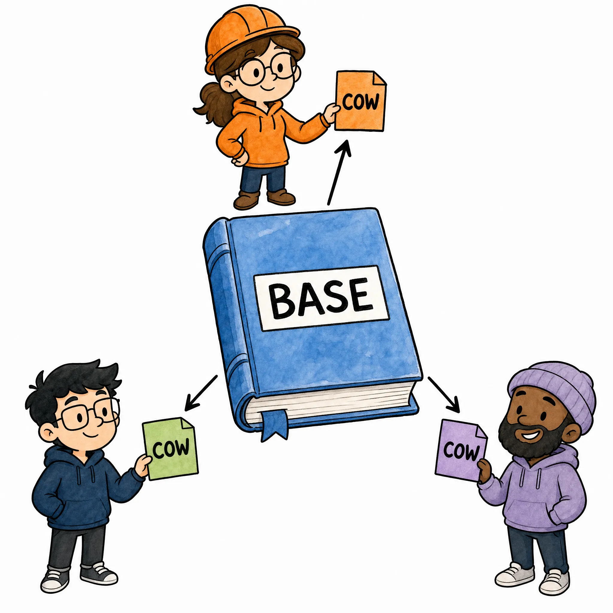
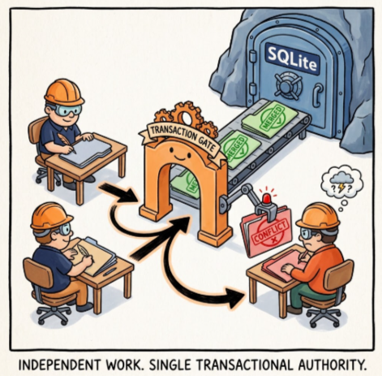

# Part III — Transforming Cloudflare Computer: 98.4% Less Branch Storage, 3.18× Faster Edits, and Safe Multi-Agent Parallelism

Part II ended with Chapter 8 and one rule: keep durable state available, then
pay for Linux only when an operation needs Linux. Part III continues at
**Chapter 9** and asks what happens when many agents repeatedly edit that
durable state:

> <u>**Can we keep the Durable Object and Computer execution model while making
> incremental work cheaper and multiple agents safer?**</u>

We built **C3**, an Agent Infra Book prototype:

```text
C3 = content-addressed storage + content-defined chunking + copy-on-write
       CAS                         CDC                     COW
```

C3 is not a Cloudflare product and does not replace Durable Objects. It changes
only the application-level file representation inside Durable Object SQLite.

<p align="center">
  
</p>

```text
PART II: WHERE SHOULD WORK RUN?       PART III: HOW SHOULD WORK BE STORED?

Chapter 5-8                           Chapter 9-13
isolate -> container on demand   ->   CAS -> COW -> CDC -> branch -> benchmark
```

## TL;DR

- <u>**Storage:**</u> CAS shares bytes, COW keeps private edits sparse, and CDC
  reconnects shifted content boundaries.
- <u>**Speed:**</u> across 10 paired full-Computer runs, 16 tiny edits were
  **3.18× faster** and a front insertion was **3.81× faster**; initial 32 MiB
  ingestion was **37% slower**.
- <u>**Multi-agent:**</u> 50 private branches used **98.4% less complete
  branch-exclusive content**, while
  stale same-file publishers became conflicts instead of silent overwrites.
- **Full path:** two agents ran through two computerd processes and two real
  FUSE mounts before publishing into one SQLite authority.
- **FUSE-to-COW:** two one-byte edits retained **8 KiB of private COW pages**
  and **8.2 KiB of complete branch-exclusive content**, versus **1.00 MiB**
  for the measured fixed-chunk adapter.
- <u>**Remaining bottleneck:**</u> the same cold branch run moved 4 MiB on push
  and 2 MiB on pull; compact branch state does not imply compact sync.

```text
                               C3
                    +-----------+-----------+
                    |           |           |
                    v           v           v
                 STORAGE      SPEED      MULTI-AGENT
                CAS + COW    COW + CDC    branch + publish
                    \           |           /
                     +----------+----------+
                                |
                                v
                     Durable Object SQLite
                     remains authoritative
```

This article labels every benchmark table by its execution boundary:

| Evidence layer | Meaning |
| --- | --- |
| **engine** | Direct storage-engine calls inside local workerd Durable Object SQLite; no request hop, computerd, or FUSE. |
| **Durable Object request** | Separate `fetch()` requests to one local Durable Object; includes request scheduling and serialization, but no computerd/FUSE. |
| **full Computer E2E** | Computer push, computerd, real FUSE, shell command, pull, Durable Object SQLite, and verification. |

---

## Chapter 9 — CAS: Store Once, Share Everywhere

> <u>**Storage rule:**</u> **A branch should refer to unchanged content, not
> copy it.**

### What does C3 inherit from Computer?

Computer already hashes chunks with SHA-256 and stores identical content once.
C3 keeps that layer and adds immutable manifests plus branch references:

| Layer | Computer baseline | C3 extension |
| --- | --- | --- |
| Content | SHA-256 chunks | Same CAS rule |
| File identity | Ordered fixed chunks | Immutable compact manifest |
| Private work | One workspace view | Branch points to a base manifest |

```text
CAS objects
  hash-A -> bytes A
  hash-B -> bytes B
  hash-C -> bytes C
  hash-X -> bytes changed by Agent A

main manifest M42  -> [hash-A, hash-B, hash-C]
agent-a base       -> M42
agent-b base       -> M42

after Agent A edits:
agent-a view       -> [hash-A, hash-X, hash-C]
agent-b view       -> [hash-A, hash-B, hash-C]
main               -> [hash-A, hash-B, hash-C]
```

Branch creation is metadata, not a checkout:

```sql
INSERT INTO branches(branch_id, base_commit, state)
VALUES ('agent-a', 42, 'active');
```

The [prototype schema](../benchmarks/cas-cdc-cow/src/engines/cas-cdc-cow.ts)
has five roles:

| Table role | What it records |
| --- | --- |
| CAS objects | Immutable content indexed by SHA-256 |
| Manifests | Ordered chunk hashes and sizes for one file version |
| Main files | The manifest currently visible in the authoritative workspace |
| Branch files | The base manifest and private materialization for one agent |
| Versions | Historical file manifests attached to commits |

Each compact entry is **32 hash bytes + 4 size bytes**:

```text
manifest entry = SHA-256 digest (32 B) + size (4 B)
manifest ID    = SHA-256(file size + encoded entries)
```

Implementation: [`compact-manifest.ts`](../benchmarks/cas-cdc-cow/src/engines/compact-manifest.ts).

### Why does this matter for multiple agents?

For a 10 GiB workspace and 50 agents:

| Branch representation | Approximate base data copied at branch creation |
| --- | ---: |
| Full checkout per agent | 500 GiB |
| C3 branch references | Branch metadata; unchanged CAS content is shared |

> **Invariant:** branch creation scales with metadata, not workspace size.

### CAS does not solve every edit

CAS recognizes exact equality only:

```text
SHA256("abcdef") != SHA256("Xabcdef")
```

```text
CAS alone                C3 composition

exact duplicate -> share     CAS -> share unchanged bytes
shifted boundary -> new       CDC -> recover later boundaries
private edit -> new view      COW -> retain only touched pages
```

> **Chapter result:** CAS gives all branches one shared immutable base. It
> removes full-workspace copies, but exact hashing alone does not make small
> edits cheap.

---

## Chapter 10 — COW: Write Only What Changed

> <u>**Mutation rule:**</u> **Private work should consume space in proportion to
> the edit, not the file.**

### What is a private COW branch?

C3 treats the authoritative file as an immutable base and records an agent's
equal-length overwrites as private **4 KiB pages**.

```text
authoritative file
[ page 0 ][ page 1 ][ page 2 ][ page 3 ][ page 4 ]
                         |
                    Agent A edits 10 B
                         |
                         v
agent-a branch pages
                      [ private page 2 ]

Agent A reads: base pages 0,1 + private page 2 + base pages 3,4
Main reads:    base pages 0,1,2,3,4
```

<p align="center">
  
</p>

Repeated writes replace the same SQLite page row:

```ts
if (equalLengthOverwrite && editBytes <= 64 * KiB) {
  for (const page of touchedPages) {
    branchPages.upsert(branchId, path, page.index, page.bytes);
  }
}
```

Evidence: [`engines.test.ts`](../benchmarks/cas-cdc-cow/src/tests/engines.test.ts)
keeps five same-page edits in one 4 KiB row and a cross-page edit in two rows.

### What happens when the agent reads?

C3 reads through a fixed overlay order:

```ts
function readBranch(branch, path) {
  let bytes = readManifest(branch.base(path));
  bytes = overlayPages(bytes, branch.pages(path));
  bytes = applyOrderedPatches(bytes, branch.patches(path));
  return bytes;
}
```

No other agent sees those pages. The main workspace changes only during
publication.

Do not confuse one COW component with the full storage bill:

```text
complete branch-exclusive content
  = private COW pages
  + ordered patch bytes
  + branch-only CAS objects
  + branch-only manifest bytes

SQLite growth = a separate physical measurement that also includes rows,
indexes, pages, and allocation effects.
```

### How much does page-level COW save?

In the 50-agent test, every agent changed one byte in a private 256 KiB file:

**Evidence layer: Durable Object request.**

| Branch storage before publication | Fixed-chunk branch | C3 COW branch |
| --- | ---: | ---: |
| Private COW-page payload | 0 KiB | **200 KiB** |
| Complete branch-exclusive content | 12,804 KiB | **200 KiB** |
| SQLite growth with branches active | 12,880 KiB | **232 KiB** |
| Complete content per agent | 256.1 KiB | **4 KiB** |
| Complete-content reduction | — | **98.4%** |

The comparison uses high-entropy files, so unrelated content cannot disappear
through accidental deduplication. The result is available in
[`multi-agent-latest.md`](../benchmarks/cas-cdc-cow/results/multi-agent-latest.md).

### Where does COW stop helping?

C3 routes writes by shape:

```text
                           EDIT
                            |
              +-------------+-------------+
              |                           |
        equal length?                     no
              |                           |
      +-------+-------+            insertion/deletion
      |               |                   |
   <=64 KiB         larger          ordered patch
      |               |                   |
  4 KiB COW       CDC/CAS          too many patches?
    pages       materialization            |
                                      full fallback
```

| Operation | C3 private representation |
| --- | --- |
| Small overwrite | 4 KiB page UPSERT |
| Repeated overwrite of one page | Replace the same branch row |
| Small insertion or deletion | Ordered structural patch |
| Replacement larger than 512 KiB | Materialize directly into CDC/CAS |
| Many structural patches | Canonical full-file fallback |

Distributed edits and full rewrites can still approach O(file size); the
fallback preserves correctness rather than promising constant-time writes.

> **Chapter result:** COW makes private overwrites cheap and isolated. It
> reduces branch storage and edit work, while explicit fallbacks preserve
> correctness for structural or large changes.

---

## Chapter 11 — CDC: Keep Small Changes Small

> <u>**Boundary rule:**</u> **Chunk boundaries should follow content closely
> enough to reconnect after a local insertion or deletion.**

### Why are fixed positions fragile?

Part I measured Computer's fixed 512 KiB chunks. A tiny overwrite normally
changes one chunk, which is acceptable. A front insertion is different because
every later fixed offset moves:

```text
before
|---- A ----|---- B ----|---- C ----|---- D ----|

insert 10 bytes at the front
|---- A' ---|---- B' ---|---- C' ---|---- D' ---|...

fixed boundaries: every later chunk can receive different bytes
```

CDC chooses boundaries from the content rather than absolute offsets:

```text
before
|-- A --|--- B ---|---- C ----|-- D --|

after front insertion
| changed prefix |--- B ---|---- C ----|-- D --|
                       ^ resynchronized boundary
```

The first familiar boundary reconnects the new prefix to old CAS hashes.

<p align="center">
  
</p>

### What algorithm does the prototype use?

C3 uses a compact FastCDC-style rolling Gear fingerprint with these parameters:

| Parameter | Value | Purpose |
| --- | ---: | --- |
| Minimum chunk | 32 KiB | Avoid excessive tiny objects |
| Target average | 128 KiB | Improve edit locality over 512 KiB fixed chunks |
| Maximum chunk | 512 KiB | Bound object size |

The core loop is intentionally small:

```ts
while (offset < bytes.length) {
  const end = findContentBoundary(bytes, offset, {
    min: 32 * KiB,
    average: 128 * KiB,
    max: 512 * KiB,
  });

  emit(sha256(bytes.slice(offset, end)));
  offset = end;
}
```

Code: [`fastcdc.ts`](../benchmarks/cas-cdc-cow/src/engines/fastcdc.ts).

### Why not scan the complete file after every edit?

A full CDC scan would improve storage reuse but could still make a one-byte
edit O(file size). C3 instead starts around the dirty region and expands until
the new chunk sequence reconnects with unchanged old content:

```text
old manifest
[ A ][ B ][ C ][ D ][ E ][ F ][ G ]
              ^ edit

local publication window
        [ B ][ C' ][ D' ][ E ]
                           ^ old boundary found

new manifest
[ A ][ B ][ C' ][ D' ][ E ][ F ][ G ]
  reuse             new       reuse
```

```ts
function publishLocalEdit(oldManifest, dirtyRange) {
  const left = previousBoundary(oldManifest, dirtyRange.start);
  const scanned = rechunkUntilKnownBoundary(left);
  return splice(oldManifest.prefix(left), scanned.newChunks, scanned.oldSuffix);
}
```

For a 16 MiB file with 1,000 one-byte overwrites, the separated benchmark
measured:

**Evidence layer: engine.**

| Metric | Fixed-chunk baseline | C3 |
| --- | ---: | ---: |
| Private edit time | 4.02 s | **274 ms** |
| Publication time | 1 ms | 124 ms |
| Total | 4.02 s | **398 ms** |
| Total speed | — | **10.1× faster** |
| SQL payload written | 497.5 MiB | **19.9 MiB** |

The baseline pays during edits; C3 moves 124 ms to publication. Compare totals.

### What does CDC cost?

The full Computer benchmark shows the trade-off:

**Evidence layer: full Computer E2E. Median of 10 paired runs.**

| Initial 32 MiB creation | Computer baseline | C3 |
| --- | ---: | ---: |
| Full pipeline time | **1,618.5 ms** | 2,219.0 ms |
| C3 change | — | **37% slower** |

| Workload shape | CDC judgment |
| --- | --- |
| Create once, edit repeatedly | Strong fit |
| Front insert/delete | Strong fit |
| Write once, never revisit | Initial scan may not pay back |
| Full unrelated rewrites | Little content reuse |

> **Chapter result:** CDC turns many offset-shifting changes back into local
> changes, but spends more CPU and metadata work to discover reusable content.

---

## Chapter 12 — Branch and Publish: Many Agents, One Durable Main

> <u>**Coordination rule:**</u> **Agents may work independently, but publication
> must pass through one transactional authority.**

### What is the multi-agent model?

Every branch records the main commit from which it started. Each changed file
also records its base manifest.

```text
                         Workspace Durable Object
                         main commit 42
                                |
               shared immutable CAS objects
                                |
             +------------------+------------------+
             |                  |                  |
             v                  v                  v
        agent-a / 42       agent-b / 42       agent-c / 42
          COW pages          COW pages          COW pages
             |                  |                  |
             +------------------+------------------+
                                |
                      transactional publish
```

```text
create branch
     |
     v
  ACTIVE --publish succeeds--> MERGED
     |
     +----base changed--------> CONFLICT --rebase/retry--> ACTIVE
     |
     `----agent abandons------> DISCARDED
```

<p align="center">
  
</p>

### How does publication detect conflicts?

C3 uses a file-level optimistic check:

```ts
for (const changedFile of branch.files) {
  if (main.manifest(changedFile.path) !== changedFile.baseManifest) {
    return { outcome: "conflict", path: changedFile.path };
  }
}
```

This allows disjoint-file branches to merge even if the workspace's global
commit advanced:

```text
Both agents start from commit 42

Agent A changes /src/a.ts  -> publish -> commit 43
Agent B changes /src/b.ts  -> publish -> commit 44

Both survive because /src/b.ts did not change in commit 43.
```

When both agents change the same file, the second publication is stale:

```text
Agent A: /src/a.ts base = hash-10 -> publish hash-11
Agent B: /src/a.ts base = hash-10 -> current is hash-11
                                      |
                                      +-> explicit conflict
```

| Conflict layer | Responsibility |
| --- | --- |
| C3 | Detect stale file manifests; never silently overwrite |
| Agent/harness | Retry, rebase, invoke a merge tool, or request resolution |

### What becomes atomic?

Hashing may `await`, so C3 checks bases twice: before preparation and again
before one synchronous SQLite transaction:

```sql
BEGIN;

-- verify every changed file still has its expected base manifest
-- insert missing CAS objects and the new manifest
-- append file versions
-- move authoritative file pointers
-- advance the main commit
-- remove private branch pages
-- mark the branch merged

COMMIT;
```

Code: [`publish()`](../benchmarks/cas-cdc-cow/src/engines/cas-cdc-cow.ts).

Publication uses an operation ID as an idempotency key. An exact retry returns
the recorded result; reusing that ID for another branch is rejected.

**Evidence layer: engine.**

| Recovery case | Verified behavior |
| --- | --- |
| Injected SQLite failure + engine recreation | Transaction rolls back; main remains unchanged; retry succeeds |
| Lost response + engine recreation | Same operation ID returns the original merge or conflict without a second commit |
| Abandoned active branch + GC | Branch data remains reachable; unrelated orphan data is reclaimed |
| Discard abandoned branch + GC | Branch-only CAS objects become unreachable and are reclaimed |
| Truncate | Shorter file publishes with exact content |
| Rename failure + retry | Source and destination roll back together; retry completes atomically |

Tests: [`recovery.test.ts`](../benchmarks/cas-cdc-cow/src/tests/recovery.test.ts).

### Did we test actual Durable Object requests?

**Evidence layer: Durable Object request.**

| Test boundary | Work submitted | What it proves |
| --- | ---: | --- |
| Local workerd Durable Object | 50 edit + 50 publish requests | Request scheduling, private state, conflicts, atomic publication |
| Authority | One SQLite owner | Agents prepare independently; accepted commits are ordered |

Test: [`multi-agent-do.test.ts`](../benchmarks/cas-cdc-cow/src/tests/multi-agent-do.test.ts).

### Does the branch model survive the Computer execution path?

Yes. The prototype now has three validated layers:

| Layer | Status |
| --- | --- |
| C3 branch engine inside Durable Object SQLite | Implemented and tested with 50 agents |
| C3 chunking through Computer, computerd, FUSE, and pull | Implemented and benchmarked with one execution mount |
| Branch-specific Computer push/shell/pull adapter | **Implemented on Computer's existing RPC wire** |
| Independent execution for two simultaneous branches | **Two computerd processes and two real FUSE mounts verified** |
| Create, rename, and delete conflict semantics | **Implemented for the regular-file namespace** |

The adapter keeps branch identity above Computer's unchanged RPC interface:

```text
one Workspace-owner Durable Object SQLite
  |
  +-> branch agent-a -> push -> computerd A -> FUSE A -> shell
  |                                      -> pull -> branch agent-a
  |
  +-> branch agent-b -> push -> computerd B -> FUSE B -> shell
                                         -> pull -> branch agent-b

publish(agent-a) -> merge or conflict
publish(agent-b) -> merge or conflict
```

```ts
async function runBranch(branchId, command, computer) {
  const cursor = await computer.push(branchView(branchId), { senderRev: 0 });
  await computer.shell.exec(command);          // computerd + FUSE
  const delta = await computer.fetchChanges({ after: cursor });
  applyToPrivateBranch(branchId, delta);
  return publishWithBaseChecks(branchId);
}
```

| Prototype boundary | Status |
| --- | --- |
| Regular files | Implemented |
| Rename | Conflict-checked create + delete |
| Symlink/directory metadata merge | Not implemented |
| Executor pooling, process-kill recovery, quotas | Not production-hardened |

The defensible statement is now:

> **C3 is a working branch-aware Cloudflare Computer prototype through real
> computerd/FUSE execution, not a production Cloudflare release.**

> **Chapter result:** private work scales independently; the Durable Object
> orders publication; disjoint files merge; stale same-file writers fail
> explicitly.

---

## Chapter 13 — Benchmark: Storage, Speed, and Multi-Agent Execution

Both candidates use Durable Object SQLite. Only the application-level
filesystem changes.

### What exactly is compared?

```text
SINGLE WORKSPACE
  baseline = pinned upstream Computer fixed 512 KiB VFS
  C3       = the same Computer commit plus the DOFS C3 patch

TWO PRIVATE BRANCHES
  baseline = measured fixed-512-KiB branch adapter, last-writer-wins publish
  C3       = measured CDC/CAS/COW branch adapter, conflict-aware publish

Both E2E comparisons use:
  Durable Object SQLite -> push -> computerd -> FUSE -> shell -> pull -> verify
```

The benchmark has three explicitly labeled evidence layers:

| Evidence layer | What it proves |
| --- | --- |
| **engine** | COW branches, CDC publication, conflict behavior, GC, and exact SQL payload |
| **Durable Object request** | Separate agent requests are serialized by one local Durable Object and publish into one SQLite authority |
| **full Computer E2E** | Results survive push, computerd, real FUSE, shell execution, pull, publication, and verification |

The full path is:

```text
Workspace DO SQLite
  -> push
  -> computerd
  -> FUSE-mounted Linux workspace
  -> command
  -> pull
  -> Workspace DO SQLite
  -> authoritative verification
```

Controlled variables: pinned Computer commit, Worker, RPC, FUSE daemon,
commands, and verification. C3 patches both Workspace and computerd DOFS.

### Storage: does C3 reduce write amplification?

The aggregate storage workload starts with one 64 MiB file and applies 32
durable checkpoints: 24 tiny overwrites, seven front insertions, and one full
rewrite.

**Evidence layer: engine.**

| Aggregate metric | Fixed-chunk baseline | C3 | Result |
| --- | ---: | ---: | ---: |
| SQL payload written | 524.0 MiB | 69.2 MiB | **86.8% less** |
| Write amplification | 8.19× | 1.08× | **7.57× lower** |
| SQLite database growth | 526.0 MiB | 70.1 MiB | **86.7% less** |
| Orphan payload before GC | 524.0 MiB | 69.1 MiB | **86.8% less** |
| Stored after GC | 64.0 MiB | 64.0 MiB | Same current workspace |

```text
same final file: 64 MiB

baseline writes 524.0 MiB  [################################]
C3 writes       69.2 MiB   [####]
```

The full Computer pipeline shows the same direction on a 32 MiB file:

**Evidence layer: full Computer E2E. Median [Q1, Q3] over 10 paired runs.**

| Full-pipeline storage | Computer baseline | C3 | Reduction |
| --- | ---: | ---: | ---: |
| Blob growth after 16 tiny edits | 8.00 MiB [8.00, 8.00] | 3.20 MiB [3.20, 3.20] | **60.0%** |
| Blob growth after front insertion | 32.00 MiB [32.00, 32.00] | 0.19 MiB [0.19, 0.19] | **99.4%** |
| Final SQLite database | 72.32 MiB [72.32, 72.32] | 35.89 MiB [35.89, 35.89] | **50.4%** |

### Speed: is less data also faster?

For the 64 MiB aggregate storage workload:

**Evidence layer: engine.**

| Operation | Fixed-chunk baseline | C3 | Result |
| --- | ---: | ---: | ---: |
| 32 edit-and-publish checkpoints | 3.39 s | 663 ms | **5.11× faster** |
| Garbage collection | 860 ms | 261 ms | **3.30× faster** |

For the complete Computer path:

**Evidence layer: full Computer E2E. Median [Q1, Q3] over 10 paired runs.**

| Operation | Computer baseline | C3 | Result |
| --- | ---: | ---: | ---: |
| Initial 32 MiB creation | **1,618.5 ms [1,609.3, 1,630.8]** | 2,219.0 ms [2,169.0, 2,276.0] | C3 **37% slower** |
| 16 durable tiny edits | 5,122.0 ms [5,100.5, 5,159.0] | 1,608.5 ms [1,569.5, 1,615.5] | C3 **3.18× faster** |
| 10-byte front insertion | 1,638.0 ms [1,628.3, 1,682.8] | 430.0 ms [424.3, 443.8] | C3 **3.81× faster** |
| Full read and sync bracket | 207.0 ms [202.3, 208.5] | 155.5 ms [154.0, 157.8] | C3 **1.33× faster** |

Use workload shape, not one universal winner:

```text
write once, rarely edit       -> baseline may be preferable
large file, repeated edits    -> C3 becomes attractive
front insertions/deletions    -> CDC has a strong advantage
full unrelated rewrite       -> little content reuse is possible
```

### Multi-agent: do branches save space and prevent loss?

The multi-agent benchmark sends separate requests for 50 branches to one local
Durable Object. First, each agent edits a different 256 KiB file:

**Evidence layer: Durable Object request.**

| 50 disjoint-file agents | Fixed-chunk branch | C3 branch | Result |
| --- | ---: | ---: | --- |
| Private COW-page payload | 0 KiB | 200 KiB | C3 page overlay; fixed chunks use no COW pages |
| Complete branch-exclusive content | 12,804 KiB | 200 KiB | **98.4% less** |
| SQLite growth with branches active | 12,880 KiB | 232 KiB | **98.2% less** |
| Edit requests | 253 ms | 138 ms | C3 **1.83× faster** |
| Publish requests | **139 ms** | 259 ms | C3 publication is slower |
| Total edit + publish | **392 ms** | 397 ms | Approximately equal |
| Correct final files | 50/50 | 50/50 | Every disjoint edit survives |

Here C3 trades slower canonical publication for 98.4% less private storage;
total request time remains close.

Next, all 50 agents edit the same byte of the same file:

**Evidence layer: Durable Object request.**

| Same-file contention | Fixed-chunk branch | C3 branch |
| --- | ---: | ---: |
| Publications reported merged | 50 | **1** |
| Explicit conflicts | 0 | **49** |
| Silent lost updates | 49 | **0** |
| Private COW-page payload | 0 KiB | **200 KiB** |
| Complete branch-exclusive content | 12,548 KiB | **200 KiB** |
| SQLite growth with branches active | 12,588 KiB | **232 KiB** |

The baseline reports 50 merges although 49 values disappear. C3 reports one
winner and 49 stale branches:

> <u>**A fast multi-agent workspace that silently loses work is not a correct
> multi-agent workspace.**</u>

### Multi-agent E2E: do branches survive shell and FUSE?

The 50-agent test isolates Durable Object publication. A second test closes the
execution gap with two independent Computer runtimes:

```text
private branch A -> push -> computerd A -> FUSE A -> shell -> pull --+
                                                                    |
private branch B -> push -> computerd B -> FUSE B -> shell -> pull --+
                                                                    v
                                                    one SQLite publish authority
```

<p align="center">
  
</p>

The comparison uses 10 complete paired executions. Trial order is randomized
from a recorded seed; latency is reported as median [Q1, Q3].

**Evidence layer: full Computer E2E.**

| Benchmark setup | Value |
| --- | --- |
| Durable authority | 1 local workerd Durable Object SQLite |
| Concurrent agents | 2 private branches |
| Native execution | 2 computerd processes + 2 real FUSE mounts |
| Sparse workload | Two 1 MiB pseudo-random files; 1 byte changed per agent |
| Excluded | Process startup, initial seed, and final verification |

#### Storage and synchronization

**Evidence layer: full Computer E2E. Both columns are measured through the
same two-mount workload.**

| Metric | Fixed-chunk adapter | C3 | Reading |
| --- | ---: | ---: | --- |
| Logical change | 2 bytes | 2 bytes | One byte per agent |
| Private COW-page payload | 0 KiB | **8 KiB** | One 4 KiB COW page per C3 agent |
| Complete branch-exclusive content | 1.00 MiB | **8.2 KiB** | **99.2% less** |
| SQLite growth with branches active | 1.01 MiB | **0.01 MiB** | **99.2% less** |
| Cold push objects, both agents | 4.00 MiB | 4.00 MiB | Two independent execution mirrors |
| Pulled objects, both agents | 2.00 MiB | 2.00 MiB | Each changed file is reconstructed |
| Silent lost updates in four conflict cases | **4** | **0** | C3 rejects stale publication |

The storage result is strong, but it also exposes the next bottleneck. C3
retains 8 KiB of COW pages and 8.2 KiB of complete branch-exclusive content;
the cold execution round still moves 6 MiB through push and pull. **Branch
storage is no longer the dominant problem--branch synchronization is.**

#### End-to-end wall time

**Evidence layer: full Computer E2E. Median [Q1, Q3] over 10 paired runs.**

| Phase | Fixed-chunk adapter | C3 |
| --- | ---: | ---: |
| Push two branch views | 192.5 ms [192.0, 196.8] | **187.5 ms [184.0, 188.8]** |
| Run both FUSE shell commands | **30.0 ms [29.3, 31.0]** | 35.0 ms [34.0, 36.0] |
| Pull both execution deltas | 95.0 ms [89.8, 97.8] | **81.5 ms [79.3, 87.8]** |
| Publish both branches | **1.0 ms [0.0, 1.0]** | 6.0 ms [6.0, 6.0] |
| **Push -> shell -> pull -> publish** | 323.0 ms [317.3, 327.5] | **316.5 ms [310.3, 319.8]** |

Push, shell, and pull run concurrently across the two executors. The Durable
Object orders the two publications. Every mutation originates in a shell
command against FUSE; the adapter derives sparse equal-length ranges from the
pulled bytes and stores them as COW pages.

```text
C3 median branch round: 316.5 ms

push       187.5 ms  [###################]
shell       35.0 ms  [####               ]
pull        81.5 ms  [########           ]
publish      6.0 ms  [#                  ]
```

**Evidence layer: full Computer E2E.**

| Two-agent conflict case | Agent A | Agent B | Verified behavior |
| --- | --- | --- | --- |
| Disjoint edit + create/delete/rename | merged | merged | Both branches survive |
| Same-file write | merged | conflict | Stale writer rejected |
| Same-path create | merged | conflict | Collision rejected |
| Delete versus edit | merged | conflict | Deleted base is not resurrected |
| Rename versus edit | merged | conflict | Stale old-path edit rejected |

This is local architectural evidence, not a production throughput or latency-
distribution claim. See the
[`machine-readable result`](../benchmarks/cas-cdc-cow/e2e/results/branches-latest.json)
and the narrow
[`presentation table`](../benchmarks/cas-cdc-cow/e2e/results/branches-presentation.md).

### What should we conclude—and what should we not?

| Supported conclusion | Unsupported conclusion |
| --- | --- |
| CDC/CAS/COW can sharply reduce incremental storage amplification. | C3 is faster for every workload. |
| The benefit survives a full Computer/FUSE synchronization path. | A two-mount proof establishes production-scale executor throughput. |
| Private COW branches can be far smaller than fixed-chunk private copies. | The prototype is production-ready. |
| File-level optimistic checks prevent silent same-file overwrites. | C3 automatically merges conflicting source code. |
| Two branch-specific Computer sessions can merge or conflict correctly. | Every POSIX namespace operation already has a merge policy. |
| Small private state does not imply small network transfer. | The 8 KiB branch result means only 8 KiB crossed push/pull. |
| Durable Object SQLite is a useful transactional publication authority. | C3 changes Cloudflare's underlying Durable Object storage engine. |

The current prototype tests transactional publication failure/retry,
idempotency, abandoned-branch GC, truncate, and rename rollback. It still needs
abrupt process-loss recovery across in-flight push/pull, symlink and directory-
metadata merge semantics, executor pooling, migration support, quotas,
observability, and production-scale GC before production use.

---

## What should you remember?

```text
                         ONE DURABLE AUTHORITY
                                  |
                 +----------------+----------------+
                 |                |                |
              STORAGE           SPEED          MULTI-AGENT
           CAS + COW + CDC   local updates   branch + publish
                 |                |                |
              less data       less work       no silent loss
                 +----------------+----------------+
                                  |
                           NEXT: CHEAPER SYNC
```

| Question | Answer |
| --- | --- |
| What remains authoritative? | One Durable Object SQLite database |
| What does CAS save? | Exact duplicate content |
| What does COW save? | Private sparse edits |
| What does CDC save? | Shifted content after insertion/deletion |
| What makes it multi-agent? | Private branches plus optimistic publication |
| What is still expensive? | Cold branch push/pull synchronization |
| Is C3 production-ready? | No; it is an evidence-backed prototype |

## Run, inspect, and verify

```powershell
# Storage, edit scale, high volume, and 50-agent publication
cd file_system_storage/cloudflare_computer/benchmarks/cas-cdc-cow
npm.cmd run run
npm.cmd run run:scale
npm.cmd run run:volume
npm.cmd run run:agents

# Full Computer/FUSE and two-branch execution
cd e2e
npm.cmd run prepare
npm.cmd run smoke
npm.cmd run benchmark
npm.cmd run branches
npm.cmd run paired:volume
npm.cmd run paired:branches
```

| Evidence | Link |
| --- | --- |
| Upstream baseline | [Computer commit `76d9e75`](https://github.com/cloudflare/computer/tree/76d9e75c5688713b656bce85540d9e0071cece8b) |
| Storage engine | [`cas-cdc-cow.ts`](../benchmarks/cas-cdc-cow/src/engines/cas-cdc-cow.ts) |
| CDC algorithm | [`fastcdc.ts`](../benchmarks/cas-cdc-cow/src/engines/fastcdc.ts) |
| Branch tests | [`multi-agent-do.test.ts`](../benchmarks/cas-cdc-cow/src/tests/multi-agent-do.test.ts), [`engines.test.ts`](../benchmarks/cas-cdc-cow/src/tests/engines.test.ts), and [`recovery.test.ts`](../benchmarks/cas-cdc-cow/src/tests/recovery.test.ts) |
| Computer adapter | [`branch-computer.ts`](../benchmarks/cas-cdc-cow/e2e/template/branch-computer.ts) |
| Storage result | [`volume-latest.md`](../benchmarks/cas-cdc-cow/results/volume-latest.md) |
| Paired full-pipeline result | [`paired-volume-latest.md`](../benchmarks/cas-cdc-cow/e2e/results/paired-volume-latest.md) |
| Paired branch result | [`paired-branches-latest.md`](../benchmarks/cas-cdc-cow/e2e/results/paired-branches-latest.md) |
| Branch correctness presentation | [`branches-presentation.md`](../benchmarks/cas-cdc-cow/e2e/results/branches-presentation.md) |

This independent experiment is not an official Cloudflare publication.
