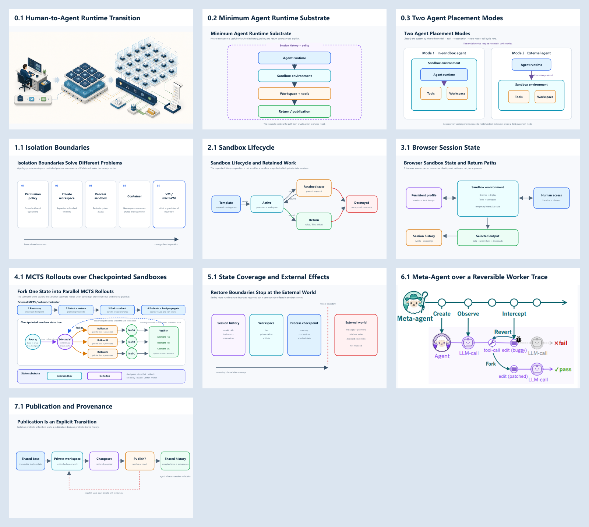

# Volume I Visual Assets

Part 0 uses ten finished figures: two raster illustrations and eight editable
SVG diagrams. No figure depends on Mermaid or another runtime
diagram renderer.

## Figure Inventory

| Figure | Chapter | Asset | Format | Editorial purpose |
| --- | ---: | --- | --- | --- |
| 0.1 | 0 | [Human-to-Agent Runtime Transition](illustrations/part-0/00-human-to-agent-runtime.png) | PNG | Chapter-opening conceptual illustration |
| 0.2 | 0 | [Minimum Agent Runtime Substrate](diagrams/part-0/00-agent-runtime-reference.svg) | SVG | Show the minimum path from agent runtime to controlled return, surrounded by history and policy |
| 0.3 | 0 | [Two Agent Placement Modes](diagrams/part-0/00-agent-placement-modes.svg) | SVG | Classify placement by whether the agent runtime is inside or outside the sandbox environment |
| 1.1 | 1 | [Isolation Boundaries](diagrams/part-0/01-isolation-boundaries.svg) | SVG | Show that policy, workspace, process, container, and VM boundaries solve different problems |
| 2.1 | 2 | [Sandbox Lifecycle](diagrams/part-0/02-sandbox-lifecycle.svg) | SVG | Show which lifecycle transitions retain private work |
| 3.1 | 3 | [Browser Session State](diagrams/part-0/03-browser-session-state.svg) | SVG | Separate temporary interaction, persistent identity, human access, outputs, and history |
| 4.1 | 4 | [MCTS Rollouts over Checkpointed Sandboxes](diagrams/part-0/04-rl-environment-stack.svg) | SVG | Show select, restore, expand, evaluate, and backpropagate across private sandbox branches |
| 5.1 | 5 | [State Coverage and External Side Effects](diagrams/part-0/05-state-coverage-side-effects.svg) | SVG | Show that restore boundaries cannot rewind external effects |
| 6.1 | 6 | [SHEPHERD Meta-Agent over a Reversible Worker Trace](illustrations/part-0/06-shepherd-meta-agent.png) | PNG | Show create, observe, intercept, revert, and fork over a worker trace |
| 7.1 | 7 | [Publication and Provenance](diagrams/part-0/07-publication-provenance.svg) | SVG | Show that publication is an explicit accepted-or-rejected transition |

## Visual System

All book-authored technical diagrams use a 1600 × 900 canvas and the same
semantic palette:

| Color | Meaning |
| --- | --- |
| Deep navy | Durable infrastructure and accepted shared history |
| Blue | Policy, lifecycle, and control surfaces |
| Cyan | Active execution and agent sessions |
| Amber | Mutable or retained runtime state |
| Purple | Audit, identity, provenance, and coordination |
| Green | Successful return, recovery, or publication |
| Red | Failure, rejection, or irreversible external effects |

SVG text uses Segoe UI with Arial as the fallback. Every SVG contains a
machine-readable `title`, `desc`, and ARIA reference. The source files can be
edited directly without recreating the figure.

## Generated Illustration Provenance

Figure 0.1 was generated with the built-in image-generation tool and then
copied into this repository. It is intentionally label-free and should be used
with a normal book caption rather than treated as an exact architecture map.

Prompt summary:

> Create a wide editorial technical illustration showing one human developer
> and workstation transforming into an agent-native runtime with many abstract
> computational workers in private translucent workspaces. Show coordination,
> audit trails, resource control, and controlled result paths. Use deep navy,
> muted cyan, warm amber, green accents, and an off-white background. Avoid
> logos, product branding, text, humanoid robots, and cyberpunk styling.

## External Figure Provenance

Figure 6.1 is the user-supplied copy of SHEPHERD Figure 1, used directly rather
than redrawn. It illustrates a meta-agent creating, observing, intercepting,
reverting, and forking a worker trace. Source: [SHEPHERD project
page](https://shepherd-agents.ai/).

## Production Notes

- Prefer SVG directly for the eight vector diagrams in web, EPUB, and modern
  PDF production; preserve Figure 6.1 as the attributed source image.
- Rasterize from the SVG only when a publishing tool cannot embed vector art.
- Do not edit the contact sheet as a source; it is only an overview.
- Preserve the semantic colors when adding future figures.
- Captions should explain the conclusion of a figure rather than repeat every
  label inside it.
