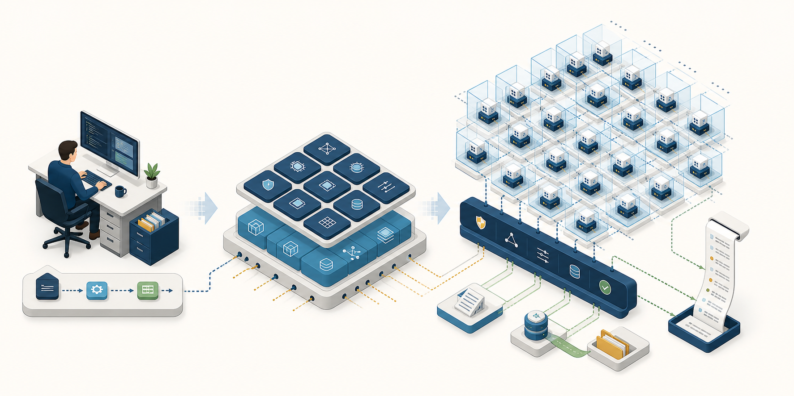
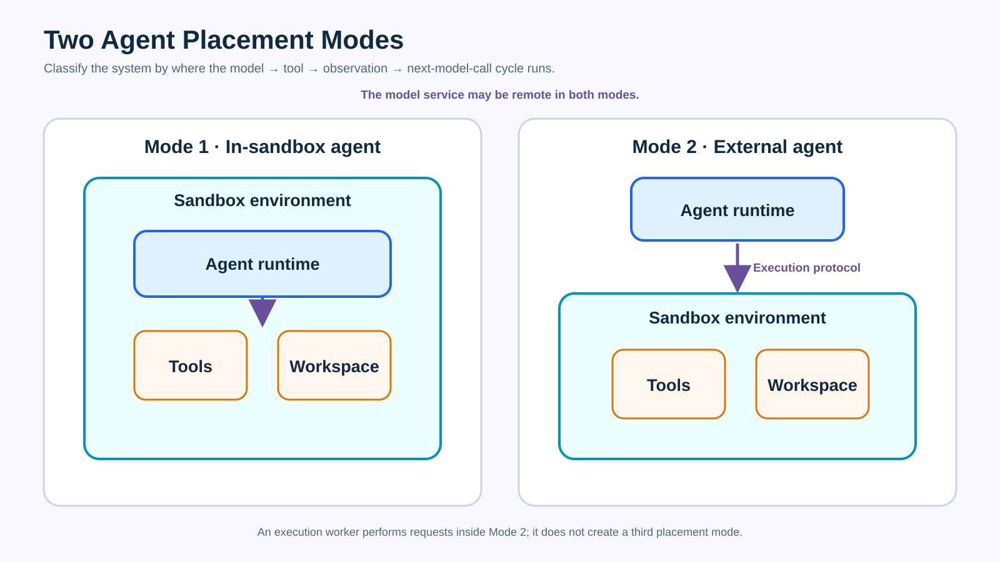
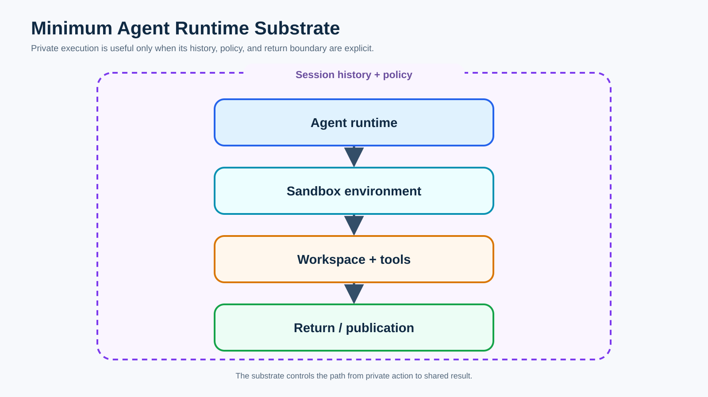
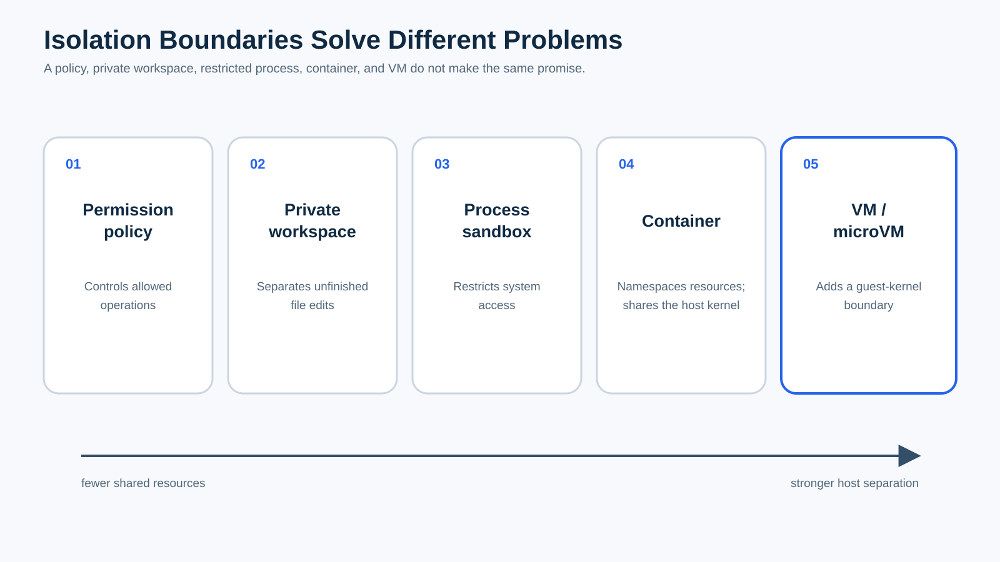
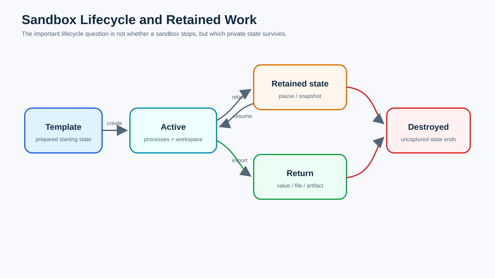
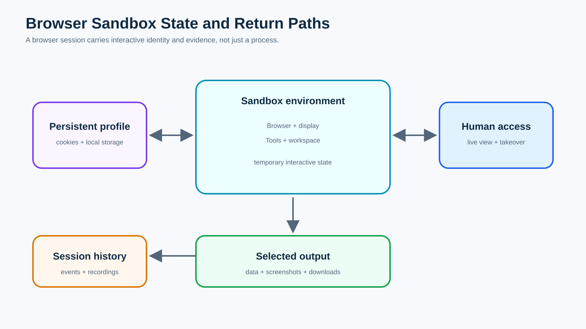
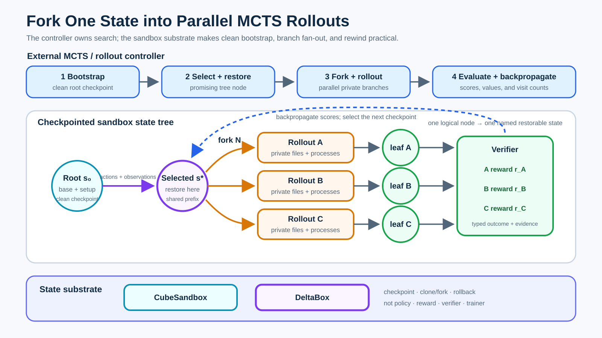
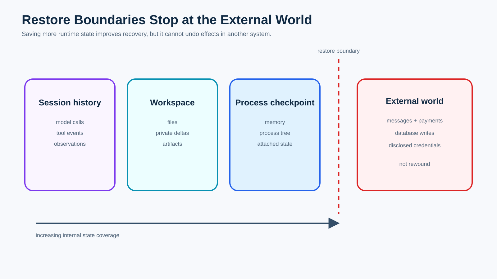
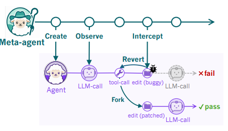
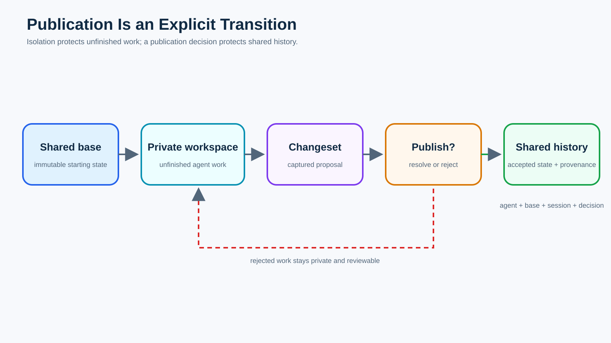

# Part 0 — Overview of Agent Sandboxes in Practice

*A comparative case study of isolation, state, rollouts, recovery, and
publication across agent runtimes.*

“Agent sandbox” sounds like one category. In practice, the label covers command
policies, private workspaces, containers, microVMs, browser sessions, rollout
environments, checkpoints, and fleet control. This part follows one dependency
update across those boundaries to show what each layer protects, retains, and
returns.

Together, these distinctions let operators compare systems without assuming
that speed, isolation, recovery, and publication arrive as one inseparable
package within a single product.

## Chapter 0 — Agent Workloads and the Runtime Substrate

### The computer that worked for one person

A developer asks three coding agents to update one dependency. They edit the
same checkout, produce incompatible lockfiles, and start test servers on the
same port. Every agent reports progress; nobody can attribute the final state.

The operating system behaved normally: one user could start processes and
modify files. What disappeared was the human coordination that assigns
ownership and decides what to keep. At agent scale, each attempt instead needs
private execution, stable identity, bounded resources, a named starting state,
history, and a controlled return path.

A **sandbox environment** contains an execution's tools, processes, browser
state, and workspace. An **agent runtime** calls the model, chooses actions,
and incorporates observations. They cooperate, but they are not the same
component.

> *💡 **Core principle:** A sandbox environment contains execution state; an
> agent runtime owns the decision cycle.*

*Figure 0.1 — One human can coordinate a personal computer informally; a
population of agents needs explicit private work, control, and return paths.*

### Exactly two placement modes

The first architectural question is where the agent runtime runs. Use one test:

> *🧭 **Placement test:** Where does the model → tool → observation →
> next-model-call cycle run?*

**There are exactly two answers.**

In an **in-sandbox agent**, the agent runtime runs inside the sandbox
environment with its tools, processes, and workspace. Calls to a remote model
service do not change that classification. The component that interprets the
model response, selects a tool, receives the result, and prepares the next
model call remains inside.

In an **external agent with sandboxed tool execution**, the agent runtime runs
outside the sandbox environment. It sends operations through an execution
protocol: a request, any streamed input or output, and a result. An execution
worker inside performs those operations. That worker may hold a PTY, expose an
MCP server, or manage processes, but it is not another agent runtime because it
does not own the decision cycle.

*Figure 0.2 — Placement depends only on where the decision cycle runs; a remote
model service and a sandbox-side worker do not create another mode.*

| Dimension | In-sandbox agent | External agent with sandboxed tool execution |
| --- | --- | --- |
| Agent runtime | Inside the sandbox environment | Outside the sandbox environment |
| Tool path | Local calls and system interfaces | Execution protocol to an execution worker |
| Private state | Usually coupled to the environment unless exported | Workspace and processes remain inside; session history may remain outside |
| Failure shape | Runtime and environment can fail together | Runtime can replace or reconnect to an environment |
| Main cost | Larger image and coupled lifecycle | Transport, serialization, and remote-tool semantics |
| Important non-guarantee | Locality does not imply strong isolation | External orchestration does not imply durable or publishable state |

Neither placement always wins. An in-sandbox runtime works naturally with
local CLIs, PTYs, sockets, and files, but its lifecycle and credentials may be
coupled to the environment. An external runtime can retain history, replace
environments, and keep credentials outside generated-code execution, but its
protocol must represent streaming, stdin, PTY resize, long-running processes,
ports, artifacts, disconnects, and idempotent retries.

Across that protocol, completion must also define when output is flushed, a
process has exited, artifacts are captured, and workspace mutations are
visible. Operation identities prevent a lost response from duplicating a
package publish or migration. These are distributed-systems obligations of the
external boundary, not a third placement mode.

Sandbox-as-a-Service is a delivery model, not a third placement mode. Anthropic's
Managed Agents architecture illustrates the external mode: an outside harness
owns the decision cycle and durable log, while a replaceable execution worker
acts as its “hands.” [Anthropic engineering
description](https://www.anthropic.com/engineering/managed-agents)

### A private room is not a runtime

Give each agent a private directory and the obvious file collision disappears,
but several harder questions remain. Can an agent read the user's SSH keys? Can
two test servers bind the same port? What happens when memory is exhausted?
Which base revision produced the result? Can a failed attempt resume? Does a
downloaded artifact belong to shared history? Who authorizes publication?

These questions expose six pressures.

**Concurrency** demands ownership of files, processes, ports, and other mutable
state. **Auditability** demands a link from identity and starting state to tool
events and outputs. **Cost** demands fast creation, density, suspension, and
cleanup rather than one permanent machine per short task. **Reproducibility**
demands explicit templates and bases. **Recovery and exploration** demand
snapshots, forks, or replay. **Publication** demands a decision that turns
private results into shared truth.

A plausible file plus “tests passed” is insufficient. Trust requires structured
causality: the agent and session, starting revision, policy, commands,
processes, artifacts, and exact proposed bytes. With that record, recovery can
distinguish rerunning from the base, resuming retained workspace state, and
reconnecting to a live process.

Git, shell history, and CI each hold fragments of that story. Session history
must join them before a human reconstructs the run manually. It should record
named transitions: environment loss after a test, runtime replacement from a
retained workspace, or reconnection after transport failure. Recovery then
means resuming from explicit state rather than issuing an ambiguous retry.

Security crosses all six, but “contains hostile code” is too narrow a
definition of an agent sandbox. A system may strongly separate a guest kernel
from its host yet offer no useful changeset. Another may be designed for
cooperating agents and provide excellent workspace provenance without claiming
hostile-tenant isolation. The word sandbox must always be followed by a unit,
a boundary, a state model, and a return path.

*Figure 0.3 — Private execution becomes dependable only when policy and session
history surround a controlled path from action to return or publication.*

The minimum substrate is an agent runtime acting through a sandbox environment
over private tools and workspace, surrounded by policy and session history,
with explicit return or publication. Controllers, schedulers, checkpoint
stores, and credential brokers refine that path at scale.

Evaluate any system by naming its unit, placement, boundary, private state and
base, lifecycle, concurrency model, evidence, return path, and most important
non-guarantee. This prevents comparing filesystems with VMs or treating a
feature list as an architecture: similarly named snapshots, worktrees, and
sandboxes may cover different state and trust boundaries.

The next chapters follow one task—update a dependency, change a source file,
run tests, open the application, and return the proposal—through different
parts of this landscape. Each category solves a different problem. None should
be mistaken for the whole agent computer.

## Chapter 1 — Sandboxing in Coding-Agent Products

### Rules, workspaces, and execution boundaries

Suppose the dependency update now runs in three separate Git worktrees. The
agents stop overwriting one another's files, but all three may still see the
same home directory, credentials, kernel, network, and local services. A
worktree is a private desk, not a locked room.

Coding-agent products combine several boundaries that are easy to blur:

- A permission policy says which operations may proceed without approval.
- A private workspace separates unfinished file edits.
- A process sandbox restricts filesystem, process, or network access.
- A container namespaces resources but normally shares the host kernel.
- A VM or microVM adds a guest-kernel boundary.

**These controls compose; they do not form a universal strength score.** A
worktree may solve the collision that matters most for cooperative coding,
while a microVM may be necessary when executed code is untrusted. Conversely,
a microVM alone says nothing about how two good patches are compared or merged.

> *🧱 **Boundary rule:** Ask what is separated—files, processes, network,
> kernel, or policy—and what still remains shared.*

*Figure 1.1 — Moving from policy to a guest kernel changes which resources are
shared; it does not automatically add history or publication.*

Codex illustrates the separation. In local chats, spawned commands run inside
a platform-native sandbox while the agent runtime remains outside that command
boundary: external agent with sandboxed tool execution. Approvals decide when
Codex must ask to cross the boundary; sandboxing enforces what a command can do
inside it. Codex worktrees give independent working copies that share Git
metadata. They reduce edit collisions, but they are not described as a tenant
security boundary. Cloud chats instead create a container, check out a chosen
revision, run environment setup, execute the task, and return an answer plus a
diff. [Codex sandbox documentation](https://learn.chatgpt.com/docs/sandboxing),
[worktree documentation](https://learn.chatgpt.com/docs/environments/git-worktrees),
[cloud environment documentation](https://learn.chatgpt.com/docs/environments/cloud-environment)

Claude Code makes a similar distinction locally. Its Bash sandbox applies
filesystem and network restrictions to commands and their children, with OS
primitives enforcing the boundary. The Claude Code agent runtime remains
outside that Bash-command boundary, so this is also external agent with
sandboxed tool execution. Its documentation explicitly keeps permission rules
separate from sandbox enforcement and describes controlled fallback for
commands that cannot run inside the sandbox. [Claude Code sandbox
documentation](https://code.claude.com/docs/en/sandboxing)

Docker Sandboxes demonstrates the other placement mode. Docker launches a
coding agent inside an isolated microVM with its own Docker daemon, filesystem,
and network. The agent runtime, tools, and workspace live in that sandbox
environment; the model service may remain remote. That is an in-sandbox agent.
The microVM is a stronger host boundary than a worktree, but the documentation
does not make it a publication system. [Docker Sandboxes
documentation](https://docs.docker.com/ai/sandboxes/)

| Example | Unit and placement | Boundary and private state | Lifecycle, evidence, and return | Important non-guarantee |
| --- | --- | --- | --- | --- |
| Codex local | Command execution; external agent | OS-enforced command sandbox; optional worktree | Chat history and diff; worktree can be handed off or restored | Worktree is not a guest-kernel boundary |
| Claude Code local | Bash execution; external agent | OS-enforced filesystem and network restrictions | Session plus working-directory changes; exceptions follow permission flow | Permission approval is not isolation |
| Docker Sandboxes | MicroVM; in-sandbox agent | Guest kernel, private Docker daemon, filesystem, and network | Environment persists for the sandbox session; work leaves through Git or exported files | MicroVM isolation does not resolve competing changes |

The task exposes the distinction: a worktree answers “whose files?”, a command
sandbox answers “which operations?”, and a microVM limits host exposure. None
chooses whether the result should return as a commit, patch, or artifact.

These examples also clarify concurrency. Ten private worktrees can prevent ten
agents from overwriting source files, while all ten still compete for host CPU,
memory, disk, ports, and rate-limited external services. Ten microVMs can
separate more of those resources but cost more to start and operate. A useful
coding-agent product states which collision it prevents rather than presenting
“sandboxed” as the end of the analysis.

Gemini CLI's documented choices reinforce the category lesson: it can use a
container with a mounted workspace, gVisor, or tool-level sandboxing. The
product name does not determine the boundary; the selected mechanism does.
[Gemini CLI sandbox documentation](https://geminicli.com/docs/cli/sandbox/)

When evaluating any coding-agent sandbox, ask what crosses the wall: the
workspace, shared Git metadata, credentials, network traffic, caches, Docker
sockets, local services, and explicit approval escapes. Then ask what comes
back. A terminal transcript and modified files may be sufficient for one
developer, but parallel agents need a more deliberate return contract.

## Chapter 2 — On-Demand Cloud Sandboxes

### A computer with a lifecycle API

The same task now arrives at a service as “give this agent a clean Linux
computer for twenty minutes.” The request sounds simple until the run times
out after the tests pass but before the patch is downloaded. The machine was
isolated; the work was still lost.

An on-demand cloud sandbox is best understood as a computer with an explicit
lifecycle. A template defines the starting tools and dependencies. Allocation
creates an identity and private state. Active execution owns processes, files,
and ports. A pause or snapshot may retain some state. A timeout or destroy
operation ends the rest. Finally, a return path carries selected values, files,
artifacts, URLs, snapshots, or patches to another system.

> *🔄 **Lifecycle rule:** Isolation protects a running sandbox; retention and
> return protect the work it produces.*

“Fresh” can mean a new process, a clean filesystem, a cached template, a
restored snapshot, or a resumed machine. Those states are operationally
different. **Reproducibility depends on naming the base**, not merely calling
the result new.

*Figure 2.1 — Stop, pause, export, and destroy are distinct transitions because
they retain different state.*

E2B exposes on-demand Linux VMs and templates through SDKs. Its documentation
separates lifecycle, persistence, snapshots, forking, filesystem transfer,
commands, metrics, and telemetry. In the common API topology, an external agent
runtime requests tool execution in the VM, making this external agent with
sandboxed tool execution. A caller can also install an agent runtime in the
template, which would use the in-sandbox mode; the delivery service itself
does not decide placement. [E2B documentation](https://e2b.dev/docs)

Daytona likewise exposes sandboxes through SDKs and an API, with documented
pause operations and snapshots. Its documentation distinguishes filesystem-only
cold snapshots from experimental snapshots that include memory. That detail
matters: restoring files is not the same as restoring a running process.
These are vendor-documented capabilities, not an independent performance
benchmark. [Daytona sandbox documentation](https://www.daytona.io/docs/en/sandboxes/)

Modal Sandboxes make the lifetime boundary visible in another way: the
documentation recommends filesystem snapshots when work must survive beyond
the sandbox's maximum run. A long-lived project is therefore assembled from
successive environments and retained files, not assumed to be one immortal
machine. [Modal Sandbox documentation](https://modal.com/docs/guide/sandboxes)

| Example | Unit and placement | Isolation and private state | Lifecycle, concurrency, and audit | Return and non-guarantee |
| --- | --- | --- | --- | --- |
| E2B | On-demand VM; usually external agent | VM files, processes, and environment | Create, connect, pause, snapshot, fork; metrics and telemetry are documented | Files, command results, URLs, snapshots; no built-in merge contract |
| Daytona | Sandbox from an image or snapshot; usually external agent | Private filesystem and experimental process-memory snapshot | Create, pause, resume, snapshot; many sandboxes are API-managed | Files and command results; snapshot is not publication |
| Modal | Sandbox process environment; external agent in the common API use | Filesystem plus attached volumes or snapshots | Bounded run with retained filesystem options | Function results and files; lifetime limits remain |

Lifecycle verbs need exact semantics. “Pause” may freeze processes or retain
only files; a preview URL, billing state, and reconnectable identity may follow
different rules. Return is equally specific: stdout omits edits, selected files
may omit deletions, a snapshot may retain secrets, and a patch assumes a base.
A robust workflow separates diagnostic retention from a reviewable proposal
and destroys the environment only after outputs and history are linked.

The common non-guarantee is decisive: **a task sandbox generally returns
material, not shared truth.** Stdout can say the tests passed while the useful
patch remains inside. A file download can omit deletions. A snapshot can
preserve too much state for review. A branch can conflict with a newer base.
The caller still needs capture, comparison, and publication.

## Chapter 3 — Browser and Computer-Use Sandboxes

### The state behind the pixels

The dependency update passes its tests, so an agent opens the application and
logs into a staging account. It dismisses a banner, changes a preference,
downloads a report, and hands control to a human for a payment confirmation.
Closing the browser process does not answer which parts of that interaction
should persist.

A browser sandbox carries more than executable code. Tabs, cookies,
localStorage, IndexedDB, downloads, browser permissions, authentication,
display state, and input state can all affect the next action. A disposable
browser session may attach to a durable profile. Human live view or takeover
crosses into the same state. Screenshots, recordings, extracted data, and
downloads can leave even when the session itself disappears.

> *🔐 **State rule:** A browser process may be disposable while its authenticated
> profile, evidence, and downloads persist.*

*Figure 3.1 — The browser process may be temporary while identity, evidence,
and selected outputs follow different retention rules.*

Browserbase makes the profile distinction explicit. Sessions start with a
fresh user-data directory by default; a Context can retain cookies,
authentication tokens, local storage, IndexedDB, and other application data
across sessions. Persistence must be enabled when session changes should update
that Context. In the usual topology, an external agent runtime drives the
remote browser through an automation protocol, so this is external agent with
sandboxed tool execution. [Browserbase Context
documentation](https://docs.browserbase.com/platform/browser/core-features/contexts)

AIO Sandbox illustrates a different unit: one Docker container combines
browser automation, VNC, shell, files, notebook, editor, and MCP surfaces over
a shared filesystem. An external agent client can call those surfaces as
tools. The integration is convenient because a downloaded file is immediately
visible to the shell, but a shared container does not by itself create a
stronger tenant boundary or a publication transaction. [AIO Sandbox
repository](https://github.com/agent-infra/sandbox)

| Example | Unit and placement | Private state and lifecycle | Auditability and return | Important non-guarantee |
| --- | --- | --- | --- | --- |
| Browserbase | Remote browser session; external agent | Fresh session data or a retained Context | Context identity plus browser automation results | A retained login is sensitive state, not proof of authorization |
| AIO Sandbox | Tool-rich container; external agent in its client topology | Browser, display, tools, and workspace share one container | Tool results, files, screenshots, and remote views | One container does not imply hostile-tenant isolation or code publication |

A session can produce a report, screenshots, browser events, source edits, a
human decision, and an updated profile. They need distinct return and retention
rules: artifacts leave, evidence remains attributable, code becomes a
changeset, and authenticated state stays bound to its owner and policy.

Teardown must balance confidentiality and reproducibility. A retained profile
may preserve a needed login or a compromised session; deleting every profile
may force repeated credential handling. The system needs an owner, retention
rule, revocation path, and event history.

The visual surface creates one more trap: **a screenshot is an observation, not
the state itself.** Two pages can look identical while cookies, permissions,
downloads, and open connections differ. Reliable computer-use evaluation and
replay therefore require structured browser and session facts alongside
pixels.

Because profiles and screenshots can retain authority or secrets, browser
infrastructure must bind identity, redaction, evidence, and profile lifecycle.
A human takeover must be marked explicitly, and an observation must not be
mistaken for an approved project change.

## Chapter 4 — RL and Evaluation Sandboxes

### Fork one state into a population of rollouts

Repeated attempts should share an initialized root, then diverge at a model
decision without rebuilding the operating system and caches. In Monte Carlo
tree search, a controller selects and restores a node, expands actions, rolls
private branches forward, scores their leaves, and backpropagates rewards and
visit counts.

RL and evaluation add an **episode contract** to execution. A dataset item
names the task and initial state; the agent produces actions; the environment
returns observations and changes private state; a verifier produces reward;
and a typed termination closes the attempt. The episode record connects that
outcome to the exact policy, trajectory, verifier, and starting checkpoint.

> *🌲 **Rollout rule:** Bootstrap one named root, fork private branches, score
> leaves, and record the exact checkpoint behind every reward.*

*Figure 4.1 — An external MCTS controller bootstraps one clean checkpoint,
restores a selected state, forks private sandboxes for parallel rollouts,
evaluates the leaves, and backpropagates their scores. CubeSandbox or DeltaBox
can accelerate state reuse; neither supplies the search policy or verifier.*

The figure materializes selected nodes as checkpoints, but an implementation
may save only branch points, replay cheap nodes, or evict old states. Each
rollout must still begin from the state named by its selected node.

CubeSandbox documents RustVMM/KVM microVMs, an E2B-compatible API, clustered
deployment, and operations to checkpoint, clone, and roll back running
sandboxes. An external controller can therefore bootstrap a template, fan out
isolated branches, and retain selected checkpoints. These are project-reported
capabilities, not a dataset, search policy, reward, or trainer. [CubeSandbox
repository](https://github.com/TencentCloud/CubeSandbox)
and [lifecycle documentation](https://cubesandbox.com/guide/lifecycle.html)

DeltaBox coordinates filesystem changes with process state for change-based
checkpoint and rollback. Its authors report millisecond-level latency in
SWE-bench tree search and RL fan-out experiments; those research results are
not service guarantees or a complete training stack. [DeltaBox
paper](https://arxiv.org/abs/2605.22781)
and [project page](https://dongyunpeng-sjtu.github.io/deltabox/)

| Sandbox substrate | Unit and placement | Fork and rollback state | Parallel rollout role | Return and non-guarantee |
| --- | --- | --- | --- | --- |
| CubeSandbox | KVM microVM sandbox; commonly an external agent with sandboxed tool execution | Templates and running-state snapshot, clone, and rollback operations | A controller can fan out private microVM branches across a service or cluster | Returns execution and sandbox state; does not define MCTS, reward, or training |
| DeltaBox | Stateful agent sandbox controlled by an external search or training loop | Coordinated filesystem and process checkpoint/rollback using changed state | Reduces repeated state materialization during tree search and RL fan-out | Restores agent state; does not define the verifier, search policy, or fleet service |

The shown controller is an external agent with sandboxed tool execution. An
in-sandbox agent remains possible, but a controller must still assign episode
identity, collect scores, and select nodes.

Reset semantics determine whether rewards are attributable. Rebuilding is
simple but expensive; restoring a snapshot is faster only if it covers every
relevant state domain. A file rollback does not stop stale processes or undo a
remote database write. The episode record must therefore name the reset
mechanism, checkpoint, and uncaptured external effects.

The root must name its image, repository revision, initialization, policy, and
retained process state. Each child then owns its files, processes, trace,
termination, and reward while referencing the shared prefix. Otherwise caches,
servers, or database rows can leak work between branches and corrupt rewards.

A losing branch may be destroyed while a promising leaf becomes the next
checkpoint. That promotion changes retained state; it must not merge unfinished
child state into siblings. Fork ancestry keeps shared history immutable while
attaching each reward to the point where its rollout diverged.

Infrastructure failure is not agent failure. Allocation, restore, protocol,
verifier, policy, and model termination need typed outcomes and retry rules.
Every reward must reference the exact checkpoint, model, runtime, actions,
verifier, and termination reason; systematic fan-out amplifies any leak or
scoring loophole.

**Fast checkpointing is an enabling primitive, not the episode contract.** The
complete system must still isolate branches, protect verifier
integrity, bound egress and resources, record every fork and restore, and make
the winning trajectory reproducible from its bootstrapped root.

## Chapter 5 — Filesystem Branching and Runtime Checkpointing

### Save points have different coverage

Three agents try different repairs from the same repository base. Copying the
entire directory three times works, but it duplicates dependencies and obscures
their relationship. A copy-on-write branch can share the base and record only
private deltas. A checkpoint can go further and preserve a running process.
Those mechanisms solve exploration and recovery, but they save different
things.

Agent state may include the conversation, tool events, files, process memory,
open descriptors, browser profiles, mounted volumes, and remote resources. A
filesystem snapshot captures no more than its filesystem domain. A
process-aware checkpoint may preserve memory and a process tree. Neither can
undo an email, payment, database write, published message, or disclosed
credential.

> *⏪ **Restore rule:** A checkpoint can rewind only the state domains it
> captured; external effects remain real.*

*Figure 5.1 — More complete checkpoints improve internal recovery, but effects
outside the captured domain remain real.*

AgentFS makes files and agent history queryable state. Its project stores file
operations, tool calls, and state changes in SQLite, and describes snapshots
as copies of the database file. That improves auditability and portability.
The project also labels itself beta. A database-backed filesystem does not
automatically isolate processes, networks, or tenants; its important unit is
agent state. [AgentFS repository](https://github.com/tursodatabase/agentfs)

BranchFS makes speculative filesystem state a tree. It describes FUSE-based
copy-on-write branches with snapshot isolation, commit-to-parent, and abort.
Separate agents can access different branch paths through one mount. Its atomic
commit means the branch delta is applied as one filesystem operation relative
to its parent; it does not mean arbitrary semantic conflicts with a separately
advancing shared project have been resolved. [BranchFS
repository](https://github.com/multikernel/branchfs)

DeltaBox is a research system that coordinates filesystem state with process
state for checkpoint and rollback. The authors report millisecond-level
checkpoint and restore in their evaluated setup by combining OverlayFS changes
with CRIU-coordinated process state. Those are author-reported research results,
not independently reproduced numbers here. The architectural lesson is that
**“checkpoint” must name both its coverage and consistency boundary.**
[DeltaBox project page](https://dongyunpeng-sjtu.github.io/deltabox/)

| Example | Unit and placement | Private state and lifecycle | Concurrency and audit | Return and non-guarantee |
| --- | --- | --- | --- | --- |
| AgentFS | SQLite agent filesystem; either placement mode | Files, key-value state, and tool history; copyable snapshots | One portable history can be queried and inspected | Database file or mounted files; no process or tenant isolation |
| BranchFS | Copy-on-write filesystem branch; either placement mode | Snapshot view plus private delta; commit or abort | Parallel branch paths with explicit parent relationships | Filesystem merge to parent; no external-side-effect rollback |
| DeltaBox | Filesystem-and-process state node; external controller in the described design | Coordinated filesystem and memory checkpoint or rollback | Designed for branching exploration with state pairs | Restored execution state; no undo of remote effects and no publication contract |

Three save operations answer different questions. A workspace snapshot retains
source and lockfile; a process checkpoint also retains runtime state but depends
on a compatible environment; a changeset excludes ephemeral state and captures
a proposal against a named base. Calling all three “state” hides their purpose.

Coverage and consistency are separate questions. A checkpoint may include both
files and memory yet capture them at incompatible moments, leaving processes
with descriptors or caches that disagree with disk. Coordinated restore must
name which domains form one recoverable state and which must be rebuilt.

Branch operations need the same precision: atomic commit-to-parent does not
resolve semantic conflicts with an advancing base. External effects belong in
history even though they cannot enter a checkpoint; retry may require an
idempotency key, compensation, or human decision.

A checkpoint selects a point inside one execution history. **Publication is a
different operation against shared history that may have advanced.** Restoring a
successful test run does not decide whether its edits are compatible with
another accepted patch. Filesystem branching supplies private alternatives;
the return boundary still needs capture, comparison, conflict semantics, and
provenance.

## Chapter 6 — Meta-Agent Runtimes, Control Planes, and Fleets

### A supervisor over a reversible trace

A worker is about to issue a tool call that would edit the wrong dependency.
A meta-agent observes the proposed action, intercepts it before execution, and
forks a corrected branch. If the original branch has already run, the
meta-agent reverts to the preceding event and tries again. This simple story
hides three different control roles.

A **meta-agent** observes or redirects another agent's decisions. A **sandbox
lifecycle control plane** creates, pauses, restores, routes, and destroys
sandbox environments. A **scheduler** places those environments on machines
and manages queues or warm capacity. One product may implement more than one
role, but the roles remain distinct. A sandbox-side daemon that executes a
command is still an execution worker, not a placement mode.

> *🧭 **Control rule:** Meta-agent supervision, sandbox lifecycle, and fleet
> placement may cooperate, but they are not the same responsibility.*

*Figure 6.1 — A meta-agent creates and observes a worker, intercepts a proposed
action, then reverts or forks the reversible trace. Source: [SHEPHERD Figure
1](https://shepherd-agents.ai/). Lifecycle control and fleet placement remain
separate roles described below.*

SHEPHERD focuses on meta-agent semantics. Its project describes reversible,
Git-like agent execution traces that can be created, observed, intercepted,
forked, replayed, and reverted. The repository also labels the software early
alpha with changing APIs. It should therefore be read as a research-driven
trace substrate, not mistaken for a mature fleet scheduler or an isolation
boundary. [SHEPHERD repository](https://github.com/shepherd-agents/shepherd)

Kubernetes Agent Sandbox focuses on lifecycle orchestration. It defines a
Sandbox custom resource for a stateful singleton workload with stable identity
and persistent storage, and it can use warm pools. Its documentation is
explicit that low-level isolation is delegated to sandbox runtimes such as
gVisor or Kata Containers. The managed workload can contain an in-sandbox
agent, or it can serve an external agent through an execution protocol; the
control plane does not add another placement mode. [Kubernetes Agent Sandbox
repository](https://github.com/kubernetes-sigs/agent-sandbox)

SWE-ReX occupies the remote-execution layer. Its project presents sandboxed
code execution for agents across local and cloud backends. In the common use,
an external agent runtime acquires or connects to an environment, executes
commands, and receives evidence. It does not become the scheduler merely
because it can address several backends. [SWE-ReX
repository](https://github.com/SWE-agent/swe-rex)

| Role or example | Primary unit and placement | Lifecycle authority | Concurrency and evidence | Important non-guarantee |
| --- | --- | --- | --- | --- |
| SHEPHERD meta-agent substrate | Reversible trace; external supervisor topology | Fork, replay, and revert trace execution | Trace history supports comparison and intervention | Early-alpha trace substrate is not a scheduler or isolation runtime |
| Kubernetes Agent Sandbox | Stateful sandbox resource; supports either of the two placement modes | Declarative create, identity, storage, claim, and warm-pool management | Kubernetes reconciliation and workload identity | Delegates the actual isolation mechanism |
| SWE-ReX remote execution | Execution environment; external agent | Backend-specific acquire, command, and release | Parallel remote commands and returned execution evidence | Remote access is not publication or meta-agent supervision |

On worker failure, the scheduler stops placement, the lifecycle controller
restores retained state into a replacement, and the runtime reports the
discontinuity. A structured event must distinguish worker loss from command
timeout, name the restored boundary, and flag uncertain external effects. A
lease prevents the old worker from publishing stale work.

The replacement receives a new execution identity while preserving the
logical session identity. If process state was not checkpointed, the runtime
must say which command completed last and whether later effects are unknown. A
meta-agent can then retry, fork recovery strategies, or stop for review without
pretending continuity.

Warm pools may retain an image and dependencies, never a previous owner's
private workspace. Claim attaches session identity and policy; release must
clean private state. Audit events then distinguish failures in the runtime,
protocol, worker, or tool. Reassigning files is not restoring processes, and
replaying history cannot undo an external API call; the control plane must show
those boundaries instead of hiding them behind “running.”

At fleet scale, this evidence becomes control input rather than debugging
output. Identity drives ownership, events drive recovery, and resource records
drive quotas and placement. Fast reuse without those links turns a performance
optimization into cross-session contamination.

## Chapter 7 — Workspace Isolation, Changesets, and Publication

### Returning work is part of execution

The agents have now produced three plausible fixes. One changed the dependency
with a small adapter. One pinned an older transitive package. One rewrote the
affected module. All pass their private tests. Isolation kept the attempts
clean; it did not decide which result belongs in the project.

> *🚦 **Publication rule:** Finishing creates a private result; publishing makes
> an accepted result shared truth.*

Return mechanisms carry different meanings.

| Return form | What it preserves | Conflict behavior | What it does not establish |
| --- | --- | --- | --- |
| Value or stdout | A result from one operation | None | Which files or state produced it |
| File or artifact | Selected bytes | Usually overwrite or rename | Relationship to a project base |
| Patch | File edits relative to an assumed base | May fail or apply partially | Complete runtime evidence |
| Branch | Commits and Git ancestry | Merge or rebase semantics | Non-Git state or policy approval |
| Changeset | Captured mutations plus explicit base and identity | Can be compared and resolved | Acceptance into shared history |
| Publication | Accepted all-or-reject transition | Rejects unresolved or forbidden change | Hostile-tenant isolation |

Suppose sessions A and B start at B-10 and edit the same setting. B publishes
first as B-11; blindly applying A would erase B's policy even if A's private
tests pass. A changeset lets the resolver compare B-10, A, and B-11, then reject,
resolve, or prepare a new proposal without discarding A's evidence.

All-or-reject publication keeps related manifest, lockfile, source, and
generated changes together. Provenance should connect each accepted line to
its changeset, session, starting base, commands, tests, agent, and decision. It
does not prove correctness, but makes acceptance inspectable.

A sound workspace contract separates four events. **Finish** means the agent
runtime stopped or returned. **Capture** turns private filesystem mutations
into a reviewable proposal. **Resolve** compares that proposal with the
currently accepted base and policy. **Publish** makes the accepted result shared
history. Any step may fail without erasing the earlier evidence.

Capture should freeze the proposal and its base. Resolve may read newer shared
history but should not mutate either side while deciding. Publish then applies
the accepted set atomically with its decision record; rejection leaves the
proposal private and inspectable. This separation prevents a retry from
silently changing what reviewers approved.

Container Use is a concrete branch-oriented example. Its environments combine
a dedicated Git branch, a container, and tracked command and file history. A
reviewer can inspect a log or diff, continue the environment, merge its branch,
apply changes as staged modifications, or discard the attempt. The product
therefore makes return choices visible, although Git remains the state and
conflict substrate. [Container Use environment
workflow](https://container-use.com/environment-workflow)

*Figure 7.1 — A private workspace becomes shared history only after capture and
an explicit accepted-or-rejected publication decision.*

### The Volume I case study

Ephemeral Sandbox sits at this return boundary. Its project describes multiple
coding agents working in isolated workspace sessions over one stable project
base inside a shared sandbox. Each session has private writable state. The
runtime captures a reviewable changeset, resolves it against shared history,
and publishes an accepted result with provenance. CLI and MCP surfaces control
the runtime; observability records activity around the transition.
[Ephemeral Sandbox repository](https://github.com/Ephemeral-AI-Lab/ephemeral-sandbox)

Using the same profile questions as the rest of this landscape:

- **Sandbox unit:** one shared sandbox containing private workspace sessions.
- **Placement:** it can serve an external agent runtime through its control
  surfaces; an agent runtime placed inside the larger sandbox remains the other
  valid mode.
- **Isolation mechanism:** private workspace state and execution-session
  boundaries for cooperating coding agents.
- **Private state:** each session's writable delta, processes, and captured
  changes before publication.
- **Lifecycle:** create a session from an explicit base, execute, capture,
  publish or reject, and destroy.
- **Concurrency:** many sessions can share immutable project truth without
  sharing unfinished writes.
- **Auditability:** session identity, operations, changesets, decisions, and
  provenance connect accepted work to its origin.
- **Return path:** a changeset enters an all-or-reject publication transition.
- **Important non-guarantee:** version 1 workspace isolation is not a hardened
  microVM boundary for mutually untrusted tenants.

That limit is central, not a footnote. Ephemeral Sandbox addresses private
parallel workspaces and controlled publication. A deployment that runs hostile
tenant code still needs an appropriate container, VM, or microVM boundary,
credential controls, network policy, and a fleet layer. The publication
contract can compose with those systems; it does not replace them.

Adjacent contracts must remain explicit. A microVM may provide isolation, a
controller may replace it, a scheduler may place it, and Ephemeral Sandbox may
manage private workspaces inside it. Stable identities must link worker, lease,
sandbox, session, execution, agent, changeset base, and accepted revision.
Publication still has one job: decide whether a captured proposal becomes
shared history.

The same explicitness prevents capability inflation. Adding a microVM does not
make workspace publication conflict-aware. Adding provenance does not stop
kernel exploits. Adding process checkpointing does not revoke a leaked token.
Adding a scheduler does not turn an execution worker into an agent runtime.
**The useful architecture is not one giant box labeled “agent sandbox.”** It is a
set of boundaries whose guarantees can be checked independently and then
composed.

### From landscape to implementation

The landscape supplies policies, disposable computers, browser profiles,
rollout environments, branching state, reversible histories, controllers, and
schedulers. The challenge is composition without capability inflation.

Volume I now follows one narrower problem: private parallel workspaces for
cooperating coding agents, observable execution, and all-or-reject publication
over shared project truth. That is the path from a sandbox environment to an
agent workspace.
