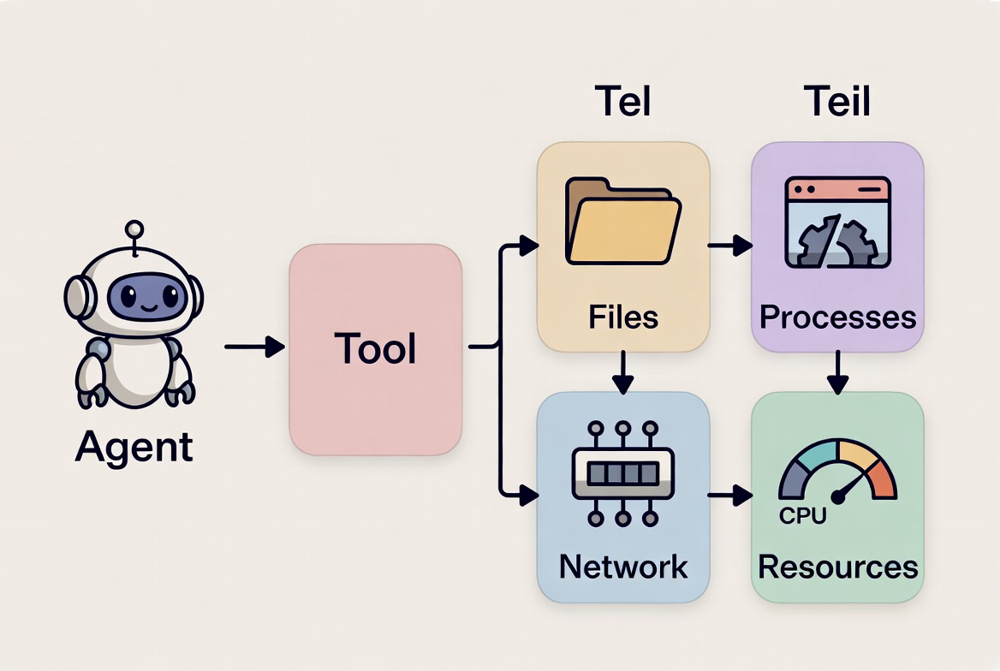
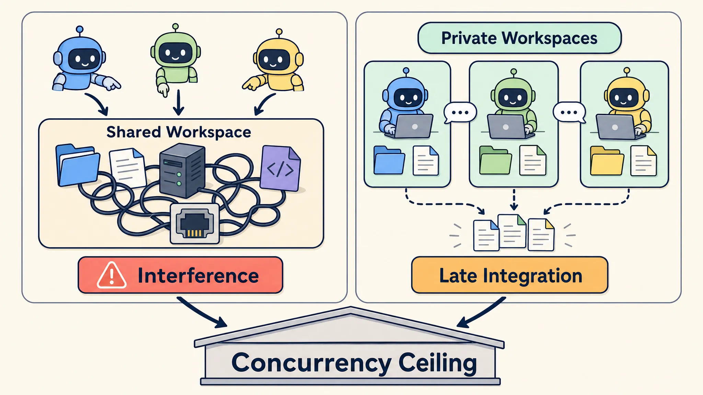
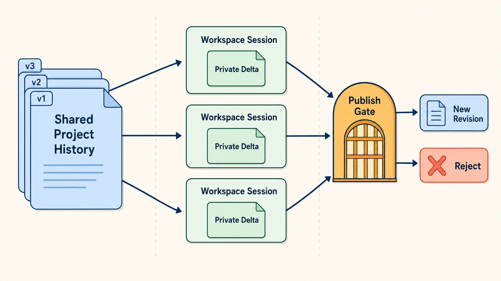
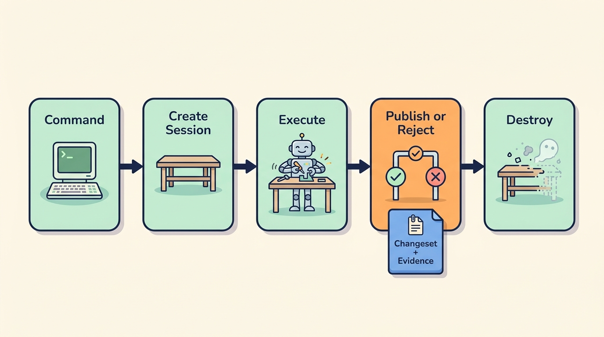
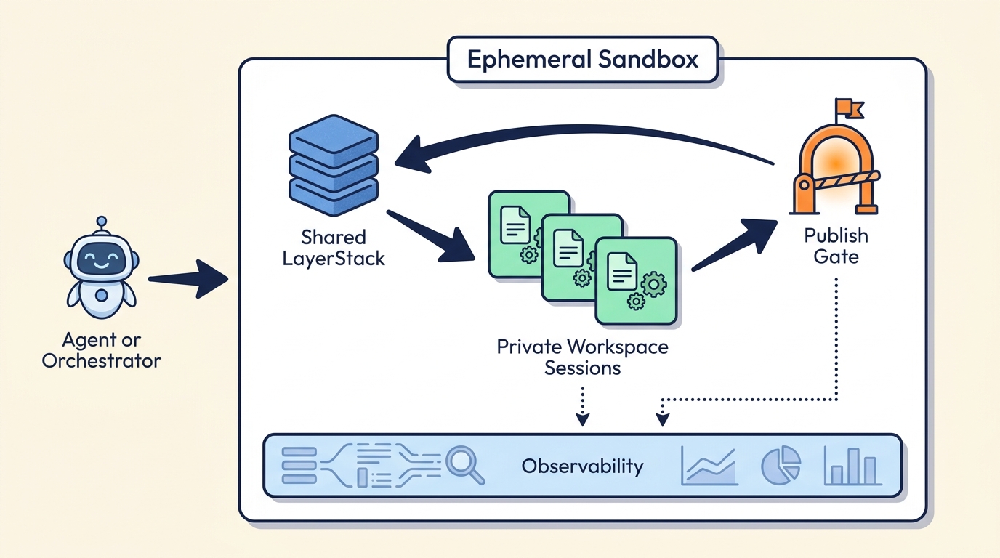

# 第 I 部分 — 并行编码智能体的并发上限

[English](PART-I.md) | **简体中文**

*原生操作系统与文件系统抽象如何限制安全的多智能体编码*

> **术语约定：** 为了便于对照 API、源代码和英文资料，容易产生歧义的系统术语会在首次定义时采用 `English（“中文”）` 形式；产品名、协议名和代码标识符不翻译。

第 0 部分巡览了沙箱技术版图。第 I 部分接着追问：当智能体不再只是生成文本，而是开始操作一台计算机时，会发生什么？

一个智能体可以编辑文件、安装软件包、启动进程、绑定端口并消耗资源。五十个智能体可以同时完成所有这些操作。那么，谁来解释究竟是哪项任务修改了第 418 行、占用了 6 GB 内存，又是谁拿走了 3000 端口？

在人类开发流程中，缺失的协调器通常就是开发者本人。人会记得当前使用的是哪份检出，等待一次安装完成，主动换用另一个端口，注意到遗留服务器，判断哪些文件应该进入提交，并在共享结果前解决冲突。这些协调工作大多存在于人的习惯中，而不是操作系统里。

并行智能体移除了这种隐性的串行化。内核可以调度它们的进程，文件系统可以保存它们写入的字节，但两者都不表示一项智能体任务、它的稳定项目基线、它的私有变更集或它的发布决定。并发升高后，这一语义缺口便成为瓶颈。

“翻终端历史，然后祈祷”不是一套基础设施策略。

本部分将建立一条完整论证：

```text
原生操作系统与文件系统原语暴露进程、路径和端口
        ↓
人类开发者通常补上任务归属与串行协调
        ↓
并行智能体相互干扰，或丢失可验证状态
        ↓
每个工作单元都需要一个可归因的工作空间会话
        ↓
私有工作必须跨过显式发布边界
        ↓
Ephemeral Sandbox 将这份契约实现为一个 workspace runtime（“工作空间运行时”）
```

---

## 第 8 章 — 智能体是会产生副作用的进程

一个智能体收到了一项看似普通的请求：

> 升级 Web 框架，修复测试，并确认开发服务器仍能正常启动。

智能体启动软件包管理器。脚本重写锁定文件、生成代码、填充缓存并派生子进程。测试消耗内存并写入输出。服务器绑定一个端口。关闭流程结束后，还有一个子进程活着。

智能体报告任务成功。

Shell 的退出码是 0，机器却没有回到原点。

### 一次 tool call（“工具调用”）就是一次机器事件

人们常把编码智能体想象成：

```text
请求 → 思考 → 调用工具 → 回答
```

计算机看到的链条更长：

```text
智能体决策 → 工具调用 → 进程树 → 机器状态
```

有些状态很显眼，例如被修改的源文件。有些则很容易漏掉：后台守护进程、编译器缓存、临时套接字、下载的依赖，或已经被占用的端口。



*图 8.1 — 工具调用会返回结果，也可能在机器上留下状态。*

| 状态 | 示例 | 为什么另一个智能体会在意 |
| --- | --- | --- |
| 文件系统 | 源代码修改、锁定文件、生成代码、缓存 | 它可能读到未完成的工作，或测试了错误的构建 |
| 进程 | 编译器、工作进程、语言服务器、开发服务器 | 遗留进程可能继续修改文件或持有锁 |
| 网络 | 端口、套接字、出站请求 | 另一项任务可能连接到错误服务，或无法绑定端口 |
| 资源 | CPU、内存、磁盘、文件描述符、I/O | 一项任务可能拖慢或压垮无关工作 |

一次软件包安装就可能触碰表中的全部四类状态，测试套件也是如此。在智能体基础设施中，“只读”是一项需要强制执行的属性，不是提示词里表达的一种心情。

这些状态还会彼此叠加。一个测试命令可能启动六个工作进程、写入快照、占用端口并连接数据库。如果命令超时，父进程可能退出，但其中一个工作进程仍继续运行。此时文件系统里留着不完整测试产生的输出，端口仍被占用，下一个智能体则继承了一个谜团。

因此，必须区分工具输出和机器结果。输出是命令报告了什么；结果则是运行时必须负责拥有、观察、发布或清理的状态转换。

> *⚙️ **副作用规则：** 只有当运行时能够说明一次智能体操作所创建的机器状态时，这项操作才算结束，而不是文本响应结束时就算结束。*

### 原生操作系统与文件系统原语缺少智能体语义

操作系统知道进程 ID、套接字、内存页、打开的文件和 CPU 时间。文件系统知道路径、权限、所有者和修改时间。

这些都是机器级身份。智能体编排需要的是任务级身份：一项任务看到了哪个项目基线，哪些文件和进程属于同一项工作，哪些证据验证了结果，以及结果是否仍为私有状态。内核可以轻松运行数千个进程，而工作空间模型却可能连这些进程分别意味着什么都说不清。

它们不会自然知道：

- 哪项智能体任务拥有一棵进程树；
- 哪次工具调用引入了一组代码行；
- 任务从哪个项目修订开始；
- 一个监听端口属于活跃工作还是废弃服务器；
- 一项文件修改是否已经准备好进入共享历史。

PID 19324 可能拥有一个套接字，Git 可能显示某个文件被修改。两者都不会自动告诉你：“这个套接字和这些代码行属于智能体 B 的依赖升级任务，基于修订 R42，目前仍未发布。”

熟悉的文件系统就像一间在抽屉上贴了标签的共享办公室。它记录一份文档放在哪里、何时被修改，却不记录哪项任务授权了这次编辑，也不说明草稿是否已经可以发出。

时间戳很有用，但它不是不在场证明。

### 跟踪一次运行，直到它真正结束

这次框架升级可能留下如下状态：

```text
升级请求
  ├─ 清单和锁定文件修改
  ├─ 下载的依赖
  ├─ 生成的客户端代码
  ├─ 测试工作进程和覆盖率输出
  └─ 监听 4173 端口的开发服务器
```

“退出码为 0”无法描述完整结果。一份有用的运行时记录需要包含项目基线修订、变更路径、进程和网络活动、资源测量、命令证据、候选变更集以及清理结果。

假设这次运行从修订 R42 开始，修改了八条源代码路径和一个锁定文件，启动了六个测试工作进程，并留下 4173 端口继续监听。锁定文件可能应该进入变更集；覆盖率输出可能只属于诊断信息；遗留服务器则属于清理范围。运行时必须保留这些区别。

并非每个运行时今天都暴露上述每个字段。这份清单仍然揭示了缺失的那个名词：一个可归因的智能体工作单元。第 10 章会把它称为**工作空间会话**。

### 隔离只是契约的起点

容器可以提供有用的文件系统、进程和网络边界。智能体工作还需要记录项目基线，区分有价值的源代码修改与运行时残留，并提供一条返回共享历史的受控路径。进程隔离回答命令在哪里运行；工作空间契约则说明它如何开始、如何保持私有，以及如何显式结束。

这个结束阶段尤其重要。清理流程应该终止遗留进程组、释放挂载与网络状态，并删除私有临时数据。发布流程则应该只保留获准的项目转换和需要留存的证据。否则，一项“临时”任务就会变成一堆永久的小惊喜。

只有一个智能体时，缺少归属信息只是麻烦。智能体多起来后，它就会成为并发上限。

---

## 第 9 章 — 为什么编码智能体会撞上并发上限

如果一个编码智能体可以完成一项任务，那么让二十个智能体分别处理二十个问题，看上去只不过是普通并行。

事实并非如此。编码任务往往在执行过程中才发现彼此重叠。多个任务可能更新同一个依赖、重新生成同一个文件、启动同一个服务，或修改同一个接口。机器可以让二十个进程全部运行起来，项目整体却反而更难完成。

**concurrency ceiling（“并发上限”）**是这样一个临界点：继续增加智能体所带来的干扰、协调、集成和诊断成本，已经超过它们新增的有效产出。

### 人类曾是隐藏的并发控制器

单个开发者会执行许多未被命名的小型串行操作。他们不会在依赖重写过程中编辑同一个文件，会先关闭一个服务器再启动另一个，会在提交前检查差异，也会记得哪个测试结果对应哪份代码状态。

原生文件系统提供可变路径，操作系统提供进程、用户、端口和资源计数器。这些原语功能强大，却无法表达“智能体 C 正在私下测试修订 R42，而智能体 A 正准备另一个候选结果”。当数百个智能体独立行动时，原本让一台共享机器保持可理解的人类惯例便无法继续扩展。

文件系统像仓库货架：路径告诉你物品放在哪里，却不说明它属于哪张工单。一个工人可以记住这些背景，一百个并发工人则需要系统把背景记录下来。

因此，并发上限并不是内核能够启动多少进程，而是运行时能够同时维持多少项彼此隔离、可归因、可审查并且能够安全集成的编码任务。

### 并行智能体出错的两种方式

两种常见布局会以不同方式失败。

```text
共享工作空间                         隔离工作空间

智能体 A ─┐                           智能体 A → 工作空间 A ─┐
智能体 B ─┼→ 一份可变检出              智能体 B → 工作空间 B ─┼→ 稍后集成
智能体 C ─┘                           智能体 C → 工作空间 C ─┘

直接干扰                             可见性不完整
```

在共享工作空间中，每个智能体都能看到当前状态——但“当前”可能意味着另一个智能体的重写只完成了一半。文件、构建输出、进程、端口和资源会直接碰撞。

在隔离工作空间中，智能体不再互相覆盖文件，但也无法直接访问另一个智能体尚未提交的文件、进程状态和测试背景。消息负责转述，补丁则在最后才相遇。

一种布局共享了过多可变状态，另一种则共享了过少可验证状态。



*图 9.1 — 隔离消除了直接碰撞，但仍然需要可验证的协调与集成。*

工作空间运行时可以采用另一种方式：让每个智能体都基于同一份已记录项目历史获得私有可写会话，然后通过受控发布返回共享历史。智能体共享同一个代码库，却不会共享写到一半的文件。

### 共享执行让每个动作都成为别人的输入

三个智能体都从修订 R42 开始：

- 智能体 A 升级一个依赖；
- 智能体 B 修改共享身份验证接口；
- 智能体 C 运行集成测试。

智能体 C 开始测试。智能体 A 替换依赖并重写锁定文件。智能体 B 修改接口，但还没来得及更新所有调用方。一个测试工作进程从磁盘重新加载代码，于是看到了两次转换各自的一部分。智能体 A 在 3000 端口启动预览服务器；智能体 C 的测试工具连接到了这个服务器，而不是自己预期的服务。

智能体 C 报告测试通过。

每一个局部动作都看似合理，但这份证据没有意义，因为没有人能说清测试究竟针对哪一份项目状态。

问题远不止文件冲突。智能体 C 可能在智能体 B 修改前加载了一个模块，又在修改后加载了另一个模块。它的依赖图可能在运行途中发生变化。一次成功的 HTTP 检查也可能访问了智能体 A 的预览服务器。即使 `git diff` 没有显示任何重叠行，这个测试结果描述的也可能是一份从未作为稳定修订真实存在过的项目状态。

操作系统允许这一切发生。大多数动作都会成功，不一致性稍后才浮现。3000 端口并不关心谁的计划更合理。

### 隔离的 A2A 团队与 CooperBench

独立检出或容器可以消除直接干扰，却不会消除任务之间的依赖。

一个智能体可能升级了某个库，另一个智能体却仍按旧 API 编码。两份补丁各自都能自洽，放在一起却不兼容。消息可以帮助智能体交换计划，但一条消息无法证明发送方当前的文件、最新测试状态或完整增量。

A2A 聊天是一场会议，不是一份数据库。

运行时仍然需要一个关于代码状态、进程状态、资源归属、证据和发布的事实来源。消息应该协调决策，而不是承担完整审计轨迹。

[CooperBench](https://arxiv.org/abs/2601.13295) 研究的正是第二类失败模式。两个智能体分别获得独立的 Docker 环境，环境都从同一仓库状态初始化。它们通过自然语言消息沟通，补丁则在之后被合并和测试。

在来自 12 个代码库、覆盖四种语言的 600 多项任务中，协作智能体的平均成功率比相应的单智能体低约 30%。另一项仅包含 46 个任务的小规模实验发现，当团队从两个智能体增加到四个时，成功率继续下降。这项小型扩展实验可以证明协调存在问题，却不能被当作一条普遍扩展定律。

| 观察 | 基础设施启示 |
| --- | --- |
| 智能体重复工作或形成分歧设计 | 消息无法提供权威的任务归属，也无法保证中间状态兼容 |
| 沟通减少了朴素合并冲突，却没有显著提高总体成功率 | 文本层集成弱于系统层集成 |
| 成功消息更经常指向具体文件和代码行 | 当协调能够引用可检查状态时，效果更好 |
| 失败包含无法验证的期望和承诺 | 智能体除了文字说明，还需要运行时证据 |

结论需要保持克制：A2A 消息可以协调意图，但不能成为代码、执行状态、资源或测试的唯一事实来源。CooperBench 并没有说明消息毫无价值，也没有说明智能体应该退回同一个共享可变目录。

> *🚧 **协调规则：** 给智能体私有工作空间，并提供一条能够检查、归因和集成其工作的系统级路径。*

### 干净合并仍可能得到损坏的系统

两次编辑可以修改不同代码行，顺利合并，却把系统弄坏。一个智能体可能重命名配置键，另一个智能体则为旧键添加新的使用者。一个智能体可能升级某个库，另一个仍按旧 API 编写代码。

同样的问题也存在于源代码文本之外。一项修改可能删除某个服务，另一项修改却添加了依赖其端口的测试。一个智能体可能根据新 schema 重新生成客户端，另一个则手工编辑旧版生成文件。文本互不重叠，并不代表行为互不依赖。

一次干净合并完全可以生成一个干净利落的坏程序。

分支记录源代码历史，工作树分离工作文件，目录副本复制更多状态，容器隔离配置范围内的文件、进程和网络。每种方式都只解决问题的一部分。

| 方法 | 擅长分离什么 | 仍需回答什么 |
| --- | --- | --- |
| Git 工作树 | 工作文件 | 进程、端口、资源、清理和集成 |
| 目录副本 | 文件和部分生成状态 | 高效历史、归因与发布 |
| 容器 | 配置范围内的文件系统、进程和网络状态 | 项目谱系、变更集、溯源与发布策略 |
| 私有工作空间会话 | 基于已记录基线、由任务拥有的可写状态和运行时状态 | 共享历史的审查与发布决定 |

Git 非常擅长比较文本，但它不是运行时协调器。

### 并行运行编码智能体的四项挑战

原生机器原语与智能体工作之间的缺口，表现为四项挑战：

1. **私有执行与受控发布。** 共享可写树会立刻暴露修改，而原生文件系统没有任务级“基线—发布”契约。智能体工作需要稳定基线、私有修改，以及进入共享历史的独立转换。
2. **文件与代码行级可审计性。** 路径、用户和时间戳无法指出是哪项智能体任务引入了一条已发布代码行。审查者需要会话和 operation provenance（“操作溯源”）。
3. **resource ownership（“资源归属”）与 observability（“可观测性”）。** PID、端口、CPU、内存、磁盘和 I/O 必须按智能体工作进行分组，而不是被当作彼此无关的机器对象逐个检查。
4. **生命周期、验证与恢复。** 进程退出比任务完成窄得多。运行时必须捕获证据、报告发布或拒绝结果，并清理会话，或保留会话以供修复。

资源归属应当和文件归属一样精确。运维者应该能够询问哪个会话拥有某个服务器、哪项任务正在消耗内存、两个智能体是否申请了同一个端口，以及一个私有增量占用了多少磁盘。这些事实可以帮助诊断故障、执行预算，并在无需根据进程名猜测的情况下决定停止哪项工作负载。

可审计性还必须在发布后继续存在。变更集进入共享历史后，仍应保留其会话与基线身份，让审查者能够从一条已发布代码行回到产生它的任务、命令和证据。

隔离与发布必须成对出现。没有集成路径的私有工作空间是一座孤岛；没有私有执行的发布，则会接纳在含糊条件下产生的证据。

这些要求彼此加强。可审计性需要稳定的会话身份，资源归属也需要同一个身份。发布需要会话的基线和变更集，恢复则需要与拒绝结果关联的私有状态和证据。如果分别用互不相关的标识符实现每份日志，只会以更高成本重新制造同一种歧义。

文件、进程、资源、变更集和发布都需要一个所有者。“这个智能体”仍然太宽泛，因为一个智能体可以执行许多次调用，也可以让一个工作空间跨越多条命令。下一章将定义拥有一个工作单元的更小边界。

---

## 第 10 章 — Tool-Call Boundary（“工具调用边界”）上的 Workspace Session

在那次失败的测试运行后，编排器追问：

> 智能体 C 的工作究竟包括什么？

Git 可以列出被修改的文件，进程表可以列出工作进程，网络栈可以指出谁拥有 3000 端口。但它们不会自然地把这些事实连接到同一项智能体任务和同一个项目基线。

缺失的对象是 **workspace session（“工作空间会话”）**：基于一份已记录项目状态，具有边界且可归因的一段工作时间。

工作空间会话补上了原生进程和文件系统抽象中缺失的智能体级身份。它把项目基线、私有文件、命令进程、网络上下文、资源、变更集和发布结果归入同一个生命周期。

默认边界被刻意设计得很小：

```text
一次独立工具调用
    → 一个私有工作空间会话
    → 一份可归因的执行结果
    → 发布或拒绝
    → 清理
```

对于命令执行，版本 1 会自动应用 **workspace-per-tool-call（“每次工具调用一个工作空间会话”）** 规则。调用者未提供会话 ID 时，运行时创建私有会话、运行命令、捕获结果、尝试发布，然后拆除会话。只有当调用者主动把相关调用放入一个持续时间更长的显式会话时，它们才会共享状态。

当前，无会话的文件写入会走另一条路径，因此“每次工具调用一个会话”是设计规则，还不是所有版本 1 操作都具备的统一实现事实。

> *⏳ **每次工具调用一个工作空间规则：** 每次独立的命令工具调用默认获得一个工作空间会话；相关调用可以显式加入同一个长生命周期会话。*

| 操作 | 版本 1 行为 |
| --- | --- |
| 未提供会话 ID 的命令 | 自动创建执行“发布后销毁”策略的工作空间会话 |
| 提供会话 ID 的命令 | 在指定显式会话内运行 |
| 提供会话 ID 的文件编辑或写入 | 修改该会话的私有工作空间 |
| 未提供会话 ID 的文件编辑或写入 | 直接发布一层由该操作归属的 LayerStack 层 |

### 跟踪一个工作空间：从基线到发布

继续沿用智能体 C 失败的测试运行：

```text
智能体 C → 请求 Q91 → 会话 S17 → 基线 R42
         → 测试进程 + 端口 3000 → 变更集 C8
         → 面向 R43 的发布被拒绝
```

这条轨迹引出了负责承载契约的五个对象：

- **project base（“项目基线”）R42** 是工作开始时采用的已记录项目状态；
- **工作空间会话 S17** 拥有这段私有执行时间；
- **private delta（“私有增量”）** 是 S17 在发布前产生的全部修改；
- **changeset（“变更集”）C8** 是从该增量中捕获的候选结果；
- **publication（“发布”）** 会根据当前已经前进到 R43 的共享历史解析 C8。

**LayerStack** 是记录这些基线与获准结果的不可变共享历史。**sandbox（“沙箱”）** 是承载 S17 的执行环境。日志和构建输出等 **artifact（“制品”）** 可以作为证据保留，却不会悄悄变成项目历史。



*图 10.1 — 智能体共享已记录历史，而不是同一个可变工作目录。*

### Automatic session（“自动会话”）与 explicit session（“显式会话”）

常规情况是每次工具调用获得一个工作空间会话。当 `exec_command` 未携带 `workspace_session_id` 时，Ephemeral Sandbox 会创建一个自动工作空间会话，并为它设置“发布后销毁”的结束策略。调用者无需手工管理每个短生命周期工作空间，也能获得私有执行边界。

自动会话会携带自己的 LayerStack 基线、私有可写视图、执行身份、网络配置档案和结束策略。



*图 10.2 — 每次独立工具调用都获得一个临时工作空间；获准工作与留存证据可以持久存在。*

对于多步骤任务，编排器会创建一个**显式会话**，并在编辑、命令、检查和重试过程中反复传递其 ID。成功发布会关闭会话，销毁会丢弃未发布状态。预提交发布被拒绝后，工作空间可以继续保留，以便诊断或修复。

这份保留状态很有价值。智能体可以检查冲突，重新读取当前项目头，调整私有工作，重新运行验证并再次尝试。拒绝因此成为生命周期中一条可见的正常分支，而不是要求运维者根据日志重建失败工作空间的灾难。

这里还存在一种更窄的命令执行会话：它包含一条命令的 PTY、数据流、超时和进程组。关闭命令执行会话，并不表示持续时间更长的工作空间已经可以发布。

#### 为什么每次工具调用都应该获得一个工作空间

一次工具调用本来就具有请求身份、输入、开始时间、终止结果，以及等待回答的调用方。为它分配工作空间会话，就能把这些常见字段组织成一次有边界的状态转换。

这个边界足够小，因此便于归因：一条命令的进程、文件和证据都属于同一个请求。同时，它又可以组合。编排器可以为彼此独立的工作使用多个自动调用，也可以显式地把相关调用放进同一个长生命周期会话。

如果命令超时、发布冲突或清理需要重试，运行时知道涉及的是哪份私有状态和哪条生命周期记录。多个自动调用可以保持相互独立，相关调用则可以明确加入同一个较长会话。

### 私有增量、变更集与发布

在会话内部，智能体看到的是一棵普通可写目录树。运行时则把稳定基线与私有 copy-on-write（“写时复制”）增量分开保存。

增量中可能同时混有预期修改、生成输出、缓存、日志、删除项和部分完成结果。**capture（“捕获”）**把可变状态转换成候选变更集，它回答“相对于这个基线，发生了什么修改？”发布则回答另一个问题：“这个候选结果能否进入当前共享历史？”

这层分离可以阻止普通文件写入悄悄变成共享事实。它也为运行时提供了应用路径策略、排除运行时自有状态、保留删除语义并在集成前描述候选结果的位置。

共享历史可能已经前进。Ephemeral Sandbox 会逐条路径解析完整候选结果。符合条件的文本文件可以采用行级三方合并。互不重叠或内容相同的修改可以组合；重叠但不同的修改会发生冲突；二进制文件和过大文件可能被拒绝。

最终结果是全部接受或全部拒绝：要么生成一个获准的不可变层，要么共享状态完全不变。

当变更集触及十条路径，而只有一条发生冲突时，这项原则尤其重要。只发布其余九条路径，会产生一份智能体从未作为整体验证过的结果。拒绝可以保留候选结果的完整性，并让编排器决定是变基、修复、重试还是放弃。

私有执行可以是推测性的，但共享历史要么接收一个完整结果，要么什么都不接收。冲突因此成为正常控制流，而不是文件系统损坏。

### 归属应该跟随会话

会话 ID 可以连接分布在不同存储中的证据：进程采样、命令记录、文件系统修改、发布事件和诊断信息。再次查看智能体 C 的轨迹：

```text
请求 Q91 → 会话 S17 → 基线 R42
    → 测试进程 + 端口 3000
    → 变更集 C8 修改 auth/client.ts
    → 面向 R43 的发布结果
    → 文件归因记录 workspace_session:S17
```

对于已发布文件，Ephemeral Sandbox 可以记录结构化代码行来源，例如 `workspace_session:<id>`、`operation:<id>`、原始内容或未知来源。即使字节由格式化工具或生成器产生，这些来源仍能指出将它们引入共享历史的工作单元。

#### Git blame 与 file blame（“文件归因”）回答不同问题

官方 [`git blame` 文档](https://git-scm.com/docs/git-blame) 把它描述为使用最后修改每一行的修订与作者对该行进行注释。这是源代码控制历史。

智能体审计则开始得更早。一次工具调用选择基线、创建工作空间、运行进程、修改文件、生成证据并提交变更集。多个智能体输出后来可能被压缩成一个提交，或统一由一个服务身份发布。Git 会忠实记录这份提交历史，却无法重建从未被编码进提交的运行时归属。

| 问题 | Git blame | Ephemeral Sandbox 文件归因 |
| --- | --- | --- |
| 主要身份 | 修订与已记录作者 | 工作空间会话、操作、原始来源或未知来源 |
| 历史 | Git 提交祖先关系 | 已发布的 LayerStack 祖先关系 |
| 主要用途 | 哪个修订最后修改了这一行？ | 哪个运行时工作单元引入了这一行？ |
| 执行证据 | 需要单独建立映射 | 可连接会话、变更集、事件和追踪记录 |
| 压缩或服务身份发布 | 多项任务可能显示为同一个身份 | 运行时来源仍保持结构化区分 |

Git blame 像发布印记：哪一版修改了这句话，又是谁签署了它。文件归因则像车间工单：哪个智能体会话把它送到了发布环节。

当编排器通过同一个机器人账户发布多项任务时，两者的差异尤其明显。Git blame 可能正确地为所有受影响代码行标出机器人和集成提交。这足以导航仓库历史，却过于粗糙，无法回答具体是哪项智能体任务、哪份基线修订、哪些测试或哪些运行时事件产生了某一行。

两者都有价值。一条完整审计链可以沿着以下路径前进：

```text
已发布代码行
    → 工作空间会话所有者
    → 基线 + 变更集 + 执行证据
    → LayerStack 修订
    → Git 提交或导出结果（如果存在）
```

Git 提交记录源代码历史，工作空间会话记录智能体工作。一条有用的审计轨迹会保留两者之间的连接。

资源归属应该使用同一个会话身份。当前版本 1 的可观测性在受支持的范围内包括沙箱级 CPU、内存、块 I/O、磁盘、执行活动和进程诊断。权威的会话级 CPU 与内存计量、预算和占用端口清单，仍然属于更广的契约目标。

最终的运维视图应该能够把代码修改与产生并验证它的资源连接起来：运行了哪棵进程树，哪个端口暴露了预览服务，内存压力是否影响测试，以及任务产生了多少私有磁盘状态。当测量、策略和清理共享同一个工作空间会话键时，它们都会变得更简单。

### 评价工作空间运行时的三个问题

读者可以用三个问题检验这份契约：

1. 运行时能否指出会话的项目基线？
2. 它能否区分私有运行时状态与候选变更集？
3. 它能否完整发布或拒绝候选结果，同时保留归因信息？

故障发生后，这些答案仍应保留。超时不能抹掉归属，持有进程退出不能让清理看似成功，过时基线也不能产生部分发布。运行时可以在内部重试，但最终状态必须始终可供编排器检查。

第 11 章将说明 Ephemeral Sandbox 如何利用这份契约提高并发上限。

---

## 第 11 章 — Ephemeral Sandbox：提高多智能体编程的并发上限

智能体需要基于共享项目历史进行私有执行。它们的工作需要身份、可审查的变更集、发布结果，以及可以持久保留的证据。

> **Ephemeral Sandbox 是一个智能体工作空间运行时：它让并发编码任务基于共享项目历史拥有私有执行状态，再把完成的工作转化为可审查、能够感知冲突的发布结果。**

它默认采用的并发原语，是为每次独立命令工具调用创建一个工作空间会话。运行时不是简单地在共享检出中再启动一个进程，而是为这次调用提供稳定项目基线、私有可写状态、可归因执行，以及明确的发布或拒绝结局。只有当调用者主动把相关工具调用加入一个显式会话时，它们才会共享同一个工作空间。

可以把它想成一间带版本记录的车间。每个智能体都会获得一张基于已登记项目状态搭建的私有工作台。它可以在那里编辑、构建、测试，也可以把桌面弄得一团糟。准备好以后，它把零件清单和检验记录提交到发布柜台。工作台被清空后，获准的设计历史仍会留下。

工作台是执行环境，目录与柜台则组成状态系统。Ephemeral Sandbox 通过工作空间会话连接两者。

Linux 进程、命名空间、挂载和文件系统仍然是执行机制。LayerStack、工作空间会话、变更集和发布，则补上了以更高并发使用这些机制所需的智能体侧语义。

### 一张图看懂 Ephemeral Sandbox

LayerStack 记录共享项目历史。私有工作空间会话把写时复制项目视图、命令执行和选定的网络配置档案组合起来。捕获把私有工作转换成变更集；发布关口完整接纳候选结果，或拒绝它。可观测性通过事件、追踪、快照、资源数据、诊断和文件溯源保存证据。



*图 11.1 — Ephemeral Sandbox 连接共享历史、私有执行、发布与证据。*

### 三个面向智能体的接口面

| 接口面 | 职责 |
| --- | --- |
| 管理 | 创建、检查和销毁沙箱实例 |
| 运行时 | 创建会话、执行命令、编辑文件、捕获、发布和销毁 |
| 可观测性 | 读取事件、追踪、快照、资源、活动、诊断和溯源 |

CLI 和 MCP 向人类与智能体暴露这三组能力。这种分离可以让检查者只获得只读可观测性，让工作智能体只获得运行时操作，同时由基础设施服务掌握管理权限。

对于外部编排器，这些接口让沙箱成为一项服务：智能体保留在沙箱之外，通过 RPC 或 MCP 调用运行时操作。嵌入式智能体也可以运行在环境内部，而控制器仍使用相同的管理与可观测性边界。无论采用哪种模式，工作空间会话始终是私有工作的基本单元。

### 从产品模型走向工作空间

第 I 部分从工具调用产生的副作用出发，找到了多智能体并发上限，并引入让工作可归因的会话与发布边界。

Ephemeral Sandbox 就是围绕这套模型构建的运行时。第 II 部分会跟随下一次工具调用，进入它的 workspace-session boundary（“工作空间会话边界”）与共享历史：

```text
工具调用 → workspace session → LayerStack lease
```

它会解释 automatic 与 explicit session lifecycle，并说明许多临时工作空间如何共享稳定的 LayerStack 历史。第 III 部分再构建它们的 private COW view，并沿着 capture（“捕获”）与 publication（“发布”）说明它们如何返回共享历史。

---

## 参考资料

1. Arpandeep Khatua 等，[“CooperBench: Why Coding Agents Cannot Be Your Teammates Yet”](https://arxiv.org/abs/2601.13295)，arXiv:2601.13295，2026。
2. Agent Infra Foundation，[“The Concurrency Ceiling of Coding Agents”](https://agent-infra-foundation.org/blog/2026/07/the-concurrency-ceiling-of-coding-agents/)，2026。
3. The Git Project，[`git-blame` 文档](https://git-scm.com/docs/git-blame)。
4. Ephemeral Sandbox，[“Architecture”](https://ephemeral-sandbox.com/architecture)。
5. Ephemeral Sandbox，[“Multi-Agent Coding Workspaces”](https://ephemeral-sandbox.com/multi-agent-coding-workspaces)。
6. Ephemeral AI Lab，[`ephemeral-sandbox` 源代码仓库](https://github.com/Ephemeral-AI-Lab/ephemeral-sandbox)。
