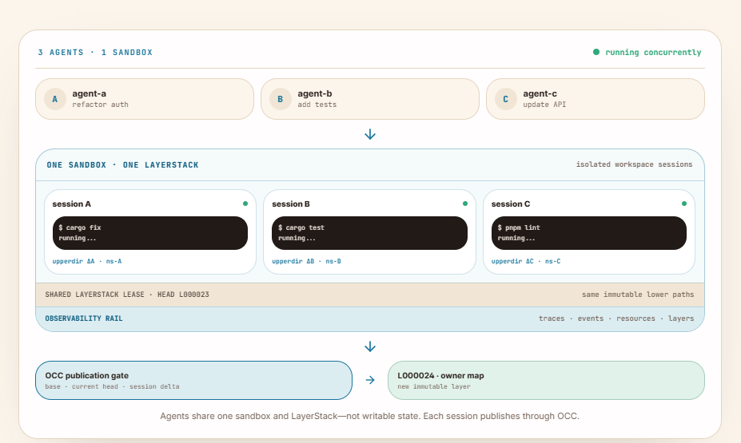

# Part II — LayerStack and Shared Project History

*How one durable filesystem history supplies stable bases to many concurrent
workspace sessions.*

Part I ended at the workspace boundary. A coding task should receive a stable
project base, private execution state, and an explicit ending. Part II starts
under that boundary, with the history every workspace consumes.

The central model is small:

> **One sandbox, one shared LayerStack, and many temporary private workspace
> sessions.**

The history does not become writable merely because more agents arrive. Each
piece of work leases one recorded point in LayerStack, and the session lifecycle
preserves which task owns that view. Part III will construct the writable COW
workspace that runs over the lease.

We will follow two tasks from published revision R42:

```text
Published head: R42

Agent A
  request Q91
  automatic workspace S17
  command C31

Agent B
  explicit workspace S18
  file edit
  command C32
  command C33

Shared head later advances to R43.
S18 continues to see its leased R42 base plus its private delta.
```

These identifiers are not decoration. They prevent “the agent changed the
file” from becoming the only surviving explanation.

---

## Chapter 12 — One LayerStack, Many Workspace Sessions

Two coding tasks enter the same sandbox. Agent A updates a parser dependency.
Agent B changes the server code that uses it. Both need the same repository,
toolchain, and published history. They do not need the same writable directory.

Putting them at one workbench would be efficient in the same way that giving
two mechanics one tray of loose screws is efficient: no duplicate tray, no
reliable inventory.

Ephemeral Sandbox separates what should be shared from what should be private.
The durable project history lives in **LayerStack**. Each active task receives
a **workspace session**, a temporary writable projection of one recorded point
in that history. Commands run inside that projection. Only an accepted result
returns to shared history.

### Four objects, four lifetimes

The word *sandbox* is often used for everything inside the box. That shortcut
becomes expensive once several lifecycles overlap.

A **sandbox** is the managed runtime boundary. It owns the larger environment:
the runtime state, workspace root, daemon, and endpoints addressed by runtime
operations. A sandbox can outlive many individual tasks.

**LayerStack** is the durable filesystem history inside that sandbox. It stores
an ordered manifest of immutable layers. Published work changes the active
history by adding another immutable layer; running a command does not edit old
layers in place.

A **workspace session** is a temporary, writable view of one leased LayerStack
history. Its private delta can change while the task works. Other sessions do
not see those unfinished changes.

A **command session** is narrower still. It identifies one running process and
its transcript. A workspace session may contain several command sessions, and
a command can finish while its containing workspace remains private.

| Object | Lifetime | Mutable? | Responsibility |
| --- | --- | --- | --- |
| Sandbox | Managed runtime lifetime | Runtime state changes | Hosts workspace execution |
| LayerStack | Durable project history | Individual layers are immutable | Stores published filesystem truth |
| Workspace session | Temporary task lifetime | Its private delta is mutable | Provides one private project view |
| Command session | Process lifetime | Process and transcript state change | Tracks one command and its I/O |

The distinction matters immediately. Destroying command C32 should not erase
Agent B's private files in S18. Destroying S18 should not erase R42. Publishing
S17 should not expose Agent B's unfinished edits. Each operation acts on the
object whose lifecycle it actually owns.

The [official core-concepts guide](https://ephemeral-sandbox.com/docs/concepts)
uses the same separation: filesystem publication belongs to a workspace
session, while process and transcript state belong to a command session.

### The durable stack and the temporary view

At R42, Agents A and B can begin from the same immutable lower history:

```text
LayerStack at R42
    ├── workspace S17 + private delta A
    └── workspace S18 + private delta B
```

The sessions share the bytes that already belong to R42. They do not clone
those bytes into two complete repositories, and they do not write back into
R42. S17 records Agent A's mutations in its own writable state. S18 does the
same for Agent B.

If S17 publishes successfully, the active head may become R43. S18 does not
suddenly change underneath command C32. Its lease still identifies the exact
history from which it started, while publication logic can later compare its
candidate with the newer head.

This gives Part II four invariants:

> **History is shared.**
> Published layers can be reused by many sessions.

> **The execution view is leased.**
> A live workspace keeps the exact lower-layer history it started with.

> **Mutation is private.**
> Writes and deletions remain in the session's copy-on-write state until
> capture and publication.

> **Publication is atomic.**
> A resolved candidate enters shared history as one layer, or none of it does.

Shared history, leases, and the session lifecycle are the subject of this part.
Part III begins by turning that lease into a private COW workspace, then follows
execution, capture, resolution, and publication.


*Figure 12.1 — Many tasks can share one published history without sharing
unfinished filesystem mutations.*



*Figure 12.2 — Three agents can run concurrently in one sandbox without sharing
a writable workspace; each session publishes through the OCC gate.*

### Sharing history is not sharing a checkout

This model does not return to the shared mutable workspace rejected in Part I.
Agents share **published truth**, not a live writable tree. Agent B can inspect
the same accepted parser code as Agent A without observing Agent A halfway
through a lockfile rewrite.

It also differs from copying the project for every task. A directory copy gives
each task private files, but repeats the base payload and loses an explicit
relationship to a shared layered history. A workspace session instead says:

```text
my visible project = leased shared history + my private delta
```

The session is therefore more than a directory. It binds a base revision,
lease, writable projection, namespace boundary, command ownership, and ending.
The agent receives a private desk, not a private copy of the building.

This model does not claim that a workspace session is a hardened hostile-tenant
boundary. Ephemeral Sandbox v1 is designed for cooperating coding agents. The
container, VM, credential, and network policies around it still determine what
code may safely run. Here, the narrower question is how concurrent tasks avoid
sharing unfinished project state.

The first answer is LayerStack: the durable history from which every temporary
workspace begins.

---

## Chapter 13 — LayerStack: Immutable Shared History

Agent A and Agent B both open `src/server.rs` at R42. Neither session copies the
entire project. Neither can rewrite R42. Each sees the same published file until
its own private workspace changes that path.

That behavior begins below the workspace, in LayerStack.

**LayerStack is an ordered manifest of immutable filesystem layers.** A layer
can contain files, directories, symlinks, and deletion metadata. The manifest
defines which layers form the current published view and in which priority
order they should be read.

LayerStack owns history, leases, and publication state. It does not launch a
shell or isolate a process. A storage system should not moonlight as a process
supervisor.

### Three kinds of immutable layer

The visible history contains three layer roles:

| Layer kind | Purpose | Mutable after creation? |
| --- | --- | --- |
| Base, `B*` | Initial content-addressed project state | No |
| Published, `L*` | Accepted filesystem delta | No |
| Squashed, `S*` | Equivalent compact representation of older history | No |

A base layer such as `B000001-base` supplies the starting project payload.
When publication accepts a changeset, it creates a new `L*` layer and prepends
it to the manifest. Squashing may later replace an eligible run of older
published layers with an equivalent `S*` layer. Squashing changes physical
layout, not the logical project view.

Part III will explain those transitions. For now, the important property is
that none of these layer directories is a shared scratchpad. Once visible in a
manifest, its contents are history.

### Newest first, first visible path wins

LayerStack manifests are ordered newest first. Suppose R42 contains:

```text
L000042       newest published delta
S000041       compacted earlier history
B000001-base  original project payload
```

A read of `src/server.rs` searches that order. The first visible version wins.
If L42 contains the file, older versions are hidden. If it does not, the read
falls through to S41 and then B1. A deletion marker in a newer layer can hide a
path that still physically exists below it.

This ordering appears in the
[LayerStack architecture](https://ephemeral-sandbox.com/architecture/layerstack)
and is preserved all the way to OverlayFS: publication prepends the newest
layer, a lease copies that order, and the overlay mount gives the first lower
path the highest priority.

Layer ordering is therefore not presentation. Array order becomes filesystem
truth.

### A revision is more than a friendly number

The active manifest carries a version, its ordered layer references, and a
schema version. Ephemeral Sandbox also computes a root hash from the ordered
layer identities and paths. Together, the manifest version, root hash, and
layer count describe the base revision held by a workspace.

The version is convenient for humans and logs. The root hash protects the more
important fact: exactly which ordered history produced this view. Two
manifests with the same layers in a different order do not represent the same
filesystem.

For the running example, S18 can record:

```text
workspace session: S18
manifest version: 42
root hash: H42
lower-layer count: 3
```

That record is stronger than “started around the time R42 was current.” It
names the project state against which Agent B's private delta has meaning.

### A lease preserves the floor beneath a session

When a workspace starts, LayerStack acquires a snapshot and a **lease**. The
lease contains the manifest and its resolved lower-layer paths. It keeps that
history available while the session is alive.

S18 does not begin reading a mixture of R42 and a later revision. Its lower
chain remains the one named by its lease. When S18 eventually proposes a
changeset, publication can compare the candidate's leased base with the active
head at that time.

A lease is not a global project lock. It does not stop S17 from publishing or
new sessions from using R43. It protects a reader's stable history and prevents
storage cleanup from reclaiming layers still needed by a live view.

The library analogy is useful for exactly one paragraph. A reader checks out a
specific edition while the library may receive a newer edition. The checkout
does not forbid new books; it prevents someone from replacing page 80 while the
reader is using it. After that, call it a lease again—the kernel does not manage
books.

### Different sessions can lease different revisions

Suppose Agent A begins at R42. Another publication creates R43 before Agent B
begins, and a later publication creates R44 before Agent C begins. All three
sessions can remain active at once, but they do not read the same lower chain:

```text
Agent A: lease R42 → [L42, S40, B1]             + private ΔA
Agent B: lease R43 → [L43, L42, S40, B1]        + private ΔB
Agent C: lease R44 → [L44, L43, L42, S40, B1]   + private ΔC
```

The layer named at the lease point is only the newest layer in that revision.
The visible project comes from the complete ordered chain beneath it. Each
agent then adds a private delta without rewriting any of those shared layers.


*Figure 13.1 — Agents may lease different LayerStack revisions while keeping
their unfinished changes private.*

A lease selects immutable history. Chapter 15 turns that leased history into an
agent-writable workspace using OverlayFS.

### Sharing the base removes one cost, not every cost

LayerStack avoids an `N × base` repository clone when N sessions begin from the
same history. The physical base payload can be shared, while each session pays
for its own metadata and copy-on-write mutations.

That does not make session storage constant. If ten agents each rewrite a
different 100 MB generated file, the private deltas still contain those copied
files. Command transcripts, processes, and runtime metadata also scale with the
number of sessions.

The honest storage model is:

```text
one shared base
+ retained published history
+ sum of private deltas
+ per-session runtime metadata
```

Layer count also has a cost. Creating a workspace must construct the ordered
lower-path list, and reads may traverse layers before finding a visible path.
Squashing can shorten old chains, but it is maintenance, not magic compression
after every command.

The useful claim is narrower and stronger: **many workspaces can reference one
immutable project history without copying or mutating that history.**

### What LayerStack does not guarantee

An immutable layer cannot stop a process from consuming memory. A lease cannot
prevent a command from opening a port. A root hash cannot decide whether a
dependency upgrade is correct. Those responsibilities belong to execution,
resource policy, validation, and publication.

LayerStack supplies the stable half of the workspace equation. The next
chapter supplies the temporary owner: a workspace session whose lifecycle
matches the work being performed.

---

## Chapter 14 — Automatic and Explicit Workspace Sessions

Agent A needs one command to update generated parser tables. Agent B needs a
sequence: edit `src/server.rs`, run a focused test, inspect the failure, adjust
the file, and run the test again.

Giving each *agent* one permanent workspace sounds simple. It is also the wrong
unit. One agent may handle ten unrelated requests, while one task may require
several related tool calls. Ownership should follow the bounded work, not the
model process that happened to request it.

Ephemeral Sandbox supports two workspace lifecycles: an automatic session for
an independent command and an explicit session for related operations.

### Automatic workspace: one independent command

When `exec_command` arrives without a `workspace_session_id`, the runtime
creates an automatic workspace session. Its fixed finalization policy is
`publish_then_destroy`.

In plain language:

```text
independent exec_command
        ↓
create private workspace
        ↓
run the command
        ↓
capture and attempt publication
        ↓
destroy the temporary workspace
```

Agent A's request Q91 becomes automatic workspace S17 and command C31. The
caller does not need to manage a separate create-and-destroy sequence merely to
run one bounded command against private project state.

The name `publish_then_destroy` describes ordering, not guaranteed acceptance.
After the session's last command reaches terminal state, the runtime attempts
to capture and publish its filesystem changes, records publication or
finalization failure, and tears down the temporary workspace. A conflict can
reject publication. “Then destroy” does not mean “publish at any cost.”

This is the implemented workspace-at-the-tool-call boundary for independent
command execution. It keeps a small request small while still giving its files,
processes, base, transcript, and ending an owner. The current operation contract
is documented in the
[runtime command catalog](https://ephemeral-sandbox.com/docs/reference/operations#runtime-command).

### Explicit workspace: one related sequence

Agent B's task cannot be split into unrelated clean-room commands. The second
test must see the edit made before the first test. Those operations deliberately
target explicit workspace S18:

```text
workspace S18 over leased R42
        ↓
file edit
        ↓
command C32
        ↓
inspect output and private file
        ↓
second edit
        ↓
command C33
        ↓
explicit finalization
```

Passing `workspace_session_id: S18` makes command and file operations use that
existing mounted view. The files created by C32 remain visible to C33 because
both commands belong to S18. Other sessions still cannot see them.

Explicit workspace lifecycle operations are internal coordination surfaces in
v1 rather than public CLI or MCP tools. Public runtime calls can target an
existing session ID, while the runtime's coordination layer owns creation,
capture, finalization, and teardown. This detail prevents the book from
inventing a public `create_workspace` command that the documented catalog does
not expose.

An explicit session uses a no-op automatic finalization policy: finishing one
command does not publish and destroy the workspace. Its owner decides when the
multi-operation task is ready for finalization.

### The session ID changes file-operation meaning

The public runtime surface deliberately distinguishes calls with and without a
workspace session ID:

| Operation | Without `workspace_session_id` | With `workspace_session_id` |
| --- | --- | --- |
| `exec_command` | Creates an automatic `publish_then_destroy` workspace session | Runs inside the selected existing workspace |
| `file_read` | Reads the latest published snapshot | Reads the selected private workspace |
| `file_write` / `file_edit` | Publishes one layer attributed to `operation:<request_id>` | Mutates the selected workspace and remains private until capture |

This table blocks two common mistakes.

First, “workspace session per tool call” is accurate shorthand for an
independent `exec_command`, not a universal statement about every runtime
operation. A sessionless file write does not create an automatic workspace. It
publishes an operation-attributed layer directly. A sessionless file read does
not need writable state at all; it projects the latest published snapshot.

Second, adding a session ID is not cosmetic routing. It changes which state the
operation can observe and whether a mutation remains private. A read of
`src/server.rs` without S18 sees published R43 after the head advances. The same
read with S18 sees leased R42 plus Agent B's private edit.

The [official operation catalog](https://ephemeral-sandbox.com/docs/reference/operations)
and [core-concepts guide](https://ephemeral-sandbox.com/docs/concepts) make
these behaviors explicit.

> *⏳ **Tool-call boundary rule:** An independent command receives an automatic
> private workspace. Operations that intentionally belong to one task target
> the same explicit workspace.*

The direct sessionless file path is useful for a small, deliberate mutation
that should become published state immediately. Its trade-off is equally
direct: it does not provide a private multi-operation period in which an agent
can edit, test, and revise before publication. Choosing whether to include a
workspace-session ID therefore chooses a lifecycle, not merely a more verbose
request shape.


*Figure 14.1 — Independent commands receive automatic temporary workspaces;
related operations deliberately reuse an explicit session.*

### Why the task boundary is better than the agent boundary

Imagine Agent A receives three unrelated operations:

1. regenerate a parser;
2. inspect a license file;
3. benchmark a test command.

Putting all three in one agent-owned workspace lets parser output influence the
benchmark and makes the license read depend on private state it never needed.
Separate automatic command sessions provide cleaner attribution and fewer
accidental dependencies.

Now imagine Agent B's repair requires an edit and two tests. Giving every call
a completely unrelated workspace would lose the edit between commands. An
explicit session preserves the intentional dependency.

The useful ownership rule is:

> *A workspace session belongs to one bounded unit of filesystem work. The unit
> may be one independent command or several deliberately related operations.*

That rule composes with different agent architectures. One model process can
own several sessions. An orchestrator can move a task between models while
retaining the same workspace identity. A reviewer can inspect a session without
becoming its author. “Agent B's folder” becomes the more precise “workspace
S18, based on R42, for this task.”

### Lifecycle edges are part of correctness

Automatic and explicit sessions fail differently, so their endings must remain
visible.

If automatic command C31 is still running, S17 must remain alive. If C31 exits
but capture fails, the runtime must report finalization failure rather than a
successful publication. If publication rejects, shared history must remain
unchanged even though the command itself succeeded.

For explicit S18, command C32 may fail while the workspace remains useful. The
agent can inspect its private files and transcript, run C33, or abandon the
task. Destroying S18 discards unpublished state; finishing C32 does not.

This is why a process exit code cannot stand in for workspace status:

```text
command status: success
workspace status: still private
publication status: not attempted
```

The workspace session now has a stable base and a precise lifecycle. Part II
has answered what the task starts from and who owns the lease. Part III begins
with the next boundary: turning that leased history into a private writable
filesystem view without making a complete project copy.


---

## References

1. Ephemeral Sandbox, [“Agent Sandbox for Parallel Coding Agents”](https://ephemeral-sandbox.com/).
2. Ephemeral Sandbox, [“Core Concepts”](https://ephemeral-sandbox.com/docs/concepts).
3. Ephemeral Sandbox, [“Operations Reference”](https://ephemeral-sandbox.com/docs/reference/operations).
4. Ephemeral Sandbox, [“Architecture Overview”](https://ephemeral-sandbox.com/architecture).
5. Ephemeral Sandbox, [“LayerStack Store and Copy-on-Write”](https://ephemeral-sandbox.com/architecture/layerstack).
6. Ephemeral Sandbox, [“Multi-Agent Coding Workspaces”](https://ephemeral-sandbox.com/multi-agent-coding-workspaces).
7. Ephemeral AI Lab, [`ephemeral-sandbox` source repository](https://github.com/Ephemeral-AI-Lab/ephemeral-sandbox).
8. Ephemeral AI Lab, [`exec_command` operation contract](https://github.com/Ephemeral-AI-Lab/ephemeral-sandbox/blob/main/crates/sandbox-operations/catalog/src/runtime/command.rs).
9. Ephemeral AI Lab, [runtime file-operation contracts](https://github.com/Ephemeral-AI-Lab/ephemeral-sandbox/blob/main/crates/sandbox-operations/catalog/src/runtime/file.rs).
10. Ephemeral AI Lab, [workspace lifecycle implementation](https://github.com/Ephemeral-AI-Lab/ephemeral-sandbox/tree/main/crates/sandbox-runtime/workspace/src).
11. Ephemeral AI Lab, [LayerStack implementation](https://github.com/Ephemeral-AI-Lab/ephemeral-sandbox/tree/main/crates/sandbox-runtime/layerstack/src).
