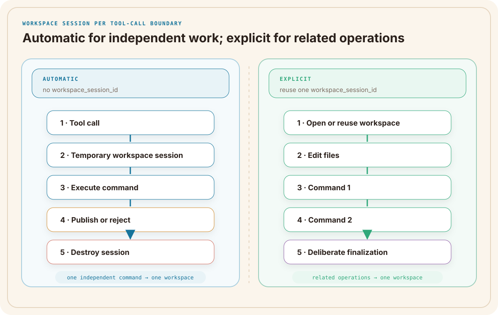
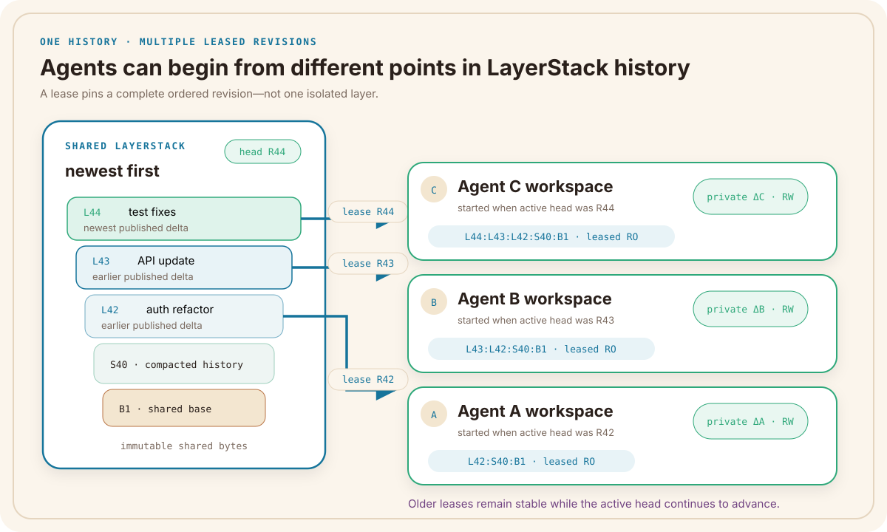
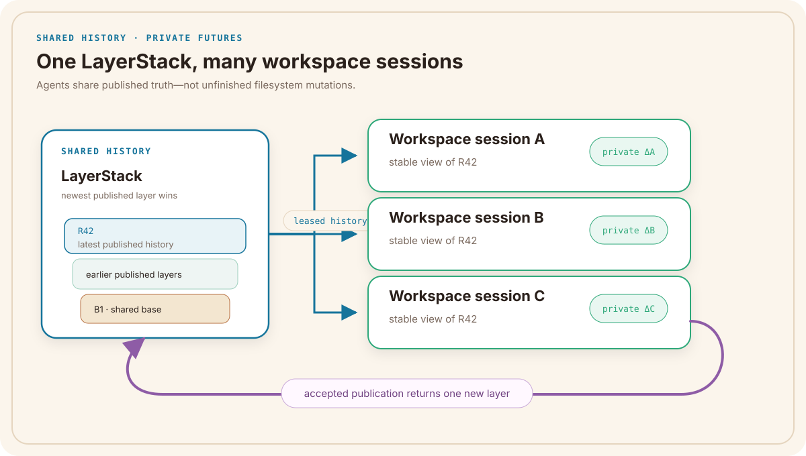

# 第 II 部分 — 共享历史与工作空间会话

[English](PART-II.md) | **简体中文**

*每个智能体工作单元如何在稳定、可复用的项目历史之上获得私有工作空间。*

第 I 部分说明了当许多编码智能体共享一份代码库时，原生进程与文件系统原语为什么会产生歧义。第 II 部分从缺失的边界开始：由 **Workspace Session（工作空间会话）** 拥有一个工作单元。

本部分按照从外到内的顺序解释这套模型：

1. 一次智能体工具调用会发生什么；
2. 大量工作空间会话如何共享稳定的项目历史；
3. LayerStack 如何用 layer（“层”）、manifest（“清单”）与 lease 表示这份历史。

第 III 部分会使用最终得到的 lease，构建真正执行命令的 private COW（copy-on-write，“写时复制”）文件系统。

---

## 第 12 章 — 每次工具调用一个工作空间会话

> **问题不只是命令在哪里运行，而是这次工具调用可以看见、创建、发布并遗留哪些机器状态。**

### 问题：独立工具调用共享机器状态

两个智能体正在 `/repo` 中的同一份代码库上工作。开始时，它们都希望使用相同的起始内容。原生文件系统暴露路径、字节与时间戳，却不会冻结这份内容，也不会把它命名为一个 project revision（“项目修订”）。

- 智能体 A 需要升级身份验证依赖并运行相关测试。
- 智能体 B 需要重新生成 API client 并运行 integration suite（“集成测试套件”）。

orchestrator（“编排器”）发出两次彼此独立的命令工具调用：

```text
智能体 A / 请求 Q91
  exec_command("cargo update -p auth-sdk && cargo test auth")

智能体 B / 请求 Q92
  exec_command("./scripts/regenerate-client && cargo test api")
```

传统 shell 只需要一个目录和一个进程。它可以在 `/repo` 中启动两条命令，再返回两个 PID：

```text
SHARED MUTABLE MACHINE VIEW

Q91 / Agent A                              Q92 / Agent B
cargo update                               regenerate client
      │                                           │
      │ rewrites Cargo.lock                       │ rewrites generated/*
      └────────────────────┐   ┌──────────────────┘
                           ▼   ▼
                ┌──────────────────────────┐
                │ /repo                    │
                │ one mutable checkout     │
                ├──────────────────────────┤
                │ source + generated files │
                │ target/ build output     │
                │ port 3000 + processes    │
                └─────────────┬────────────┘
                              ▼
                mixed diff · ambiguous tests
```

这足以执行命令，却不足以解释命令的结果。

智能体 A 可能在智能体 B 解析依赖时重写 `Cargo.lock`。智能体 B 可能在智能体 A 的测试 worker 仍在加载 module 时替换生成的 client 文件。两条命令可能写入同一个 build directory，也可能都希望使用 3000 端口。一条命令即使成功退出，也可能观察到一组从未作为某个已记录 revision 存在过的混合状态。

shell 仍然拥有一个 working directory、两棵 process tree 与两个 exit code。它缺少的是第 I 部分指出的 agent-work context（“智能体工作上下文”）：

| 问题 | 传统 Shell 的答案 | Agent Workspace 的答案 |
| --- | --- | --- |
| 这条命令测试了哪份项目状态？ | “运行期间 `/repo` 碰巧包含的内容” | 一份已记录的 LayerStack base |
| 哪些文件系统变更属于它？ | 一份混合在一起的 working-tree diff | 由 S17 或 S18 拥有的 private delta |
| 哪些进程、端口与资源属于它？ | 彼此分离的 PID 与机器计数器 | 一份工作空间会话级运行时身份 |
| 它的文件能否成为共享状态？ | 它们已经在 `/repo` 中可见 | 先 capture，再 publish 或 reject |
| “完成”表示什么？ | parent process（“父进程”）已经退出 | 命令结束、publication 已解析、cleanup 已记录 |

文件系统路径 `/repo` 同时承担了太多职责：它既是 project base，也是智能体 A 与智能体 B 的 scratch space（“草稿区”）、测试输入，以及结果最终进入提交的位置。因为这些角色没有分开，每次写入都会立刻改变另一次工具调用所处的世界。

### 设计回应：让 Tool Call 成为 Workspace Boundary

因此，在 multi-agent coding（“多智能体编码”）中，一条命令不能只是从某个目录启动的进程。它必须是一项有边界的状态转换：拥有稳定的开始、私有的中间过程、可归属的结果，以及明确的结束。

independent tool call（“独立工具调用”）适合作为默认边界，因为 orchestrator 已经能够准确标识它：它拥有 request ID、输入、开始时间与一个终态响应。agent identity（“智能体身份”）太宽——一个智能体可能处理许多无关任务；PID 又太窄——一条命令可能创建整棵 process tree、文件、端口与后台 worker。工作空间会话包住的是一次独立调用所产生的完整 machine event（“机器事件”）。只有主动加入一个生命周期更长的工作空间会话，相关调用才会共享状态。

Ephemeral Sandbox 会先把共享项目状态记录为 LayerStack revision R42，再让两次调用在这份历史之上获得彼此独立的工作空间会话：

```text
每条独立命令一个工作空间会话

                         ┌───────────────────────┐
                         │ LayerStack R42        │
                         │ immutable shared base │
                         └───────┬───────┬───────┘
                         lease R42       lease R42
                               │         │
          Q91                  ▼         ▼                  Q92
           │           ┌────────────┐ ┌────────────┐         │
           └──────────►│ S17        │ │ S18        │◄────────┘
                       │ private ΔA │ │ private ΔB │
                       │ command C31│ │ command C32│
                       │ evidence A │ │ evidence B │
                       └─────┬──────┘ └──────┬─────┘
                         candidate A      candidate B
                               └─────┐ ┌─────┘
                                     ▼
                              ┌───────────────┐
                              │ publication   │
                              │ accept/reject │
                              │ then cleanup  │
                              └───────┬───────┘
                                      ▼
                              shared head advances
                              only through accepted work
```

现在，智能体 A 无法重写智能体 B 正在读取的文件。每条命令的 process tree、transcript 与 filesystem delta 都有同一个 owner；端口和资源观测也可以关联到同一份工作空间会话身份。每份测试结果都能指出自己真正执行过的 base 与 private state。调用结束时，它的 candidate change（“候选变更”）必须跨过 publication boundary，而不会在执行到一半时泄漏给另一次调用。

这份对应关系是刻意设计的：

> **一条独立命令调用 → 一份 recorded base → 一个 private delta → 一个 runtime owner → 一项 publication outcome → 一个 cleanup scope。**

这条边界可以阻止文件系统直接交错，并保留有意义的 execution evidence。它并不保证智能体 A 的依赖升级与智能体 B 生成的 client 在语义上兼容。它真正做的是把两项不受控制的修改转换成两份拥有已知 base、可以归属的 candidate。随后，publication path 可以 merge、reject 或要求 repair，而不必先从共享目录中重建刚才究竟发生了什么。

这才是 agent workspace runtime 需要提供的完整答案。运行时返回的不只是 command output，而是一套有边界的 lifecycle；只有被接受的结果才能推动 shared history 前进。

这份临时工作空间是本部分的核心。Ephemeral Sandbox 会为每一条独立命令工具调用创建 automatic workspace session（“自动工作空间会话”）。当多项操作主动属于同一任务时，它们可以改为指向同一个显式工作空间会话。

两种工作空间会话都从共享 **LayerStack** 历史开始。它们共享已经接受的项目状态，而不是尚未完成的写入。即使其他工作空间会话在执行期间完成发布，lease（“租约”）也会保持每个工作空间会话的起始修订稳定。

开场中的智能体 A 可以用一条独立命令完成依赖升级。智能体 B 的工作则可能扩展成一组连续操作：重新生成 client、检查失败的 API 测试、编辑 `src/server.rs`，然后再次运行测试。

两项任务需要不同的生命周期。智能体 A 的命令可以获得一份自动收尾的临时工作空间；智能体 B 的相关操作则需要在多次调用之间持续保持私有的同一工作空间。

因此，隔离单元不是“每个智能体一个文件夹”，而是**每个边界明确的文件系统工作单元一个工作空间会话**。

### 自动工作空间会话：一条独立命令

当 `exec_command` 请求不包含 `workspace_session_id` 时，运行时会创建自动工作空间会话，并采用固定的 finalization policy（“收尾策略”）`publish_then_destroy`：

```text
独立 exec_command
        ↓
创建 private workspace S17
        ↓
运行命令 C31
        ↓
capture 并尝试 publication
        ↓
销毁 S17
```

调用者不必仅仅为了执行一条有边界的命令，就额外管理创建与销毁流程。运行时会为命令提供稳定 base、私有可写状态、进程归属、transcript（“执行记录”）以及明确的结束方式。

`publish_then_destroy` 描述的是顺序，并不保证结果一定会被接受。命令可能成功，但 publication（“发布”）因冲突而被拒绝。运行时记录这项结果，销毁临时工作空间，并保持共享历史不变。

这就是 v1 中 **workspace session per tool call（“每次工具调用一个工作空间会话”）** 的准确含义：它是一条独立 `exec_command` 的默认边界，而不是声称每一种运行时操作都会创建工作空间。

真正重要的是“默认”。如果隔离依赖智能体记得创建目录，或依赖 orchestrator 正确包装每一条命令，只要有一个调用者忘记，并发上限就会重新出现。在命令启动前创建工作空间会话，可以让可归属的私有执行路径成为常规路径，即使调用者没有自定义 workspace-management logic 也是如此。

### 显式工作空间会话：一组相关操作

智能体 B 的第二次测试必须看到第一次测试前完成的编辑。因此，它的操作会主动指向同一个 explicit workspace S18：

```text
基于租用修订 R42 的 workspace S18
        ↓
文件编辑
        ↓
命令 C32
        ↓
检查私有文件与输出
        ↓
第二次编辑
        ↓
命令 C33
        ↓
显式 finalization
```

传入 `workspace_session_id: S18`，会让文件与命令操作使用同一份 mounted project view（“已挂载项目视图”）。C33 可以看到 C32 之前完成的工作，其他工作空间会话则看不到。

C32 结束时不会发布或销毁 S18。multi-operation task（“多操作任务”）准备好后，由 workspace owner（“工作空间所有者”）决定何时收尾，或何时丢弃私有状态。



*图 12.1 — 独立命令使用自动工作空间会话；彼此相关的操作主动复用一个显式工作空间会话。*

### 工作空间会话 ID 选择一套 Lifecycle

公开运行时接口会明确区分包含和不包含工作空间会话 ID 的调用：

| 操作 | 不带 `workspace_session_id` | 带 `workspace_session_id` |
| --- | --- | --- |
| `exec_command` | 创建 automatic `publish_then_destroy` workspace | 在指定 workspace 中运行 |
| `file_read` | 读取最新 published snapshot（“已发布快照”） | 读取指定 private workspace |
| `file_write` / `file_edit` | 发布一个归属于 `operation:<request_id>` 的 layer | 修改指定 workspace，并在 capture 前保持私有 |

添加工作空间会话 ID 并非无关紧要的路由装饰。它既会改变操作可以观察哪份状态，也会改变修改采用什么生命周期。

不带工作空间会话 ID 的读取会看到最新 published snapshot；S18 中的读取会看到它租用的 base 加上 S18 的私有编辑。不带工作空间会话 ID 的 file write 会直接发布一个小型 operation-attributed layer（“操作归属层”）；S18 中的写入则保持私有，让智能体可以先编辑、测试和修订，再决定是否发布。

[Operation Catalog](https://ephemeral-sandbox.com/docs/reference/operations) 与 [Core Concepts 文档](https://ephemeral-sandbox.com/docs/concepts)记录了这些行为。

> *⏳ **Tool-call boundary rule（“工具调用边界规则”）：** 为一条独立命令提供 automatic workspace；让主动相关的操作使用同一个 explicit workspace。*

### 三种 Runtime Lifetime，一份共享历史

四个名称就足以描述这套模型：

| 对象 | 生命周期 | 它拥有什么 |
| --- | --- | --- |
| Sandbox | 受管理的运行时生命周期 | 工作空间运行的环境 |
| LayerStack | 持久项目生命周期 | 已接受的文件系统历史 |
| 工作空间会话 | 有边界的任务生命周期 | 稳定 base、私有文件与 finalization |
| 命令会话 | 进程生命周期 | 一个进程及其 transcript |

把它们画成一棵小树会更容易记忆：

```text
Sandbox
  ├── LayerStack：共享的 published history
  ├── Workspace S17：一个有边界的任务
  │     └── Command C31
  └── Workspace S18：一组相关操作
        ├── Command C32
        └── Command C33
```

销毁 C32 不会擦除 S18 的私有文件；销毁 S18 不会擦除 LayerStack 修订 R42；发布 S17 也不会暴露 S18 尚未完成的工作。每项操作只结束自己真正拥有的生命周期。

在 v1 中，显式工作空间会话的创建与 finalization 属于 internal coordination surface（“内部协调接口面”），而不是公开 CLI 或 MCP tool。公开运行时调用可以指定已有工作空间会话 ID；外围生命周期由 coordination layer（“协调层”）拥有。

### Task Boundary 优于 Agent Boundary

一个模型进程可能处理多项互不相关的任务。如果把它们保存在同一个 agent-owned folder（“智能体所有文件夹”）中，一个请求的 parser 输出就可能影响另一个请求的 benchmark。独立的自动工作空间会话可以移除这种意外依赖。

反过来也一样。一项修复可能需要一次编辑和多次测试。如果每次调用都得到互不相关的工作空间，编辑就会在命令之间消失。显式工作空间会话可以保留这份有意建立的依赖。

ownership rule（“归属规则”）是：

> *一个工作空间会话属于一个边界明确的文件系统工作单元。这个单元可以是一条独立命令，也可以是数项主动关联的操作。*

orchestrator（“编排器”）可以把任务转交给不同模型，同时保留相同的工作空间会话身份。reviewer（“审查者”）可以检查工作空间会话而不成为它的作者。“智能体 B 的文件夹”会变成更准确的“基于 R42、服务于这项任务的工作空间会话 S18”。

### Process Success 不等于 Workspace Success

命令退出码描述的是一个进程，而不是容纳它的工作空间状态：

```text
command status：success
workspace status：still private
publication status：not attempted
```

automatic command 可以成功，但 capture 失败或 publication 被拒绝。explicit command 可以失败，但工作空间仍然可供检查和再次尝试。这些结局必须保持独立并且可见。

### 这套设计如何回应第 I 部分的四项挑战

第 I 部分最后总结了并行智能体使用原生机器原语时产生的四项问题。工作空间会话设计让四项问题拥有同一个 owner：

| 第 I 部分的挑战 | 第 II 部分的设计回应 | 开场场景中的结果 |
| --- | --- | --- |
| Private execution 与 controlled publication | 工作空间会话租用稳定 base、拥有 private delta，并跨过显式 publication boundary | S17 与 S18 不会向彼此暴露写到一半的文件；两份 candidate 分别被接受或拒绝 |
| File 与 line-level auditability | request、工作空间会话、base、command 与 changeset identity 保持连接 | 已发布代码行可以保留自己来自 Q91/S17 还是 Q92/S18，而不是只剩一份混合的 `/repo` diff |
| Resource ownership 与 observability | 命令会话位于工作空间会话内部，让进程、transcript、端口与资源观测共享一个 task key | operator 可以把 3000 端口或 process tree 关联到 S17 或 S18，而不必根据 PID 猜测 |
| Lifecycle、validation 与 recovery | command、workspace 与 publication state 拥有不同结局；自动与显式工作空间会话使用明确的 finalization policy | 退出码 0 不会悄悄代表 publication 成功；cleanup 或 retry 会作用于正确的 private state |

LayerStack 本身并不实现表中的全部答案。第 II 部分建立共同 identity 与 stable-history contract（“稳定历史契约”）。第 III 部分构建 private filesystem、capture、publication 与 provenance 路径；第 IV 部分再把同一套 ownership model 应用于进程、端口、资源、diagnostic 与 recovery。

这种划分非常重要。系统不会为文件、进程、资源与 publication 创建四套互不相关的日志，而是让它们拥有同一个 join key（“连接键”）：工作空间会话。正是工作空间会话把分散的 machine fact（“机器事实”）转换成一项可以检查的智能体工作单元。

现在，工作单元已经清楚。下一个问题是：所有这些临时工作空间会话从什么状态开始？

---

## 第 13 章 — 一个 LayerStack，多个稳定基线

第 12 章为每个工作单元指定了 owner。第 I 部分的第一项挑战仍然需要回答：这个 owner 看到的究竟是一份稳定项目状态，还是另一个智能体不断移动的目标？

两项编码任务进入同一个 sandbox。它们都需要仓库、工具链和已经接受的项目状态，却不需要共用同一个可写 checkout（“检出”）。

Ephemeral Sandbox 把持久项目历史保存在一个 **LayerStack** 中。每个工作空间会话租用一个已经记录的 revision（“修订”），再增加自己的 private delta（“私有增量”）：

```text
可见项目 = 租用的共享历史 + private delta
```

共享的一半可以复用并且不可变；私有的一半只属于一个有边界的任务。

### 共享历史不等于共享 Checkout

在修订 R42，两个工作空间会话可以从同一份历史开始：

```text
R42 的 LayerStack
    ├── workspace S17 + private delta A
    └── workspace S18 + private delta B
```

它们复用已经属于 R42 的字节，不会把这些字节复制成两份完整仓库，也不会把修改写回 R42。S17 在自己的可写状态中记录智能体 A 的变更；S18 对智能体 B 的工作做同样的事。

这不是第 I 部分拒绝的 shared mutable workspace（“共享可变工作空间”）。智能体共享的是**已发布事实**，而不是一棵活跃目录树。智能体 B 可以读取智能体 A 所使用的同一份已接受 parser 代码，却不会看到智能体 A 重写 lockfile 到一半的状态。

它也比为每项任务复制仓库更精确。复制目录可以提供私有文件，却不说明这些文件来自哪一份共享 revision。工作空间会话会把这份 revision 与任务、私有状态、命令和 finalization result 绑定在一起。

### Lease 保持起始 Revision 稳定

S18 从 R42 启动时，LayerStack 会为它提供 snapshot（“快照”）与 **lease**。lease 指定构成工作空间会话 base 的有序历史，并在工作空间会话存活期间保持这份历史可用。

如果 S17 完成发布，active head（“活跃头部”）变成 R43，S18 不会在正在运行的命令下方改变。它仍然看到租用的 R42 加上自己的 private delta。S18 之后提出 changeset（“变更集”）时，publication 可以把它的 R42 base 与当前 R43 head 比较。

lease 不是全局项目锁。它不会阻止其他工作空间会话发布，也不会阻止新的工作空间会话从 R43 开始。它保护的是一个 reader（“读取者”）脚下的稳定地板，并防止清理回收该 reader 仍然需要的 layer。

可以把它想成借阅图书馆里的某个明确版本，同时新版本仍然可以继续入库。借阅不会关闭图书馆，只会防止有人在你阅读时替换第 80 页。说完这一段以后，请继续叫它 lease——内核并不管理图书。

### 不同工作空间会话可以租用不同 Revision

假设智能体 A 从 R42 开始。智能体 B 启动前，一次 publication 创建了 R43；智能体 C 启动前，另一次 publication 创建了 R44：

```text
智能体 A：lease R42 → [L42, S40, B1]             + private ΔA
智能体 B：lease R43 → [L43, L42, S40, B1]        + private ΔB
智能体 C：lease R44 → [L44, L43, L42, S40, B1]   + private ΔC
```

三个工作空间会话可以同时保持活跃。每个工作空间会话都会看到 lease 时间点的完整有序历史，以及自己的 private delta。没有任何工作空间会话会重写下方的 layer。



*图 13.1 — 并发工作空间会话可以保留不同但稳定的 LayerStack revision。*

### 共享 Base 只消除一项成本

当 N 个工作空间会话从相同历史开始时，LayerStack 可以避免产生 `N × base` 份仓库副本。每个工作空间会话仍然需要为自己的元数据和 COW 变更付出成本。

诚实的存储模型是：

```text
一份共享 base
+ 被保留的 published history
+ 所有 private delta 之和
+ 每个工作空间会话的运行时元数据
```

如果十个智能体分别重写不同的 100 MB 生成文件，它们的 private delta 仍然会消耗这些空间。进程、command transcript 与运行时元数据也会随并发量增长。

准确的结论是：**许多工作空间可以引用同一份不可变项目历史，而不必复制或修改这份历史。**

下一章会打开 LayerStack 本身，解释这份历史如何表示。

---

## 第 14 章 — LayerStack 内部：Layer、Manifest 与 Lease

lease 承诺 workspace 会保留稳定 base。auditability 需要更强的答案：运行时必须准确指出这份 base 代表哪一段有序文件系统历史。

在 R42，智能体 A 与智能体 B 都打开 `src/server.rs`。在各自的 private workspace 修改该路径之前，它们读取的是同一份已发布文件。这种行为从工作空间下方的 LayerStack 开始。

**LayerStack 是一份由不可变文件系统 layer 组成的有序 manifest。** 一个 layer 可以包含文件、目录、符号链接与删除元数据。manifest 定义哪些 layer 构成一份 published revision，以及路径解析采用什么顺序。

LayerStack 拥有文件系统历史、revision identity（“修订身份”）、lease 与 publication state。它不会启动 shell 或隔离进程；这些责任属于构建在它之上的 workspace runtime。

### 三类不可变 Layer

| Layer 类型 | 用途 | 创建后是否可变 |
| --- | --- | --- |
| Base，`B*` | 初始的 content-addressed project state（“内容寻址项目状态”） | 否 |
| Published，`L*` | 已接受的文件系统 delta | 否 |
| Squashed，`S*` | 旧历史的等价紧凑形式 | 否 |

例如 `B000001-base` 这样的 base layer 包含初始项目。publication 接受结果后，会创建一个 `L*` layer，并把它放到 active manifest 最前面。之后，squash（“压缩”）可以把每一段符合条件的连续 layer block 替换成等价的 `S*` layer。一次 squash 可以产生多个 `S*` layer；lease boundary（“租约边界”）与长度不足以 squash 的 layer run 则继续保留为普通 `L*` 条目。之后的 publication 还会继续在最前面加入新的 `L*` layer。squash 改变物理布局，不改变可见项目。

一个 layer 一旦出现在 manifest 中，就是历史，不再是共享草稿区。

### 最新优先，第一个可见路径获胜

active manifest 并不限定只能包含一个 published layer、一个 squashed layer 与一个 base。它可以交错包含多项 `L*` 与 `S*`：

```text
manifest.layers                         最新优先

L-head          近期发布的 delta
L-recent        另一个尚未压缩的 published delta
S-block-A       一段旧 layer run 的扁平化替代层
L-boundary      在 lease boundary 保留的未压缩 layer
S-block-B       另一段旧 layer run 的扁平化替代层
B-base          原始项目内容
```

示例缩短了 layer 名称。真实 `L*` 与 `S*` ID 包含 allocation version 与 unique suffix。ID 中看似数字的部分并不决定查找优先级；manifest array 才决定。

读取 `src/server.rs` 时，系统会按照这个顺序检查每一项。第一个可见版本获胜，无论它来自尚未压缩的 `L*` layer，还是已经压缩的 `S*` layer。任何高优先级 layer 中的删除标记，都可以隐藏物理上仍然存在于下层的路径。

[LayerStack Architecture](https://ephemeral-sandbox.com/architecture/layerstack) 会一直把这份顺序保留到 OverlayFS：publication 把最新 layer 放到最前面；lease 复制这些有序路径；第一个 lower path（“下层路径”）获得最高查找优先级。

数组顺序最终会变成文件系统事实。

### Revision 标识确切的有序历史

active manifest 包含 version、按顺序排列的 layer reference（“层引用”）与 schema version。Ephemeral Sandbox 还会根据有序的 layer identity 与路径计算 root hash（“根哈希”）。

manifest version、root hash 与 layer count 共同描述工作空间持有的 base：

```text
工作空间会话：S18
manifest version：42
root hash：H42
lower-layer count：6
```

version 便于日志记录；root hash 保护更强的事实：究竟是哪一份有序历史生成了当前视图。包含相同 layer、但顺序不同的两份 manifest，并不表示同一个文件系统。

### Lease 把历史连接到活跃 Workspace

lease 会保存 manifest snapshot 及其解析后的 lower-layer path。它有两个用途：

1. 运行中的 workspace 保留开始时那份确切历史；
2. 存储维护知道哪些 layer 仍然正在使用。

因此，squash 与 garbage collection（“垃圾回收”）必须尊重 active lease。维护流程只有在保留每一份 leased logical view（“已租用逻辑视图”）的前提下，才能替换符合条件的 layer block；它不能仅仅因为 R43 已经成为 active revision，就移除 S18 脚下的地板。

过长的 layer chain 也有成本。创建 workspace 时，系统必须构造有序 lower-path list；读取路径时，也可能要穿过多层才能找到可见版本。squash 可以缩短符合条件的旧 chain，但它是一项维护操作，不是每条命令结束后都会发生的魔法压缩。

### 第 II 部分建立的四项保证

现在可以用四句话描述完整模型，不需要再引入新对象：

> **历史是共享的。** Published layer 可以服务于许多工作空间会话。

> **执行基线来自 lease。** 活跃 workspace 会保留开始时的 revision。

> **变更是私有的。** 尚未完成的写入停留在共享历史之外。

> **发布是原子的。** 经过解析的候选结果要么作为一个 layer 进入历史，要么完全不进入。

LayerStack 无法阻止进程消耗内存、打开端口或产生错误代码。execution、resource、validation 与 publication policy 会在后续部分处理这些责任。



*图 14.1 — 一个 LayerStack 为许多私有工作空间会话提供稳定历史；只有被接受的工作才会作为新的共享 layer 返回。*

第 II 部分已经确定了工作单元，以及它下方的稳定历史。第 III 部分将从 kernel boundary（“内核边界”）开始：OverlayFS 把租用的 lower layer 与私有 `upperdir`、`workdir` 组合起来，形成智能体真正工作的可写视图。

---

## 参考资料

1. Ephemeral Sandbox，[“Agent Sandbox for Parallel Coding Agents”](https://ephemeral-sandbox.com/)。
2. Ephemeral Sandbox，[“Core Concepts”](https://ephemeral-sandbox.com/docs/concepts)。
3. Ephemeral Sandbox，[“Operations Reference”](https://ephemeral-sandbox.com/docs/reference/operations)。
4. Ephemeral Sandbox，[“Architecture Overview”](https://ephemeral-sandbox.com/architecture)。
5. Ephemeral Sandbox，[“LayerStack Store and Copy-on-Write”](https://ephemeral-sandbox.com/architecture/layerstack)。
6. Ephemeral Sandbox，[“Multi-Agent Coding Workspaces”](https://ephemeral-sandbox.com/multi-agent-coding-workspaces)。
7. Ephemeral AI Lab，[`ephemeral-sandbox` 源代码仓库](https://github.com/Ephemeral-AI-Lab/ephemeral-sandbox)。
8. Ephemeral AI Lab，[`exec_command` 操作契约](https://github.com/Ephemeral-AI-Lab/ephemeral-sandbox/blob/main/crates/sandbox-operations/catalog/src/runtime/command.rs)。
9. Ephemeral AI Lab，[运行时文件操作契约](https://github.com/Ephemeral-AI-Lab/ephemeral-sandbox/blob/main/crates/sandbox-operations/catalog/src/runtime/file.rs)。
10. Ephemeral AI Lab，[workspace lifecycle 实现](https://github.com/Ephemeral-AI-Lab/ephemeral-sandbox/tree/main/crates/sandbox-runtime/workspace/src)。
11. Ephemeral AI Lab，[LayerStack 实现](https://github.com/Ephemeral-AI-Lab/ephemeral-sandbox/tree/main/crates/sandbox-runtime/layerstack/src)。
