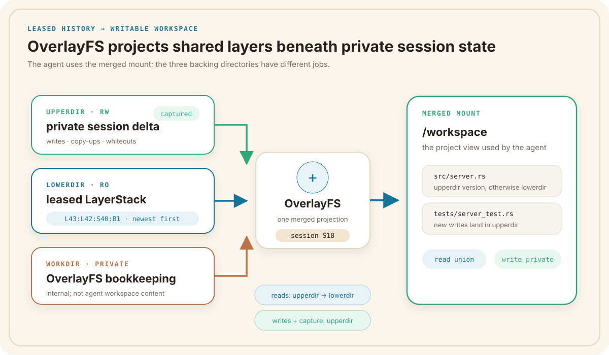

# Part III — Private Workspaces and Published History

*How a leased LayerStack revision becomes an agent-writable workspace, then
returns as reviewed published history.*

Part II ended with a lease: one stable, immutable LayerStack revision owned by a
workspace session. A lease tells the runtime which history the session must
continue to see. It does not, by itself, provide somewhere to write.

Part III begins by constructing that writable view.

---

## Chapter 15 — Copy-on-Write Workspace Projection

Agent B's session S18 has leased R43. The revision is shared and read-only, but
Agent B needs to edit files, create test output, and delete paths without
changing R43 for anyone else.

Ephemeral Sandbox projects the leased history through OverlayFS. The resulting
workspace looks like a normal project directory to the agent, while its backing
state remains divided into shared history and private mutation.

### How a lease becomes a writable workspace

OverlayFS combines three directories into one mounted workspace:

- `lowerdir` is the ordered, read-only LayerStack history named by the lease;
- `upperdir` stores this session's writes, copy-ups, and deletion metadata;
- `workdir` is private OverlayFS bookkeeping and must live with the upper state.

The agent does not open those backing directories directly. Commands use the
merged mount, such as `/workspace`. A read checks the private upper state first
and falls through the ordered lower layers. A mutation is directed into the
upper directory, leaving the leased layers unchanged.



*Figure 15.1 — OverlayFS combines leased lower history with private session
state to present one writable project view.*

For S18, the conceptual mount inputs are:

```text
lowerdir = L43:L42:S40:B1     # leased, newest-first, read-only
upperdir = sessions/S18/upper # private mutations
workdir  = sessions/S18/work  # private OverlayFS bookkeeping
mount    = /workspace         # merged view used by the agent

capture source = upperdir
```

The last line matters. Publication does not scan the shared lower layers and
guess what changed. Capture reads the session's `upperdir`, where OverlayFS has
recorded its private writes and deletion metadata. The `workdir` is runtime
machinery, not part of the agent's changeset.

This projection explains how many sessions can share LayerStack bytes without
sharing writable state. Chapter 16 will keep the mounted view alive across
commands and explain which process owns its namespace.
